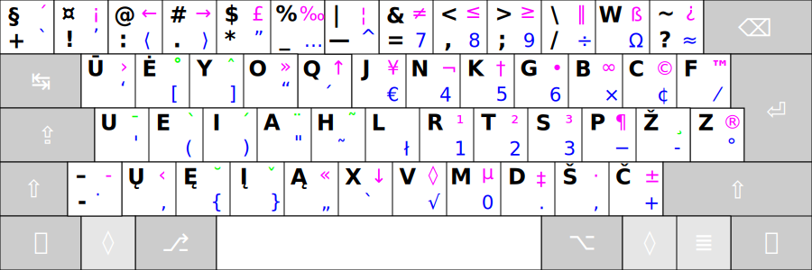

[Read in English](README_eng.md)

-----------------------------------------------
# LIETUVIŠKAS ERGONOMIŠKAS KLAVIATŪROS IŠDĖSTYMAS „RATISĖ“

Laida 2.4

__Lietuviškas ergonomiškas kompiuterio klaviatūros spausdinamųjų ženklų išdėstymas ŪĖYOQJ, arba „Ratìsė“__ yra skirtas patogiam lietuviško teksto rinkimui klaviatūra (spaudynu) visais pirštais, taip vadinamu „akluoju“ būdu, tai yra [spausdinant klaviatūra visais pirštais](docs/spaud_tvarka.md) apčiuopomis, nežiūrint. Taip pat išdėstymas leidžia patogiai rinkti tekstus anglų kalba, programavimo kalbomis bei įvesti ypatingas kitų kalbų raides bei kitokius reikalingus ženklus.

Kuriant Ratisės išdėstymą buvo atsižvelgta į atskirų raidžių dažnumą, jų samplaikas bei eiliškumą lietuvių kalbos žodžiuose. Balsės ir priebalsės išskirtos skirtingoms rankoms. Dažnesniau naudojamos raidės ir ženklai užima patogesnes vietas išdėstyme, bei tenka pajėgesniems pirštams. Spausdinamieji ženklai dėstyti tvarkingai, kad išdėstymas būtų patogesnis ir lengviau įsimenamas.

+ Kairės ir dešinės rankos pirštų pagrindinės padėtys atitinkamai yra: _uei**a**·**r**tsp_ (čia paryškintos tenkančios rankų smiliams raidės).

+ „Ratisė“ pavadinimas kyla iš pačio išdėstymo: spaudžiant paeiliui pakaitomis skirtingų rankų pirštais pagrindinių padėčių mygtukus, pradedant dešiniuoju smiliumi.

+ Ratisės išdėstyme raidės ir kiti ženklai ẽsti keturiuose lygiuose (neskaitant Didžiųjų raidžių lygio).

+ Kaip išdėstyti spausdinamieji ženklai (spaudaĩ) atskiruose lygiuose, žiūrėkite: [Ratisės ženklų išdėstymo lygiai](docs/ratises_lygiai.md)

+ Išsamus darybinis išdėstymo aprašas (angliškai): [txt](SPECIFICATIONS.txt)

+ Ratisės išdėstymo valdyklės yra teikiamos __Windows, MacOS, Linux (xkb), Haiku__ operacijų sistemoms (skaitmeninėms aplinkoms):

[›› Parsisiųsti Ratisės išdėstymą ‹‹](https://github.com/albuck/Ratise-layout/zipball/master)

__Valdymo myktukų ženkliukai ir pavadinimai:__

- ↹ — Tab / Tabular / Tabulator / Atitraukimas / Įtraukimas
- ⇪ — ⮸ / Caps / Caps Lock / Didž / Didžiosios
- ⇧ — Shift / Level 2 / Aukšt / Aukštesnis, Antrasis lygis
- ⎈ — Ctrl / Control / Vald / Valdymas
- ◊ — OS / Super / System / Cmd / Command / ⌘ Command (MacOS) /⊞ Win,  Windows / ◆ Meta / Logo / Vėliava / Vada
- ⎇ — Alt / Alternate / Alternatyve / ⌥ Opt (MacOS) / Option / Kitaip
- ⇮ — AltGr / Alternate Graphic / ⌥ Opt (MacOS) / Option / Level 3 / Trečiasis lygis / Kitas
- ≣ — Menu / Mn / Meniu / Sąrašas
- ⏎ — ↵ / Enter / Return / Įvesti / Įvedimas
- ⌫ — ← / Backspace / Trinti / Trynimas

__Pastaba:__ Lyginant su įprastomis klaviatūromis [Apple klaviatūrose](https://en.wikipedia.org/wiki/Apple_keyboards) mygtukai ⎇(Alt/⌥/Opt) ir ◊(OS/Win/⌘/Cmd) savo padėtimi yra sukeisti vietomis.

--------------------------------------------------------------------

PAPILDYMAI:
-----------

- [RATISĖS ŽENKLŲ IŠDĖSTYMO LYGIAI](docs/ratises_lygiai.md)
- [SPAUSDINIMO VISAIS PIRŠTAIS TVARKA](docs/spaud_tvarka.md)
- [RATISĖS KETURIŲ LYGIŲ ŽENKLAI VIENAME PAVEIKSLĖLYJE](docs/lek_ratise.md)
- [TĘSTIES MYGTUKAI IR JAIS ĮVEDAMI ŽENKLAI](docs/testies_mygtukai.md)
- [KIRČIUOTŲ RAIDŽIŲ ĮVEDIMO YPATUMAI](docs/kirciuotos_raides.md)
- [SUDURTINIS ŽENKLŲ ĮVEDIMAS](docs/sudurt_ivedimas.md)
- [IŠDĖSTYMO TRŪKUMAI IR JŲ APĖJIMO BŪDAI](docs/trukumu_apejimas.md)
- [MYGTUKŲ SPAUDELIOJIMO DAŽNUMAI](docs/spaud_daznis.md)
- [LIETUVIŠKŲ IŠDĖSTYMŲ NAŠUMO PALYGINIMAS](docs/palyginimas.md)
- [SPAUSDINIMO PATOGUMAS, NAŠUMAS BEI SVEIKATA](docs/spaud_patoga.md)
- [KAIP ATSIRADO RATISĖ](docs/kaip_atsirado_ratise.md)

## Papildomi išdėstymai:

- [RATISĖS LATVIŠKAS IŠDĖSTYMAS](docs/lek_ratise_latvian.md)
- [RATISĖS GERMANIŠKAS IŠDĖSTYMAS](docs/lek_ratise_germanic.md)
- [RATISĖS KIRILICA IŠDĖSTYMAS](docs/lek_ratise_kirilica.md)

## Kitos naudingos nuorodos:

- [Standartinė ergonomiška klaviatūra](https://albuck.github.io/SEL-keyboard/SKAITYK.html)
- [Lietuviški klaviatūrų išdėstymai (registrucentras.lt)](https://www.registrucentras.lt/litwin/keyboard.html)
- [Klaviatūros išdėstymai (lietuvybė.lt)](http://lietuvybė.lt/standartai/klaviat%C5%ABros-i%C5%A1d%C4%97stymai/)
- [Lietuviška ergonomiška klaviatūra LEKP](https://lekp.info/)
- [Ergonomic Keyboard Reviews (angliškai)](http://xahlee.info/kbd/ergonomic_keyboards_index.html)
- [Do-It-Yourself Keyboards (angliškai)](http://xahlee.info/kbd/diy_keyboards_index.html)
