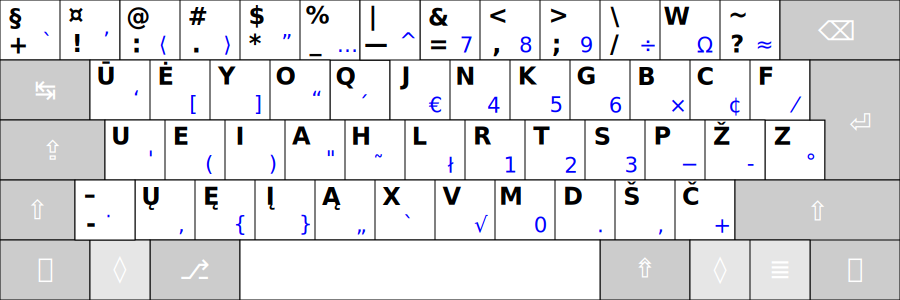

[Read in English](README_eng.md)

-----------------------------------------------
# LIETUVIŠKAS KLAVIATŪROS IŠDĖSTYMAS RATISĖ

Laida 2.4

_Lietuviškas ergonomiškas kompiuterio klaviatūros išdėstymas __ŪĖYOQJ__, arba __Ratìsė__ yra skirtas patogiam lietuviško teksto rinkimui visais pirštais, taip vadinamu „akluoju“ būdu, tai yra [spausdinant klaviatūra visais pirštais](docs/spausdinimo-visais-pirstais-tvarka.md) apčiuopomis, nežiūrint į spaudyną. Taip pat išdėstymas leidžia patogiai rinkti tekstus anglų kalba, programavimo kalbomis, bei įvesti lietuviškas kirčiuotas raides ar atskirus kirčių ženklus, ypatingas kitų kalbų raides ir kitokius rečiau reikalingus ženklus._

__Ratisės klaviatūros išdėstymas:__

+ [Valdymo mygtukų ženkliukai ir pavadinimai](docs/klaviaturos-valdymo-mygtukai.md)

_Ratìsė_ (antroji kirčiuotė) pavadinimas kyla iš pačio išdėstymo: spaudžiant paeiliui pakaitomis skirtingų rankų pirštais pagrindinių padėčių mygtukus, pradedant dešiniuoju smiliumi.

__Kuriant Ratisės išdėstymą buvo atsižvelgta į atskirų raidžių dažnumą, jų samplaikas bei eiliškumą lietuvių kalbos žodžiuose:__
+ Dažnesniau naudojamos raidės ir ženklai užima patogesnes vietas išdėstyme, bei tenka pajėgesniems pirštams.
+ Balsės ir priebalsės išskirtos skirtingoms rankoms.
+ Spausdinant Ratisè paprastai ritmiškai kaitaliojamos skirtingos rankos ir pirštai, dėl to sumažėja nuovargis ir yra lengviau spausdinti.
+ Tam pačiam pirštui išdėstyme teks daug rečiau iš eilės vėl spaudyti mygtukus.
+ Tai pačiai rankai teks rečiau iš eilės vėl spaudyti mygtukus.
+ Pagrindiniame, lengviausiai prieinamame, išdėstymo lygyje yra dažniausiai reikalingi rašto ženklai.
+ Pagrindiniai ir papildomi spausdinamieji ženklai dėstyti tvarkingai, kad išdėstymas būtų kuo patogesnis ir lengviau įsimenamas.
+ Kairės ir dešinės rankos pirštų pagrindinės padėtys atitinkamai yra: _uei**a**·**r**tsp_ (čia paryškintos tenkančios rankų smiliams raidės).

__Ratisės išdėstymo valdyklės__ yra teikiamos _Windows, MacOS, Linux/Unix (xkb), Haiku_ operacijų sistemoms (skaitmeninėms aplinkoms):

[↓ Parsisiųsti Ratisės išdėstymą ↓](https://github.com/albuck/Ratise-layout/zipball/master)

--------------------------------------------------------------------

- [RATISĖS ŽENKLŲ IŠDĖSTYMO LYGIAI](docs/ratises-isdestymo-lygiai.md)

   - [Ratisės išdėstymo ženklai](docs/ratise-isdestymo-zenklai.md)

- [SPAUSDINIMO VISAIS PIRŠTAIS TVARKA](docs/spausdinimo-visais-pirstais-tvarka.md)

- [RATISĖS TĘSTIES MYGTUKAI IR JAIS ĮVEDAMI ŽENKLAI](docs/ratises-testies-mygtukai.md)

- [KIRČIUOTŲ RAIDŽIŲ ĮVEDIMO YPATUMAI](docs/kirciuotos-raides.md)

- [SUDURTINIS ŽENKLŲ ĮVEDIMAS](docs/sudurtinis-zenklu-ivedimas.md)

- [RATISĖS IŠDĖSTYMO TRŪKUMAI IR JŲ APĖJIMO BŪDAI](docs/ratises-trukumu-apejimas.md)

- [RATISĖS MYGTUKŲ SPAUDELIOJIMO DAŽNUMAI](docs/mygtuku-spaudeliojimo-daznumai.md)

- [LIETUVIŠKŲ KLAVIATŪROS IŠDĖSTYMŲ NAŠUMO PALYGINIMAS](docs/lt-isdestymu-palyginimas.md)
   
   - [Pagrindinių lietuviškų klaviatūros išdėstymų palyginamoji statistika](docs/lt-isdestymu-statistika.md)
   - [Pagrindinių lietuviškų klaviatūros išdėstymų palyginamosios statistinės lentelės](docs/lt-isdestymu-statistines-lenteles.md)
   - [Papildomų esamų ir galimų lietuviškų klaviatūros išdėstymų palyginamoji statistika](docs/papildomu-isdestymu-statistika.md)

- [SPAUSDINIMO KLAVIATŪRA PATOGUMAS, NAŠUMAS BEI SVEIKATA](docs/spausdinimo-klaviatura-patogumas.md)

- [KAIP IR KODĖL ATSIRADO RATISĖS IŠDĖSTYMAS](docs/kaip-atsirado-ratise-isdestymas.md)

## Papildomi kitų kalbų Ratisės išdėstymai:

- [RATISĖS LATVIŠKAS IŠDĖSTYMAS](docs/ratise-latvian.md)
- [RATISĖS GERMANIŠKAS IŠDĖSTYMAS](docs/ratise-germanic.md)
- [RATISĖS KIRILICA IŠDĖSTYMAS](docs/ratise-kirilica.md)

## Ergonomiškos klaviatūros:

- [Standartinė ergonomiška klaviatūra (apmatai)](https://albuck.github.io/SEL-keyboard/SKAITYK.html)
- [Ergonomic Keyboard Reviews (angliškai)](http://xahlee.info/kbd/ergonomic_keyboards_index.html)
- [Do-It-Yourself Keyboards (angliškai)](http://xahlee.info/kbd/diy_keyboards_index.html)

## Kiti lietuviški klaviatūrų išdėstymai:

- [Lietuviški klaviatūrų išdėstymai (registrucentras.lt)](https://www.registrucentras.lt/litwin/keyboard.html)
- [Klaviatūros išdėstymai (lietuvybė.lt)](http://lietuvybė.lt/standartai/klaviat%C5%ABros-i%C5%A1d%C4%97stymai/)
- [Lietuviška ergonomiška klaviatūra LEKP](https://lekp.info/)

