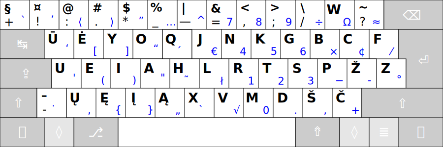
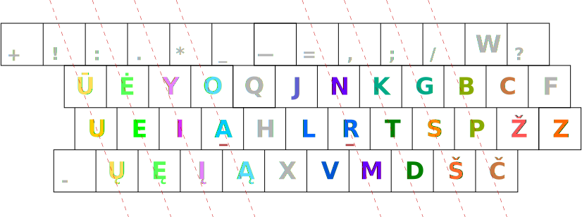

[🏴󠁧󠁢󠁥󠁮󠁧󠁿 Read in English](README_eng.md)

-----------------------------------------------

# LIETUVIŠKAS KLAVIATŪROS IŠDĖSTYMAS RATISĖ

Laida 2.4

Lietuviškas ergonomiškas kompiuterio klaviatūros išdėstymas _ŪĖYOQJ_ arba _Rati̇̀sė_ yra skirtas patogiam lietuviško teksto rinkimui visais pirštais, vadinamuoju „akluoju“ būdu, tai yra [spausdinant klaviatūra visais pirštais](docs/spausdinimo-visais-pirstais-tvarka.md), apčiuopomis, nežiūrint į spaudyną. Taip pat išdėstymu patogu yra rinkti tekstus anglų kalba, programavimo kalbomis, bei įvesti lietuviškas kirčiuotas raides ar atskirus kirčių ženklus, ypatingas kitų kalbų raides ar kitokius, rečiau reikalingus ženklus.

_Rati̇̀sė_ (antroji kirčiuotė) pavadinimas kyla iš pačio išdėstymo: spaudžiant paeiliui pakaitomis skirtingų rankų pirštais pagrindinių padėčių mygtukus, pradedant dešiniuoju smiliumi.

__Ratisės išdėstymas:__

+ Mėlyni ženklai išdėstyme įvedami spaudžiant klaviatūroje trečiojo lygio mygtuką <kbd>⇮ AltGr</kbd>.
+ [Klaviatūros valdymo-keitimo mygtukų ženkliukai ir pavadinimai](docs/klaviaturos-valdymo-mygtukai.md)
+ [Ratisės klaviatūros ženklų išdėstymo lygiai](docs/ratises-isdestymo-lygiai.md)

Ratisės lietuviško klaviatūros išdėstymo tekstinis braižinys

<pre style="font-size: 60%">
╔═════╦═════╦═════╦═════╦═════╦═════╦═════╦═════╦═════╦═════╦═════╦═════╦═════╦═══════════╗
║ §   ║ ¤   ║ @   ║ #   ║ $   ║ %   ║ |   ║ &   ║ <   ║ >   ║ \   ║ W   ║ ~   ║ Backspace ║
║ + ` ║ ! ’ ║ : ⟨ ║ . ⟩ ║ * ” ║ _ … ║ — ^ ║ = 7 ║ , 8 ║ ; 9 ║ / ÷ ║   Ω ║ ? ≈ ║           ║
╠═════╩══╦══╩══╦══╩══╦══╩══╦══╩══╦══╩══╦══╩══╦══╩══╦══╩══╦══╩══╦══╩══╦══╩══╦══╩══╦════════╣
║ Tab    ║ Ū   ║ Ė   ║ Y   ║ O   ║ Q   ║ J   ║ N   ║ K   ║ G   ║ B   ║ C   ║ F   ║  Enter ║
║        ║   ‘ ║   [ ║   ] ║   “ ║   ́  ║   € ║   4 ║   5 ║   6 ║   × ║   ¢ ║   / ║        ║
╠════════╩═╦═══╩═╦═══╩═╦═══╩═╦═══╩═╦═══╩═╦═══╩═╦═══╩═╦═══╩═╦═══╩═╦═══╩═╦═══╩═╦═══╩═╗      ║
║ CapsLock ║ U   ║ E   ║ I   ║ A   ║ H   ║ L   ║ R   ║ T   ║ S   ║ P   ║ Ž   ║ Z   ║      ║
║          ║   ' ║   ( ║   ) ║   " ║   ̃  ║   ł ║   1 ║   2 ║   3 ║   - ║   − ║   ° ║      ║
╠═══════╦══╩══╦══╩══╦══╩══╦══╩══╦══╩══╦══╩══╦══╩══╦══╩══╦══╩══╦══╩══╦══╩══╦══╩═════╩══════╣
║ Shift ║ –   ║ Ų   ║ Ę   ║ Į   ║ Ą   ║ X   ║ V   ║ M   ║ D   ║ Š   ║ Č   ║         Shift ║
║       ║ - ̇  ║   ‚ ║   { ║   } ║   „ ║   ̀  ║   √ ║   0 ║   . ║   , ║   + ║               ║
╠═══════╩═╦═══╩═╦═══╩═╦═══╩═══╦═╩═════╩═════╩═════╩═════╩════╦╩═════╩╦════╩╦═════╦════════╣
║ Ctrl    ║ Fn  ║ OS  ║  Alt  ║                              ║ AltGr ║ OS  ║ Mn  ║   Ctrl ║
║         ║     ║     ║       ║                              ║       ║     ║     ║        ║
╚═════════╩═════╩═════╩═══════╩══════════════════════════════╩═══════╩═════╩═════╩════════╝

* Mygtuko ženklų lygių tekstinis braižinys:

╔═════╗
║ 2 4 ║
║ 1 3 ║
╚═════╝

• 1 — Pagrindinis, pirmasis lygis;
• 2 — ⇧ Shift — antrasis lygis;
• 3 — ⇮ AltGr — trečiasis lygis;
• 4 — ⇮ AltGr + ⇧ Shift — ketvirtasis lygis.
</pre>

 
 
## Ratisė yra lietuviška tikrinė klaviatūra

*[Tikri̇̀nė](http://www.lkz.lt/?zodis=tikrinis&id=26058900000){:target="_blank"}* čia reiškia: _teisinga, derama, tokia, kokios reikėtų, tikroji_.

__Taigi, kuriant Ratisės klaviatūros išdėstymą buvo atsižvelgta į atskirų raidžių dažnumą, jų samplaikas bei eiliškumą lietuvių kalbos žodžiuose:__

+ Paveikslėlyje aukščiau lietuviškų raidžių spalvos ir atspalviai sąlygiškai rodo jų žymimų garsų prigimties artumą.
+ Brūkšninės linijos rodo atskiriems pirštams spausti priklausančias klaviatūros mygtukų skiltis.
+ Kairės ir dešinės rankos pirštų pagrindinės padėtys atitinkamai yra: <kbd>U</kbd><kbd>E</kbd><kbd>I</kbd><kbd>A̱</kbd> ir <kbd>Ṟ</kbd><kbd>T</kbd><kbd>S</kbd><kbd>P</kbd> (pabrauktos smiliams tenkančios raidės).

### Esminiai Ratisės išdėstymo privalumai:

+ _Ratisės išdėstyman yra įtraukti visi reikalingi spaudos ženklai lietuvių, anglų ir kitoms Europos kalboms._
+ _Ratisės išdėstyme rasite ir ženklus reikalingus programavimui, mokslui, technikai._
+ _Ratisės išdėstymu galima įvesti lietuviškas priegaides dviem būdais (atskirais uždėtiniais ženkleliais ir per tęsties mygtukus)._
+ _Balsės ir priebalsės išskirtos skirtingoms rankoms._
+ _Dažnesniau naudojamos raidės ir ženklai užima patogesnes vietas išdėstyme, bei tenka pajėgesniems pirštams._
+ _Pajėgesniems pirštams tenka ir didesnis bendras spausdinimo krūvis._
+ _Abiejoms rankoms ir atitinkamiems jų pirštams tenka panašus spausdinimo krūvis (dešinei rankai — šiek tiek didesnis)._
+ _Pusė visų paspaudimų tenka pagrindinės padėties eilės mygtukams._
+ _Tam pačiam pirštui iš eilės daug rečiau tenka vėl spausti kitą mygtuką._
+ _Tai pačiai rankai iš eilės daug rečiau tenka vėl spausti kitą mygtuką._
+ _Spausdinant Ratise paprastai paeiliui kaitaliojamos rankos ir pirštai — taip yra išvengiama atskirų pirštų pervargimo — palengvėja ir pagreitėja teksto rinkimas._
+ _Pirštai spausdinant Ratise nueina ženkliai mažesnį atstumą nei senesniuose lietuviškuose išdėstymuose._
+ _Pagrindiniame, lengviausiai prieinamame, išdėstymo lygyje yra dažniausiai reikalingi rašto ženklai — rečiau teks naudoti klaviatūros lygių keitimo mygtukus._
+ _Kuo paprastesnis tekstas, tuo lengviau yra jį rinkti Ratisės išdėstymu._
+ _Kuo ergonomiškesnė fizinė klaviatūra, tuo našesnis yra Ratisės išdėstymas._
+ _Pagrindiniai ir papildomi spausdinamieji ženklai dėstyti tvarkingai, kad išdėstymas būtų patogesnis ir lengviau įsimenamas._
+ *Ratisės išdėstymas suderinamas su [ISO, ANSI](https://upload.wikimedia.org/wikipedia/commons/1/14/Physical_keyboard_layouts_comparison_ANSI_ISO.png){:target="_blank"} bei dar kitokios darybos klaviatūromis.*

__Tai reiškia, kad renkant tekstą Ratisės išdėstymu reikia žymiai mažiau pastangų nei kitais lietuviškais išdėstymais:__

- **[Keyboard Layout Analyzer (KLAnext)](https://klanext.keyboard-design.com/#/main){:target="_blank"}** — [‘Paprasti rašiniai’ (nuotrauka)](https://albuck.github.io/lithuanian-keyboard-layouts/images/test-klanext-lt-txt.png){:target="_blank"}
- **[Keyboard Layout Analyzer (SP)](https://stevep99.github.io/keyboard-layout-analyzer/#/main){:target="_blank"}** — [‘Paprasti rašiniai’ (nuotrauka)](https://albuck.github.io/lithuanian-keyboard-layouts/images/test-sp-lt-txt.png){:target="_blank"}
- **[Keyboard Layout Analyzer (patorjk)](http://patorjk.com/keyboard-layout-analyzer/#/about){:target="_blank"}** — [‘Paprasti rašiniai’](http://patorjk.com/keyboard-layout-analyzer/#/load/4dXzM6GS){:target="_blank"},  [‘1660 dažniausių žodžių’](http://patorjk.com/keyboard-layout-analyzer/#/load/tjM7xwzK){:target="_blank"}  [‘Lietuviškos pasakos’](http://patorjk.com/keyboard-layout-analyzer/#/load/rQDGFz81){:target="_blank"}, [‘Lietuvos Respublikos Konstitucija’](http://patorjk.com/keyboard-layout-analyzer/#/load/FKxkC94M){:target="_blank"}, [Vikipedija ‘Lietuva’](http://patorjk.com/keyboard-layout-analyzer/#/load/hsKjZhC7){:target="_blank"}, [Wikipedia ‘Physics’](http://patorjk.com/keyboard-layout-analyzer/#/load/FtrXp5xW){:target="_blank"}, [‘Programming Punctuation Torture Test’](http://patorjk.com/keyboard-layout-analyzer/#/load/sdc4LPrC){:target="_blank"}, [‘Bash, C, CPP, HTML, JavaScript, Python’](http://patorjk.com/keyboard-layout-analyzer/#/load/Qz6cKHCn){:target="_blank"}

 
 
## Ratisės klaviatūros valdyklės

Ratisės išdėstymo klaviatūros valdyklės yra teikiamos _Windows, MacOS, Linux/Unix (xkb), Haiku_ skaitmeninėms aplinkoms (operacijų/operacinėms sistemoms):

[↓ Parsisiųsti Ratisės išdėstymą ↓](https://github.com/albuck/Ratise-layout/zipball/master)

--------------------------------------------------------------------

 

## TURINYS

### Išsamiau apie Ratisės klaviatūros išdėstymą:
- [KLAVIATŪROS VALDYMO-KEITIMO MYGTUKŲ ŽENKLIUKAI IR PAVADINIMAI](docs/klaviaturos-valdymo-mygtukai.md)
- [RATISĖS ŽENKLŲ IŠDĖSTYMO LYGIAI](docs/ratises-isdestymo-lygiai.md)
- [RATISĖS IŠDĖSTYMO ATMAINOS](docs/ratises-atmainos.md)
- [RATISĖS IŠDĖSTYMO ŽENKLAI](docs/ratises-isdestymo-zenklai.md)
- [RATISĖ SKIRTINGOS DARYBOS KLAVIATŪROSE](docs/ratise-skirtingos-darybos-klaviaturose.md)
- [RATISĖ STAČIAKAMPIO MYGTUKŲ IŠDĖSTYMO KLAVIATŪROSE](docs/ratise-staciakampese-klaviaturose.md)
- [RATISĖS TĘSTIES MYGTUKAI IR JAIS ĮVEDAMI ŽENKLAI](docs/ratises-testies-mygtukai.md)
- [RATISĖS IŠDĖSTYMO TRŪKUMAI IR JŲ APĖJIMO BŪDAI](docs/ratises-trukumu-apejimas.md)
- [RATISĖS MYGTUKŲ SPAUDELIOJIMO DAŽNUMAI IR IŠDĖSTYMO NAŠUMAS](docs/mygtuku-spaudeliojimo-daznumai.md)
- [KAIP IR KODĖL ATSIRADO RATISĖS IŠDĖSTYMAS](docs/kaip-atsirado-ratise-isdestymas.md)

### Teksto rinkimas klaviatūra visais pirštais nežiūrint:
- [SPAUSDINIMO VISAIS PIRŠTAIS TVARKA](docs/spausdinimo-visais-pirstais-tvarka.md)
- [GALIMOS SKIRTINGOS SPAUSDINIMO VISAIS PIRŠTAIS TVARKOS](docs/skirtingos-spausdinimo-tvarkos.md)
- [SPAUSDINIMO KLAVIATŪRA PATOGUMAS, NAŠUMAS BEI SVEIKATA](docs/spausdinimo-klaviatura-patogumas.md)

### Ypatingi spausdinamųjų ženklų įvedimo atvejai:
- [KIRČIUOTŲ RAIDŽIŲ ĮVEDIMO YPATUMAI](docs/kirciuotos-raides.md)
- [SUDURTINIS ŽENKLŲ ĮVEDIMAS](docs/sudurtinis-zenklu-ivedimas.md)

### Ratisės išdėstymo palyginimai su kitais klaviatūrų išdėstymais:
- [LIETUVIŠKŲ KLAVIATŪROS IŠDĖSTYMŲ NAŠUMO PATIKROS](https://albuck.github.io/lithuanian-keyboard-layouts/lt-isdestymu-patikros.html){:target="_blank"}
- [RATISĖS SUTAPIMAI SU KITAIS IŠDĖSTYMAIS](docs/sutapimai.md)

### Ratisės papildymai:
- [RATISĖS PAPILDOMIEJI KITAKALBIAI IŠDĖSTYMAI](https://github.com/albuck/ratise_kitakalbe){:target="_blank"}
- [RATISĖS IŠDĖSTYMAS RAŠYMO MAŠINĖLEI](docs/ratise-spausdykle.md)

-----------------------------------------------

 
 
## Kitos naudingos nuorodos

### Lietuviški klaviatūrų išdėstymai:
- [Lietuviškų klaviatūros išdėstymų palyginimas](https://albuck.github.io/lithuanian-keyboard-layouts/){:target="_blank"}
- [Klaviatūros išdėstymai (lietuvybė.lt)](http://lietuvybė.lt/standartai/klaviat%C5%ABros-i%C5%A1d%C4%97stymai/){:target="_blank"}
- [Lietuviška ergonomiška klaviatūra LEKP](https://lekp.info/){:target="_blank"}
- [Lietuviška standartinė kompiuterio klaviatūra](http://www.ims.mii.lt/klav/){:target="_blank"}
- [Pagerintas „skaičiukinis“ klaviatūros išdėstymas](https://rimas.kudelis.lt/numeric/){:target="_blank"}

### Spausdinimo klaviatūra pratybos:
- [Lietuviškos klaviatūros žaidimas treniruoklis](https://www.lietutis.lt/){:target="_blank"}
- [Touch Typing Practice](https://www.typingstudy.com/){:target="_blank"}
- [TypingGames](https://www.typinggames.zone/){:target="_blank"}
- [Typing Games - Learn...](https://www.typing.com/student/games){:target="_blank"}

### Papildomi ištekliai:
- [Standartinė ergonomiška klaviatūra (apmatai)](https://albuck.github.io/SEL-keyboard/SKAITYK.html){:target="_blank"}
- [Deskthority wiki](https://deskthority.net/wiki/Main_Page){:target="_blank"}
- [Ergonomic Keyboard Reviews](http://xahlee.info/kbd/ergonomic_keyboards_index.html){:target="_blank"}
- [Do-It-Yourself Keyboards](http://xahlee.info/kbd/diy_keyboards_index.html){:target="_blank"}
- [Colemak Mod-DH](https://colemakmods.github.io/mod-dh/){:target="_blank"}
- [Keyboard Layout Analyzer](http://patorjk.com/keyboard-layout-analyzer/#/main){:target="_blank"}
- [Frequency Analysis Tool](https://www.dcode.fr/frequency-analysis){:target="_blank"}
- [Keyboard layouts standard ISO/IEC 9995](https://en.wikipedia.org/wiki/ISO/IEC_9995){:target="_blank"}

