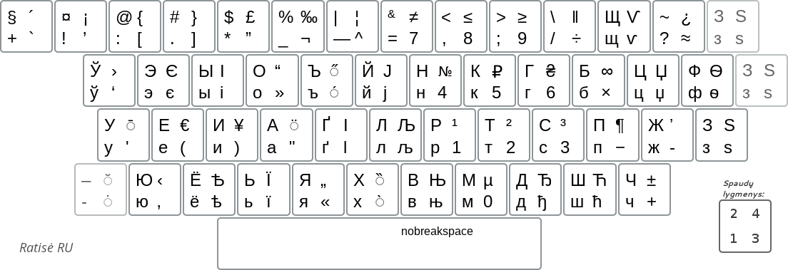

[Skaityti lietuviškai](README.md)

------------------------------------

# Lithuanian Ergonomic Keyboard Layout "Ratise"

version 2.0

------------------------------------------------------------------------------------

------------------------------------------------------------------------------------

### Supplement Cyrillic (Russian) Phonetic Layout for Lithuanian Ergonomic Keyboard "Ratise":

------------------------------------------------------------------------------------

+ The specifications of this keyboard layout you can find in:  [txt](SPECIFICATIONS.txt)

[Read more about LEK "Ratise" layout (in lithuanian)](README.md)

+ _LEK "Ratise" Keyboard Layout_ drivers are available for __Windows, MacOS, Linux (xkb), Haiku__ operating systems:

[Download LEK "Ratise" layout](https://github.com/albuck/Ratise-keymap/zipball/master)

------------------------------------------------------------------------------------

#### Other links:

[Standard ergonomic layout computer keyboard](https://albuck.github.io/SEL-keyboard/)

[Ergonomic Keyboard Reviews](http://xahlee.info/kbd/ergonomic_keyboards_index.html)
