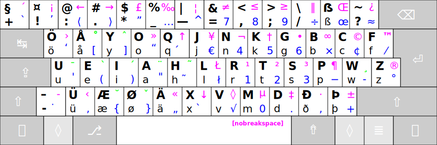
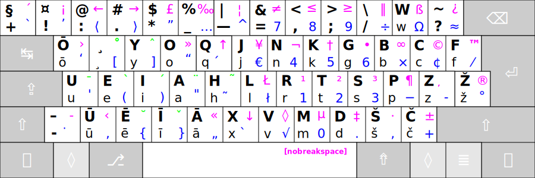
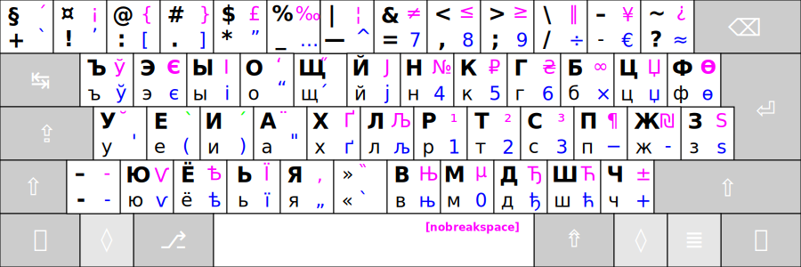

[To the top](../README_eng.md)

ADDITIONAL LAYOUTS
------------------

These are four level layouts:

 1. first level
 2. shifted second level
 3. AltGr third level
 4. shifted AltGr fourth level
 
 ------------------------------------------------------------------------------------

### Germanic Ratise:

† Supplement Germanic Phonetic Layout for Lithuanian Ergonomic Keyboard layout "Ratise".

------------------------------------------------------------------------------------

### Latvian Ratise:

† Supplement Latvian Phonetic Layout for Lithuanian Ergonomic Keyboard layout "Ratise".

------------------------------------------------------------------------------------

### Cyrillic Ratise:

† Supplement Cyrillic (Russian) Phonetic Layout for Lithuanian Ergonomic Keyboard layout "Ratise".

------------------------------------------------------------------------------------

[›› Download "Ratise" layout ‹‹](https://github.com/albuck/Ratise-layout/zipball/master)

