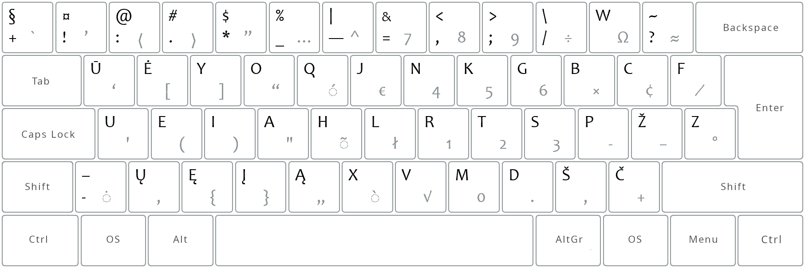

# KAIP IR KODĖL ATSIRADO RATISĖS IŠDĖSTYMAS

Tikriausiai akivaizdu, kad kiek profesionalesnis kompiuterio naudojimas reikalauja gerų teksto rinkimo klaviatūra įgūdžių… Taigi, pradėjęs mokytis rinkti tekstus visais pirštais (lietuvišku _ĄŽERTY Standartiniu_ išdėstymu, jis ne ką geresnis už _QWERTY Baltic-Numeric_), nežiūrint į klaviatūrą, susidūriau su nepatogumais ir pirštų skausmais. Spausdinant tokiu nevykusiu išdėstymu pirštai padrikai šokinėja po klaviatūrą, ir dažnai į nepatogias vietas. Vieni pirštai „tinginiauja“, kiti gi — persidirba. Toks išdėstymas neturi jokios logikos ir yra sunkiai įsimenamas. Tai suvokęs, priėjau išvados, kad turėtų būti geresnis sprendimas. Taip to geresnio sprendimo ieškojimas ir atvedė mane į [VLKK](http://www.vlkk.lt/) diskusijas (panaikintos). Kur ir užsimezgė būsimoji Ratisė:

+ [„Ergonomiška klaviatūra“ (iš web.archive.org)](https://web.archive.org/web/20071101094827/http://www.vlkk.lt/diskusijos/tema.3095.1.html)

Laimei, tuose pokalbiuose atradau Remigijų, jo protingus patarimus bei jo sukurtą išdėstymą:

+ [„Lietuviškos klaviatūros apmatai“ (iš web.archive.org)](https://web.archive.org/web/20080315055411/http://pradmenes.net/tekstu_katalogas/remigijus/klaviatura.html)

Šis Remigijaus lietuviškas klaviatūros išdėstymas ir tapo Ratisės išeities tašku.

Pradėjęs bandyti Remigijaus išdėstymą ir jame radau dalykų, kurie man netiko, pirmiausia, norėjau išlyginti spausdinimo krūvį tenkantį pirštams pagal tų pirštų pajėgumą: pertvarkiau kairės rankos balsių skiltis. Antra, pašalinau dešinės rankos mažojo piršto dažnokus ir nepatogius raidžių derinius ```dž``` ir ```šč```.  Gavau ir dalykiškų pastabų — „dažnai reikalingi skyrybos ženklai trečiame lygyje!“ — tikrai negerai, taigi, skyrybos ženklai nukeliavo viršun. Nelietuviškos raidės iš trečiojo lygio nukeliavo į laisvus mygtukus. Gavau pagalbos skaičiuojant raidžių dažnius lietuviškame rašte. Padėka pagelbėjusiems.

Taip tobulinant Remigijaus išdėstymą ir užgimė [Tikrinė](images/sena_tikrine.png) — ne „tikroji“, kaip tikėjausi, o „tikrinamoji“. Ir taip, juk tai buvo tik sumąstytas ir nupieštas išdėstymas, spausdinti aš juo nemokėjau, bei ir šiaip, apie visus tuos klaviatūrų reikalus mažai teišmaniau. Taigi, tikrai įvertinti ir išbaigti išdėstymo negalėjau. Tolimesniam išdėstymo tobulinimui reikėjo išmokti juo spausdinti ir visokeriopai išbandyti. Tai darant, teko keisti, kai kuriuos nevykusius sprendimus, ieškoti kitų — geresnių. Kaip žmonės sako: „gyveni ir mokais“…

Galų gale, tobulinimas buvo baigtas ir Ratisė įgavo savo dabartinį pavidalą:



Ar jums tiks toks išdėstymas, kiek jis yra geresnis — išbandykite ir spręskite patys. O iš anksto, galima tik pateikti kažkiek išdėstymą vertinančių skaičių bei palyginti juos su kitų išdėstymų skaičiais.

+ Lyginant su _QWERTY Baltic-Numeric_ spausdinant _Ratise_:
   - __4,7__ karto rečiau tam pačiam pirštui teks iš eilės vėl iškart spausti mygtuką;
   - __2__ kart rečiau teks tos pačios rankos pirštams vėl iškart spausti mygtuką;
   - __1,5__ karto rečiau teks spausti keitimo mygtukus (<kbd>Shift</kbd>, <kbd>AltGr</kbd>, <kbd>Shift</kbd>+<kbd>AltGr</kbd>);
   - __1,5__ karto pirštai eis mažesnį atstumą.

+ Lyginant su _ĄŽERTY Lithuanian Standard_ spausdinant _Ratise_:
   - __3,6__ karto rečiau tam pačiam pirštui teks iš eilės vėl iškart spausti mygtuką;
   - __2__ kart rečiau teks tos pačios rankos pirštams vėl iškart spausti mygtuką;
   - __1,3__ karto rečiau teks spausti keitimo mygtukus (<kbd>Shift</kbd>, <kbd>AltGr</kbd>, <kbd>Shift</kbd>+<kbd>AltGr</kbd>);
   - __1,4__ karto pirštai eis mažesnį atstumą.

+ Lyginant su _QGRLDČ LEKP_ spausdinant _Ratise_:
   - __1,8__ karto rečiau tam pačiam pirštui teks iš eilės vėl iškart spausti mygtuką;
   - __1,9__ karto rečiau teks tos pačios rankos pirštams vėl iškart spausti mygtuką;
   - __1,3__ karto rečiau teks spausti keitimo mygtukus (<kbd>Shift</kbd>, <kbd>AltGr</kbd>, <kbd>Shift</kbd>+<kbd>AltGr</kbd>);
   - pirštai eis panašų atstumą (priklausomai nuo teksto, kai kur Ratisė mažesnį, kai kur LEKP).

<details>
<summary>Lietuviškų klaviatūros išdėstymų tekstinės diagramos</summary>
<pre style="font-size: 60%">


 ŪĖYOQJ Ratisė ISO:
┏━━━┯━━━┯━━━┯━━━┯━━━┯━━━┯━━━┯━━━┯━━━┯━━━┯━━━┯━━━┯━━━┳━━━━━━━┓
┃ + │ ! │ : │ . │ * │ _ │ — │ = │ , │ ; │ / │ W │ ? ┃     ⌫ ┃
┣━━━┷━┱─┴─┬─┴─┬─┴─┬─┴─┬─┴─┬─┴─┬─┴─┬─┴─┬─┴─┬─┴─┬─┴─┬─┺━┳━━━━━┫
┃ ↹   ┃ Ū │ Ė │ Y │ O │ Q │ J │ N │ K │ G │ B │ C │ F ┃     ┃
┣━━━━━┻┱──┴┬──┴┬──┴┬──┴┬──┴┬──┴┬──┴┬──┴┬──┴┬──┴┬──┴┬──┺┓  ⏎ ┃
┃ ⇬    ┃ U │ E │ I │ A │ H │ L │ R │ T │ S │ P │ Ž │ Z ┃    ┃
┣━━━━┳━┹─┬─┴─┬─┴─┬─┴─┬─┴─┬─┴─┬─┴─┬─┴─┬─┴─┬─┴─┬─┴─┲━┷━━━┻━━━━┫
┃ ⇧  ┃ - │ Ų │ Ę │ Į │ Ą │ X │ V │ M │ D │ Š │ Č ┃        ⇧ ┃
┣━━━━┻━┳━┷━┳━┷━┳━┷━┱─┴───┴───┴───┴───┴─┲━┷━┳━┷━┳━┻━┳━━━┳━━━━┫
┃ ⎈    ┃ ƒ ┃ ◇ ┃ ⎇ ┃                   ┃ ⇮ ┃ ⇨ ┃ ◇ ┃ ≣ ┃  ⎈ ┃
┗━━━━━━┻━━━┻━━━┻━━━┻━━━━━━━━━━━━━━━━━━━┻━━━┻━━━┻━━━┻━━━┻━━━━┛


 QGRLDČ LEKP ISO:
┏━━━┯━━━┯━━━┯━━━┯━━━┯━━━┯━━━┯━━━┯━━━┯━━━┯━━━┯━━━┯━━━┳━━━━━━━┓
┃ ` │ / │ \ │ . │ , │ F │ ! │ W │ Ų │ Į │ ( │ ) │ : ┃     ⌫ ┃
┣━━━┷━┱─┴─┬─┴─┬─┴─┬─┴─┬─┴─┬─┴─┬─┴─┬─┴─┬─┴─┬─┴─┬─┴─┬─┺━┳━━━━━┫
┃ ↹   ┃ Q │ G │ R │ L │ D │ Č │ J │ U │ Ė │ Ę │ ? │ = ┃     ┃
┣━━━━━┻┱──┴┬──┴┬──┴┬──┴┬──┴┬──┴┬──┴┬──┴┬──┴┬──┴┬──┴┬──┺┓  ⏎ ┃
┃ ⇬    ┃ A │ K │ S │ T │ M │ P │ N │ E │ I │ O │ Y │ ' ┃    ┃
┣━━━━┳━┹─┬─┴─┬─┴─┬─┴─┬─┴─┬─┴─┬─┴─┬─┴─┬─┴─┬─┴─┬─┴─┲━┷━━━┻━━━━┫
┃ ⇧  ┃ ; │ Z │ X │ C │ V │ Ž │ Š │ B │ Ū │ Ą │ H ┃        ⇧ ┃
┣━━━━┻━┳━┷━┳━┷━┳━┷━┱─┴───┴───┴───┴───┴─┲━┷━┳━┷━┳━┻━┳━━━┳━━━━┫
┃ ⎈    ┃ ƒ ┃ ◇ ┃ ⎇ ┃                   ┃ ⇮ ┃ ⇨ ┃ ◇ ┃ ≣ ┃  ⎈ ┃
┗━━━━━━┻━━━┻━━━┻━━━┻━━━━━━━━━━━━━━━━━━━┻━━━┻━━━┻━━━┻━━━┻━━━━┛


 ĄŽERTY Lithuanian Standard ISO:
┏━━━┯━━━┯━━━┯━━━┯━━━┯━━━┯━━━┯━━━┯━━━┯━━━┯━━━┯━━━┯━━━┳━━━━━━━┓
┃ ` │ ! │ - │ / │ ; │ : │ , │ . │ = │ ( │ ) │ ? │ X ┃     ⌫ ┃
┣━━━┷━┱─┴─┬─┴─┬─┴─┬─┴─┬─┴─┬─┴─┬─┴─┬─┴─┬─┴─┬─┴─┬─┴─┬─┺━┳━━━━━┫
┃ ↹   ┃ Ą │ Ž │ E │ R │ T │ Y │ U │ I │ O │ P │ Į │ W ┃     ┃
┣━━━━━┻┱──┴┬──┴┬──┴┬──┴┬──┴┬──┴┬──┴┬──┴┬──┴┬──┴┬──┴┬──┺┓  ⏎ ┃
┃ ⇬    ┃ A │ S │ D │ Š │ G │ H │ J │ K │ L │ Ų │ Ė │ Q ┃    ┃
┣━━━━┳━┹─┬─┴─┬─┴─┬─┴─┬─┴─┬─┴─┬─┴─┬─┴─┬─┴─┬─┴─┬─┴─┲━┷━━━┻━━━━┫
┃ ⇧  ┃ < │ Z │ Ū │ C │ V │ B │ N │ M │ Č │ F │ Ę ┃        ⇧ ┃
┣━━━━┻━┳━┷━┳━┷━┳━┷━┱─┴───┴───┴───┴───┴─┲━┷━┳━┷━┳━┻━┳━━━┳━━━━┫
┃ ⎈    ┃ ƒ ┃ ◇ ┃ ⎇ ┃                   ┃ ⇮ ┃ ⇨ ┃ ◇ ┃ ≣ ┃  ⎈ ┃
┗━━━━━━┻━━━┻━━━┻━━━┻━━━━━━━━━━━━━━━━━━━┻━━━┻━━━┻━━━┻━━━┻━━━━┛


 QWERTY Baltic-Numeric+ ISO:
┏━━━┯━━━┯━━━┯━━━┯━━━┯━━━┯━━━┯━━━┯━━━┯━━━┯━━━┯━━━┯━━━┳━━━━━━━┓
┃ ` │ Ą │ Č │ Ę │ Ė │ Į │ Š │ Ų │ Ū │ „ │ “ │ - │ Ž ┃     ⌫ ┃
┣━━━┷━┱─┴─┬─┴─┬─┴─┬─┴─┬─┴─┬─┴─┬─┴─┬─┴─┬─┴─┬─┴─┬─┴─┬─┺━┳━━━━━┫
┃ ↹   ┃ Q │ W │ E │ R │ T │ Y │ U │ I │ O │ P │ [ │ ] ┃     ┃
┣━━━━━┻┱──┴┬──┴┬──┴┬──┴┬──┴┬──┴┬──┴┬──┴┬──┴┬──┴┬──┴┬──┺┓  ⏎ ┃
┃ ⇬    ┃ A │ S │ D │ Š │ G │ H │ J │ K │ L │ ; │ ' │ \ ┃    ┃
┣━━━━┳━┹─┬─┴─┬─┴─┬─┴─┬─┴─┬─┴─┬─┴─┬─┴─┬─┴─┬─┴─┬─┴─┲━┷━━━┻━━━━┫
┃ ⇧  ┃ — │ Z │ X │ C │ V │ B │ N │ M │ , │ . │ / ┃        ⇧ ┃
┣━━━━┻━┳━┷━┳━┷━┳━┷━┱─┴───┴───┴───┴───┴─┲━┷━┳━┷━┳━┻━┳━━━┳━━━━┫
┃ ⎈    ┃ ƒ ┃ ◇ ┃ ⎇ ┃                   ┃ ⇮ ┃ ⇨ ┃ ◇ ┃ ≣ ┃  ⎈ ┃
┗━━━━━━┻━━━┻━━━┻━━━┻━━━━━━━━━━━━━━━━━━━┻━━━┻━━━┻━━━┻━━━┻━━━━┛


Keitimo-valdymo mygtukų ženklinimų reikšmės:

⌫ — Backspace key — Trynimo mygtukas.
⏎ — Enter key — Įvedimo mygtukas.
↹ — Tab key — Atitraukimo mygtukas.
⇬ — Caps Lock key — Didžiųjų raidžių rakinimo mygtukas.
⇧ — Shift key — Didžiųjų raidžių (antrojo lygio) įjungimo mygtukas.
⇮ — AltGr key — Kitokio ženklo (grafikos) įvedimo mygtukas.
⎇ — Alt key — Kitokio įvedimo būdo pasirinkimo mygtukas.
⎈ — Ctrl key — Valdymo mygtukas.
≣ — Menu key (optional) — Sąrašo (Meniu) mygtukas (neprivalomas).
◇ — System key (optional) — Vėliavos (Sistemos) mygtukas (neprivalomas).
ƒ — Fn, Function key (optional) — Veikmens (Funkcijos) mygtukas (neprivalomas).
⇨ — Group selection key (optional) — Kito raidyno pasirinkimo mygtukas (neprivalomas).

</pre>
</details>
<br>

__Pastaba:__ duotieji skaičiai yra imti iš „Lietuviškų pasakų iš Basanavičiaus rinkinio“ [skaidymo (Keyboard Layout Analyzer)](http://patorjk.com/keyboard-layout-analyzer/#/load/DLqKXSHF).

__Arba__, kitaip sakant, anot [Keyboard Layout Analyzer : KLAnext v0.06](https://klanext.keyboard-design.com/#/about) puslapio patikros ([Lietuviškos pasakos](https://albuck.github.io/lithuanian-keyboard-layouts/images/test-klanext-lt-txt.png)), [renkant visais pirštais](spausdinimo-visais-pirstais-tvarka.md) minimą lietuvišką tekstą kitais išdėstymais nei _Ratisė_, jums prireiks pastebimai daugiau pastangų (išreikštos nuošimčiais, lyginant su Ratise (ISO) — 0%):

+ _LEKP (ISO)_ — __+37%__
+ _Lithuanian Standard (ISO)_ — __+79%__ 
+ _Baltic-Numeric (ISO)_ — __+91%__


-------------------------

[Ratisės našumo palyginimas su kitais išdėstymais](lt-isdestymu-palyginimas.md)

[Lietuviškų klaviatūros išdėstymų palyginimas](https://albuck.github.io/lithuanian-keyboard-layouts/)

[Į pradžią](../README.md)
