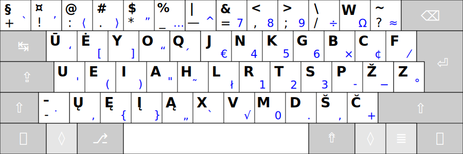

# Valdymo-keitimo mygtukų ženkliukai ir pavadinimai



Skirtingų gamintojų klaviatūrose ir skaitmeninėje įrangoje valdymo-keitimo mygtukai gali būti pažymėti ir pavadinti skirtingai:

- ```↹``` — ⭾, ⇥, Tab, Tabular, Tabulator; Atitraukimas, Įtraukimas.
- ```⇪``` — ⮸, ⇬, 🄰, 🅰, Caps, Caps Lock; Didž, Didžiosios, Didžios.
- ```⇧``` — ⬆, ⭡, Shift, Level 2; Lyg2, Aukšt, Aukštinis, Aukštesnysis, Antrasis lygis, Antrinis.
- ```⎈``` — ✲, Ctrl, Control; Vald, Valdymas, Valdinis.
- ```◊``` — ◇, ❖, OS, Super, System, Cmd, Command, ⌘ Command (MacOS), ⊞ Win,  Windows, ◆ Meta, Logo; Vėliava, Vadinis, Vada.
- ```⎇``` — Alt, Alternate, Alternatyve, Opt, ⌥ Option (MacOS); Kitaip.
- ```⇮``` — AltGr, Alternate Graphic, Opt, ⌥ Option (MacOS), Level 3; Lyg3, Trečiasis lygis, Tretinis, Kitas, Kitkis.
- ```≣``` — ≡, Menu, Mn, Application; Meniu, Sąrašas.
- ```⏎``` — ↵, ⎆, ↩, Enter, Return; Įvesti, Įvedimas.
- ```⌫``` — ← Backspace; Trinti, Trynimas.

__Pastabos:__ 
+ Lyginant su įprastomis klaviatūromis [Apple klaviatūroje](https://upload.wikimedia.org/wikipedia/commons/e/ea/Apple_iMac_Keyboard_A1243.png) mygtukai ```⌥ Option (⎇ Alt)``` ir ```⌘ Command (⊞ Win)``` savo padėtimi yra sukeisti vietomis.
+ Šviesiai pilkų mygtukų ar mygtuko gali nebūti klaviatūroje.
+ Tarp kairiųjų ```Ctrl``` ir ```OS``` mygtukų kai kuriose klaviatūrose įsiterpia ```Fn``` mygtukas: su juo kartu spaudžiant kitą kokį klaviatūros mygtuką gali būti keičiamas pastarojo veikmuo (funkcija), t. y. tasis gali laikinai pavirsti į kitą mygtuką, kurio, pavyzdžiui, nėra/trūksta klaviatūroje.
 
-----------------------------------------

[Į pradžią](../README.md)
