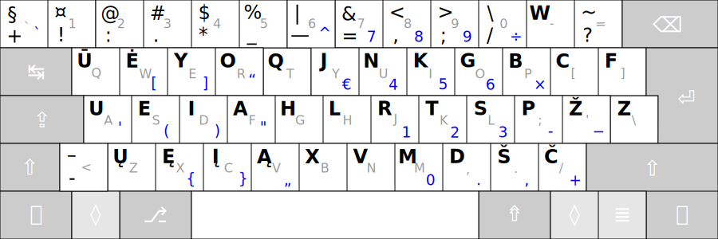

# Valdymo mygtukų ženkliukai ir pavadinimai



Skirtingų gamintojų klaviatūrose ir skaitmeninėje įrangoje valdymo mygtukai gali būti pažymėti ir vadinami skirtingai:

- ```↹``` — ⭾, ⇥, Tab, Tabular, Tabulator; Atitraukimas, Atatraukimas (Ata), Įtraukimas.
- ```⇪``` — ⮸, ⇬, 🄰, 🅰, Caps, Caps Lock; Didž, Didžiosios, Didžios.
- ```⇧``` — Shift, Level 2; Aukšt, Aukštinis, Aukštesnis, Antrasis lygis, Antrinis.
- ```⎈``` — ✲, Ctrl, Control; Vald, Valdymas, Valdinis.
- ```◊``` — ◇, OS, Super, System, Cmd, Command, ⌘ Command (MacOS), ⊞ Win,  Windows, ◆ Meta, Logo; Vėliava, Vadinis, Vada.
- ```⎇``` — Alt, Alternate, Alternatyve, Opt, ⌥ Option (MacOS); Kitaip.
- ```⇮``` — AltGr, Alternate Graphic, Opt, ⌥ Option (MacOS), Level 3; Trečiasis lygis, Tretinis, Kitas.
- ```≣``` — Menu, Mn, Application; Meniu, Sąrašas.
- ```⏎``` — ↵, ⎆, ↩, Enter, Return; Įvesti, Įvedimas.
- ```⌫``` — ← Backspace; Trinti, Trynimas.

__Pastaba:__ lyginant su įprastomis klaviatūromis [Apple klaviatūroje](https://upload.wikimedia.org/wikipedia/commons/e/ea/Apple_iMac_Keyboard_A1243.png) mygtukai ```⌥ Option (⎇ Alt)``` ir ```⌘ Command (⊞ Win)``` savo padėtimi yra sukeisti vietomis.

-----------------------------------------

[Į pradžią](../README.md)
