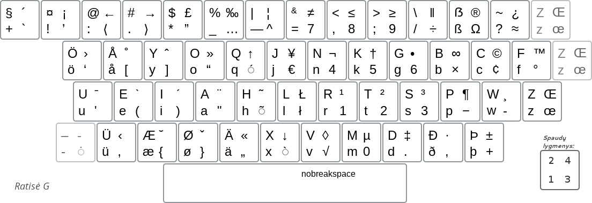

[Į pradžią](../README.md)

RATISĖS GERMANIŠKAS IŠDĖSTYMAS
--------------------------------

Tai yra papildomas ratisės išdėstymas, kuriame germanų kalbų raidės išdėstytos vietoje lietuviškųjų pagal garso ar kitą panašumą.
Ratisės germaniškasis išdėstymas leidžia patogiai rinkti tekstus germanų kalbomis.
