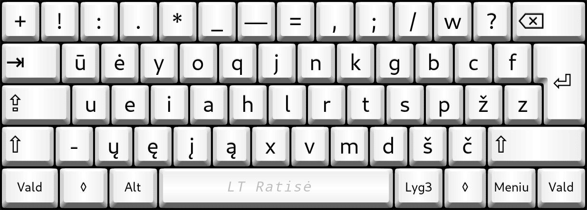
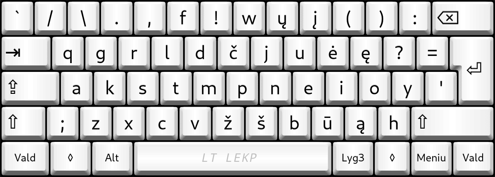
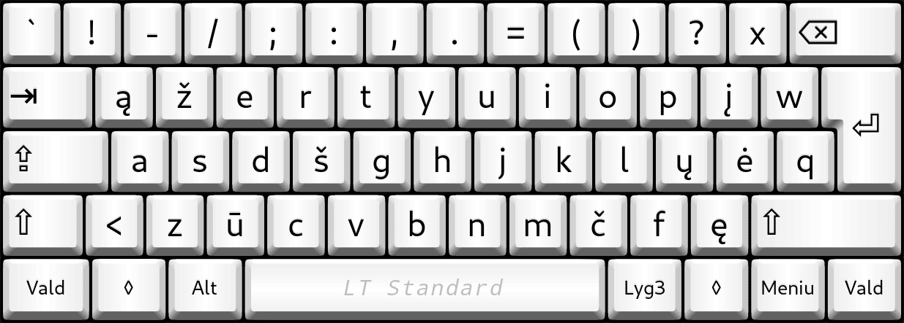
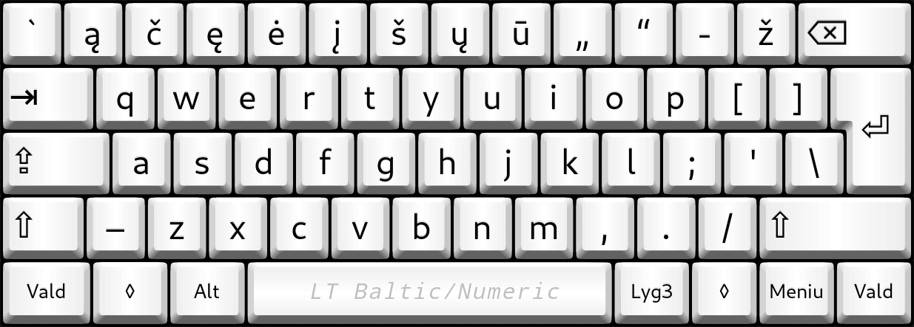

# Pagrindinių lietuviškų klaviatūros išdėstymų palyginamoji statistika

## Palyginami tokie lietuviški klaviatūrų išdėstymai:

  __Ratisė (ŪĖYOQJ):__

   

  __LEKP (QGRLDČ):__

   

  __Standard (ĄŽERTY):__

   

  __Baltic/Numeric (QWERTY):__

   

+ Duomenys imti iš [Keyboard Layout Analyzer](http://patorjk.com/keyboard-layout-analyzer/#/main) puslapio.

+ __Duomenų pateikimo pavidalas:__ „Pirmenybė“. „Išdėstymas“ — „išdėstymo įvertinimo taškai“

Skaičiuojant taškus atsižvelgiama į pirštų nueinamą atstumą (33%), kaip dažnai tam pačiam pirštui tenka iš eilės spaudinėti (33%), bei kaip dažnai spausdinant kaitaliojami pirštai (17%) ir rankos (17%).

__Pastabos.__ Patikroje septintas viršutinis mygtukas (QWERTY skaičių eilėje ‘6’) priskirtas kairiajam smiliui ir vienuoliktas (QWERTY ‘0’) dešiniajam bevardžiui, klaviatūrose su skersuotais mygtukais taip patogiau; taip pat perskirtose klaviatūrose tas septintas mygtukas paprastai būna kairėje pusėje. Perpaskyrus, kaip įprastai turėtų būti, patikros taškai gali nežymiai skirtis. Išdėstymuose patikroje yra suvienodinti ilgieji brūkšniai.

## Lietuviško teksto skaidymas:

+ [Keyboard Layout Analyzer: Lietuviškų dažnų žodžių šimtukas](http://patorjk.com/keyboard-layout-analyzer/#/load/sld9vR0J)

   1. __Ratise (ISO) — 76.16__
   2. LEKP (ISO) — 69.00
   3. LT Standard 2000 (ISO) — 58.80
   4. QWERTY Baltic+ (ISO) — 57.39

+ [Keyboard Layout Analyzer: Paprasti rašiniai](http://patorjk.com/keyboard-layout-analyzer/#/load/WFx8NwLB)

   1. __Ratise (ISO) — 71.52__
   2. LEKP (ISO) — 62.81
   3. LT Standard 2000 (ISO) — 50.21
   4. QWERTY Baltic+ (ISO) — 48.53

+ [Keyboard Layout Analyzer: Lietuvių kalbos literatūros terminų žodynėlis](http://patorjk.com/keyboard-layout-analyzer/#/load/Xz8wSZWp)

   1. __Ratise (ISO) — 67.93__
   2. LEKP (ISO) — 57.11
   3. LT Standard 2000 (ISO) — 43.05
   4. QWERTY Baltic+ (ISO) — 42.90

+ [Keyboard Layout Analyzer: Lietuvių padavimai](http://patorjk.com/keyboard-layout-analyzer/#/load/Qst6lLzQ)

   1. __Ratise (ISO) — 67.70__
   2. LEKP (ISO) — 60.51
   3. LT Standard 2000 (ISO) — 48.34
   4. QWERTY Baltic+ (ISO) — 45.20

+ [Keyboard Layout Analyzer: Lietuviškos pasakos (iš Basanavičiaus rinkinio)](http://patorjk.com/keyboard-layout-analyzer/#/load/FSp4k3hc)

   1. __Ratise (ISO) — 67.43__
   2. LEKP (ISO) — 58.00
   3. LT Standard 2000 (ISO) — 47.29
   4. QWERTY Baltic+ (ISO) — 44.22

+ [Keyboard Layout Analyzer: Vikipedijos straipsnis „Lietuva“](http://patorjk.com/keyboard-layout-analyzer/#/load/BC5Np6hg) (ilgieji brūkšniai ir tekstas netaisyti)

   1. __Ratise (ISO) — 61.03__
   2. LEKP (ISO) — 53.86
   3. LT Standard 2000 (ISO) — 41.62
   4. QWERTY Baltic+ (ISO) — 40.77

+ [Keyboard Layout Analyzer: Eglė Žalčių karalienė, Salomėja Nėris (pasaka-poema)](http://patorjk.com/keyboard-layout-analyzer/#/load/hqhrCnh0)

   1. __Ratise (ISO) — 55.97__ (72.24)
   2. LEKP (ISO) — 44.71 (65.20)
   3. LT Standard 2000 (ISO) — 36.58 (53.36)
   4. QWERTY Baltic+ (ISO) — 36.44 (49.86)

   - Skliaustuose — [šio teksto vienų žodžių skaičiai](http://patorjk.com/keyboard-layout-analyzer/#/load/4dh4lPx0).

## Angliško teksto skaidymas:

+ [Keyboard Layout Analyzer: List of the most commonly used words](http://patorjk.com/keyboard-layout-analyzer/#/load/dmGqDp7C)

   1. __Ratise (ISO) — 66.90__
   2. LEKP (ISO) — 66.73
   3. QWERTY Baltic+ (ISO) — 49.04
   4. LT Standard 2000 (ISO) — 46.72

+ [Keyboard Layout Analyzer: Wikipedia “Physics”](http://patorjk.com/keyboard-layout-analyzer/#/load/qnJ2s2Gk)

   1. __Ratise (ISO) — 63.59__
   2. LEKP (ISO) — 58.91
   3. QWERTY Baltic+ (ISO) — 47.45
   4. LT Standard 2000 (ISO) — 42.70

+ [Keyboard Layout Analyzer: Alice in Wonderland, Chapter 1](http://patorjk.com/keyboard-layout-analyzer/#/load/bFvC6HlX)

   1. __Ratise (ISO) — 62.38__
   2. LEKP (ISO) — 60.28
   3. QWERTY Baltic+ (ISO) — 52.89
   4. LT Standard 2000 (ISO) — 47.08

## Programavimo kalbų teksto skaidymas:

+ [Keyboard Layout Analyzer: ‘Programming Punctuation Torture Test’](http://patorjk.com/keyboard-layout-analyzer/#/load/w95Sqrdr)

   1. __Ratise (ISO) — 46.95__
   2. LT Standard 2000 (ISO) — 34.29
   3. QWERTY Baltic+ (ISO) — 22.23
   4. LEKP (ISO) — 22.14

+ [Keyboard Layout Analyzer: ‘HTML, JavaScript’](http://patorjk.com/keyboard-layout-analyzer/#/load/H5lW3zvN)

   1. __Ratise (ISO) — 45.88__
   2. LEKP (ISO) — 39.76
   3. QWERTY Baltic+ (ISO) — 35.70
   4. LT Standard 2000 (ISO) — 31.38

+ [Keyboard Layout Analyzer: ‘Bash, C, CPP, Python’](http://patorjk.com/keyboard-layout-analyzer/#/load/JmF3vLs9)

   1. __Ratise (ISO) — 44.80__
   2. LEKP (ISO) — 41.96
   3. LT Standard 2000 (ISO) — 35.83
   4. QWERTY Baltic+ (ISO) — 32.33

## Lotyniško teksto „Lorem Ipsum“ skaidymas:

+ [Keyboard Layout Analyzer: Lorem Ipsum](http://patorjk.com/keyboard-layout-analyzer/#/load/hfj6plsw)

   1. __Ratise (ISO) — 70.69__
   2. LEKP (ISO) —  	67.92
   3. QWERTY Baltic+ (ISO) — 48.67
   4. LT Standard 2000 (ISO) — 46.24

## Išvados:

+ Iš visų aukščiau tikrintų, [Ratisės](images/kb-lt-ratise.svg) išdėstymas geriausiai tinka lietuvių, anglų bei programavimo kalbų tekstams rinkti, t. y. su _Ratise_ atliksite tą patį darbą ženkliai patogiau ir lengviau negu su kitais išdėstymais.
+ _Ratisės_ išdėstyme darbo krūvis tenkantis pirštams yra sumažintas (spausdindami pirštai nukeliauja mažesnį atstumą, rečiau tam pačiam pirštui prireikia vėl iškart spausti, spausdinant dažniau yra kaitaliojamos rankos ir pirštai) ir išlygintas pagal tų pirštų pajėgumą (jėgą ir vikrumą), todėl spausdindami _Ratise_ išvengsite ypatingo atskirų pirštų pervargimo (ir iš to sekančio skausmo).
+ [LT Standard 2000](https://www.registrucentras.lt/litwin/kbdlts.gif) ir _Baltic+_ išdėstymai prastai pasirodo ir lietuviškuose, ir angliškuose, ir programavimo tekstuose.
+ [LT Standard 2000](https://www.registrucentras.lt/litwin/kbdlts.gif) ir _Baltic+_ išdėstymuose dažnai dažniau reikalingi ženklai išdėstyti toliau nuo pagrindinės pirštų padėties, daug dažniau kai kuriems pirštams tenka iš eilės spaudinėti vėl mygtukus, pirštai nueina didesnį atstumą spausdindami, kai kurie pirštai yra perkrauti darbu ne pagal jų pajėgumą. Ženklai šiuose išdėstymuose išdėstyti netvarkingai: visiškai neatsižvelgta nei į pirštų pajėgumą, nei į teksto rinkimo ritmą, nei į raidžių dažnumą ir eiliškumą žodžiuose.

__Pastabos.__ Vadinamieji išdėstymai _Lithuanian [Baltic](https://www.registrucentras.lt/litwin/kbdltb.gif), [Numeric/Skaičiukinis](https://www.registrucentras.lt/litwin/kbdlt1.gif), [Skaičiukinis pagerintas](https://rimas.kudelis.lt/numeric/), [LEKP Baltic+](https://lekp.info/images/baltic+.jpg)_ yra vienas ir tas pats išdėstymas su [mažai reikšmingais patikrai skirtumais](http://patorjk.com/keyboard-layout-analyzer/#/load/BWsjctw1), manasis _QWERTY Baltic+ (ISO)_, čia, ko gero, netgi geresnis patikrai (nes turi papildomą ilgąjį brūkšnį ir lietuviškas kabutes pirmame lygyje). _Lithuanian Standard_ arba _Lietuviška standartinė klaviatūra_ turi du valstybinius standartus (LST 1582:2000 ir LST 1582:2012), senu įpratimu rašau _LT Standard 2000_, abiejų standartų išdėstymai nesiskiria vienas nuo kito. ‘Programming Punctuation Torture Test’ paimtas iš [stevep99 puslapio](https://stevep99.github.io/keyboard-layout-analyzer/#/main).

### Kiti išdėstymų pirvalumai:
+ _Ratisės_ išdėstymas turi tvarkingai išdėstytus ženklus, todėl yra lengviau ir greičiau įsimenamas.
+ _Ratisės_ išdėstymas turi uždėtinius priegaidžių ženklelius ir kirčiuotas lietuviškas raides (per tęsties lygius).
+ _Ratisės_ išdėstymas turi daug daugiau papildomų (kad ir rečiau reikalingų) rašto ženklų.
+ _Ratisės_ išdėstymu galima įvesti kitų Europos kalbų raides (per tęsties lygius).
+ _Ratisė_ ir _LEKP_ yra pritaikyti teksto rinkimui visais pirštais, nežiūrint į klaviatūrą.
+ _Baltic/Numeric_ raidės sutampa su angliškojo _QWERTY_ raidėmis, kurios dažniausiai ir būna užpaišytos and pačių klaviatūrų mygtukų, kas yra labai patogu naujokui susiieškoti klaviatūroje tas raides. (Reik manyti, tai yra pagrindinė priežastis, kodėl šis išdėstymas išplito pas mus ir vis dar yra labiausiai naudojamas.)
+ _Baltic/Numeric_ išdėstymas yra visur platinamas ir žinomas, kaip numatytasis „Lithuanian/Lietuvių“.
+ _Lithuanian Standard_ išdėstymas yra platinamas valstybinės įstaigos.
+ _Baltic/Numeric_ išdėstymo ženklai dažnai būna papildomai užžymėti ant Lietuvoje parduodamų klaviatūrų.
+ _Baltic/Numeric_ išdėstymas yra pritaikytas labiau spausdinti vienu/dviem/keliais pirštais žiūrint į klaviatūrą ir ieškant, kur kokia yra raidė.
+ _Baltic/Numeric_ ir _Lithuanian standard_ išdėstymų paprastai nereikia papildomai įdieginėti.

### Priedai:

+ [Lietuviškų klaviatūros išdėstymų našumo palyginimas](lt-isdestymu-palyginimas.md)
+ [Pagrindinių lietuviškų klaviatūros išdėstymų palyginamosios statistinės lentelės](lt-isdestymu-statistines-lenteles.md)
+ [Papildomų esamų ir galimų lietuviškų klaviatūros išdėstymų palyginamoji statistika](papildomu-isdestymu-statistika.md)

-----------------------------------------

+ [Į pradžią](../README.md)
