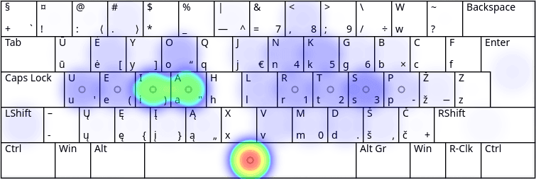
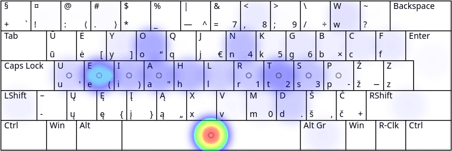
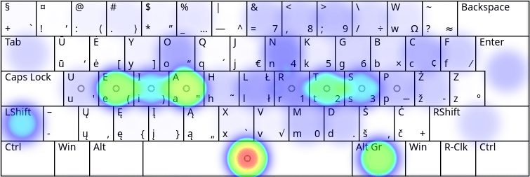

# RATISĖS MYGTUKŲ SPAUDELIOJIMO DAŽNUMAI

Mygtukų paspaudimo dažnumas yra iš anksto apspręstas raidžių dažnumo lietuviškame rašte ([iasteourknlpmdvjėgšbžyųąįūčęczhf](lt-raidziu-daznumas.txt)):

__i__ — 13,0%; __a__ — 12,0%; __s__ — 8,0%; __t__ — 5,6%; __e__ — 5,4%; __o__ — 5,4%; __u__ — 5,2%; __r__ — 5,1%; __k__ — 5,0%; __n__ — 4,8%; __l__ — 3,2%; __p__ — 3,0%; __m__ — 3,0%; __d__ — 2,7%; __v__ — 2,5%; __j__ — 2,2%; __ė__ — 2,2%; __g__ — 2,0%; __š__ — 1,7%; __b__ — 1,5%; __ž__ — 1,1%; __y__ — 1,1%; __ų__ — 0,9%; __ą__ — 0,8%; __į__ — 0,7%; __ū__ — 0,5%; __č__ — 0,4%; __ę__ — 0,4%; __c__ — 0,2%; __z__ — 0,2%; __h__ — 0,1%; __f__ — 0,1%.

Tai yra didesnio ėminio paapvalinti skaičiai, atskiruose tekstuose jie kažkiek svyruos.

Antras atsižvelgtinas dalykas yra žodžių skyrybos ženklų vartosena, kuri taip pat, vėlgi, kažkiek įvairuos skirtinguose tekstuose.

Tad, akivaizdu, kad [spausdinant visais pirštais](spausdinimo-visais-pirstais-tvarka.md) patogesnis bus tas klaviatūros išdėstymas, kuriame dažniau naudojamos raidės bei dažnesni skyrybos ženklai yra patogesnėje, lengviau ir greičiau pasiekiamoje vietoje.

Žemiau pateikiami paveikslėliai su Ratisės išdėstymo klaviatūros mygtukų naudojimo dažnumu spausdinant tam tikrą tekstą. Ryškesnė spalva rodo didesnį mygtuko naudojimo dažnumą.

## Lietuviško teksto skaida

__Lietuviškos pasakos iš Basanavičiaus rinkinio:__

Pirštų užimtumas:
|Kairysis mažasis|Kairysis bevardis|Kairysis didysis|Kairysis smilius|Nykščiai|Dešinysis smilius|Dešinysis didysis|Dešinysis bevardis|Dešinysis mažasis|
|----------|-----------|----------|----------|--------|----------|----------|-----------|----------|
|   6,9%   |   7,2%    |   12,5%  |   15,1%  |  14,6% |   16,4%  |   12,4%  |    8,8%   |   6,3%   |

## Angliško teksto skaida

__Angliškas grožinis tekstas (Alice in Wonderland, Chapter 1):__

Pirštų užimtumas:
|Kairysis mažasis|Kairysis bevardis|Kairysis didysis|Kairysis smilius|Nykščiai|Dešinysis smilius|Dešinysis didysis|Dešinysis bevardis|Dešinysis mažasis|
|----------|-----------|----------|----------|--------|----------|----------|-----------|----------|
|   4,3%   |   9,5%    |    6,7%  |   17,0%  |  19,5% |   14,1%  |   13,1%  |    6,3%   |   9,4%   |

## Programavimo kalbų tekstas

__‘Bash, C, CPP, HTML, JavaScript, Python’ bendrai:__

Pirštų užimtumas:
|Kairysis mažasis|Kairysis bevardis|Kairysis didysis|Kairysis smilius|Nykščiai|Dešinysis smilius|Dešinysis didysis|Dešinysis bevardis|Dešinysis mažasis|
|----------|-----------|----------|----------|--------|----------|----------|-----------|----------|
|   8,0%   |   7,4%    |   6,4%   |   13,8%  |  15,6% |   15,3%  |   9,9%   |    9,8%   |   13,9%  |

__Pastaba:__ paveikslėliai imti iš [Keyboard Layout Analyzer](http://patorjk.com/keyboard-layout-analyzer/#/main) puslapio.

-------------------------

[Lietuviškų klaviatūros išdėstymų našumo palyginimas](lt-isdestymu-palyginimas.md)

[Į pradžią](../README.md)
