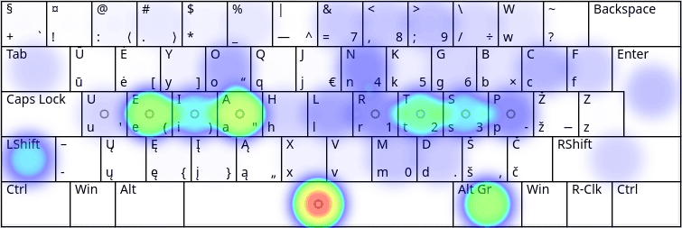

# RATISĖS MYGTUKŲ SPAUDELIOJIMO DAŽNUMAI IR IŠDĖSTYMO NAŠUMAS

Mygtukų paspaudimo dažnumas yra iš anksto apspręstas raidžių dažnumo lietuviškame rašte ([iasteourknlpmdvjėgšbžyųąįūčęczhf](lt-raidziu-daznumas.txt)):

|  i  |  a  |  s  |  t  |  e  |  o  |  u  |  r  |  k  |  n  |  l  |  p  |  m  |  d  |  v  |  j  |
|-----|-----|-----|-----|-----|-----|-----|-----|-----|-----|-----|-----|-----|-----|-----|-----|
|13,0%|12,0%| 8,0%| 5,6%| 5,4%| 5,4%| 5,2%| 5,1%| 5,0%| 4,8%| 3,2%| 3,0%| 3,0%| 2,7%| 2,5%| 2,2%|

|  ė  |  g  |  š  |  b  |  ž  |  y  |  ų  |  ą  |  į  |  ū  |  č  |  ę  |  c  |  z  |  h  |  f  |
|-----|-----|-----|-----|-----|-----|-----|-----|-----|-----|-----|-----|-----|-----|-----|-----|
| 2,2%| 2,0%| 1,7%| 1,5%| 1,1%| 1,1%| 0,9%| 0,8%| 0,7%| 0,5%| 0,4%| 0,4%| 0,2%| 0,2%| 0,1%| 0,1%|

Tai yra didesnio ėminio paapvalinti skaičiai, atskiruose tekstuose jie kažkiek svyruos.

Antras atsižvelgtinas dalykas yra žodžių skyrybos ženklų vartosena, kuri taip pat, vėlgi, kažkiek įvairuos skirtinguose tekstuose.

Tad, akivaizdu, kad [spausdinant visais pirštais](spausdinimo-visais-pirstais-tvarka.md) patogesnis bus tas klaviatūros išdėstymas, kuriame dažniau naudojamos raidės bei dažnesni skyrybos ženklai yra patogesnėje, lengviau ir greičiau pasiekiamoje vietoje.

Žemiau pateikiami paveikslėliai su Ratisės išdėstymo klaviatūros mygtukų naudojimo dažnumu spausdinant tam tikrą tekstą. Ryškesnė spalva rodo didesnį mygtuko naudojimo dažnumą.

 

## Lietuviško teksto skaida

__Lietuviškos pasakos iš Basanavičiaus rinkinio:__

||Kairysis mažasis|Kairysis bevardis|Kairysis didysis|Kairysis smilius|Abu nykščiu|Dešinysis smilius|Dešinysis didysis|Dešinysis bevardis|Dešinysis mažasis|
|------------------------|----------|-----------|----------|----------|--------|----------|----------|-----------|----------|
|    Pirštų užimtumas:   |   6,9%   |   7,2%    |   12,5%  |   15,1%  |  14,6% |   16,4%  |   12,4%  |    8,8%   |   6,3%   |
|Pirštų nueitas atstumas:|   7,5%   |   7,0%    |    7,7%  |   12,3%  |   0,2% |   26,5%  |   20,9%  |    5,9%   |  12,0%   |

 

### Lietuviškų klaviatūros išdėstymų našumo patikra lietuviškam tekstui:

   1. __ŪĖYOQJ Ratise (Ergodox) — 68.61__
   2. __ŪĖYOQJ Ratise (ANSI) — 67.64__
   3. __ŪĖYOQJ Ratise (ISO) — 67.42__
   4. QGRLDČ LEKP (Ergodox) — 60.81
   5. QGRLDČ LEKPa (ANSI) — 58.07
   6. QGRLDČ LEKP (ISO) — 57.94
   7. ĄŽERTY LT Standard 2000 (Ergodox) — 48.54
   8. ĄŽERTY IBM, LT Standard 1992 (Ergodox) — 48.01
   9. ĄŽERTY LT Standard 2000 (ANSI) — 47.74*
   10. ĄŽERTY LT Standard 2000 (ISO) — 47.29*
   11. ĄŽERTY IBM, LT Standard 1992 (ANSI) — 46.95
   12. ĄŽERTY IBM, LT Standard 1992 (ISO) — 46.82
   13. QWERTY Baltic-Numeric (Ergodox) — 46.51
   14. QWERTY Baltic-Numeric (ISO) — 46.40
   15. QWERTY Baltic-Numeric (ANSI) — 46.10

 

__Šaltiniai__ — Keyboard Layout Analyzer _Lietuviškos pasakos (iš Basanavičiaus rinkinio)_: [ISO](http://patorjk.com/keyboard-layout-analyzer/#/load/STk23sfB), [ANSI](http://patorjk.com/keyboard-layout-analyzer/#/load/rQDGFz81), [Ergodox](http://patorjk.com/keyboard-layout-analyzer/#/load/j3vlH9WZ)

 

## Angliško teksto skaida

__Angliškas grožinis tekstas (Alice in Wonderland, Chapter 1):__

||Kairysis mažasis|Kairysis bevardis|Kairysis didysis|Kairysis smilius|Abu nykščiu|Dešinysis smilius|Dešinysis didysis|Dešinysis bevardis|Dešinysis mažasis|
|------------------------|----------|-----------|----------|----------|--------|----------|----------|-----------|----------|
|    Pirštų užimtumas:   |   4,3%   |   9,5%    |    6,7%  |   17,0%  |  19,5% |   14,1%  |   13,1%  |    6,3%   |   9,4%   |
|Pirštų nueitas atstumas:|   4,6%   |   0,6%    |    4,1%  |   19,9%  |   8,8% |   18,2%  |   13,9%  |    4,0%   |  25,8%   |

 

### Lietuviškų klaviatūros išdėstymų našumo patikra angliškam tekstui:

   1. __ŪĖYOQJ Ratise (Ergodox) — 64.87__
   2. __ŪĖYOQJ Ratise (ANSI) — 62.52__
   3. __ŪĖYOQJ Ratise (ISO) — 62.43__
   4. QGRLDČ LEKP (Ergodox) — 61.86
   5. QGRLDČ LEKP (ISO) — 61.04
   6. QGRLDČ LEKPa (ANSI) — 60.63
   7. QWERTY Baltic-Numeric (Ergodox) — 54.33
   8. ĄŽERTY IBM, LT Standard 1992 (Ergodox) —53.70
   9. QWERTY Baltic-Numeric (ANSI) — 53.04
   10. QWERTY Baltic-Numeric (ISO) — 52.89
   11. ĄŽERTY IBM, LT Standard 1992 (ANSI) — 48.97
   12. ĄŽERTY IBM, LT Standard 1992 (ISO) — 48.95
   13. ĄŽERTY LT Standard 2000 (Ergodox) — 48.21
   14. ĄŽERTY LT Standard 2000 (ANSI) — 47.22*
   15. ĄŽERTY LT Standard 2000 (ISO) — 47.12*

 

__Šaltiniai__ — Keyboard Layout Analyzer _Alice in Wonderland, Chapter 1_: [ISO](http://patorjk.com/keyboard-layout-analyzer/#/load/8cXCDNrm), [ANSI](http://patorjk.com/keyboard-layout-analyzer/#/load/88skV92F), [Ergodox](http://patorjk.com/keyboard-layout-analyzer/#/load/z12tW3Lb)

 

## Programavimo kalbų tekstas

__‘Bash, C, CPP, HTML, JavaScript, Python’ bendrai:__

||Kairysis mažasis|Kairysis bevardis|Kairysis didysis|Kairysis smilius|Abu nykščiu|Dešinysis smilius|Dešinysis didysis|Dešinysis bevardis|Dešinysis mažasis|
|------------------------|----------|-----------|----------|----------|--------|----------|----------|-----------|----------|
|    Pirštų užimtumas:   |   8,0%   |   7,4%    |   6,8%   |   13,4%  |  15,6% |   15,3%  |   9,9%   |    9,8%   |   13,9%  |
|Pirštų nueitas atstumas:|  11,5%   |   1,1%    |   2,4%   |    8,3%  |  25,8% |   14,0%  |   6,8%   |    9,1%   |   20,9%  |

 

### Lietuviškų klaviatūros išdėstymų našumo patikra programavimo tekstui:

   1. __ŪĖYOQJ Ratise (Ergodox) — 55.76__
   2. QGRLDČ LEKP (Ergodox) — 52.90
   3. __ŪĖYOQJ Ratise (ANSI) — 46.82__
   4. __ŪĖYOQJ Ratise (ISO) — 45.97__
   5. QGRLDČ LEKP (ISO) — 40.92
   6. QGRLDČ LEKPa (ANSI) — 40.32
   7. QWERTY Baltic-Numeric (Ergodox) — 39.83
   8. ĄŽERTY IBM, LT Standard 1992 (Ergodox) — 39.61
   9. ĄŽERTY LT Standard 2000 (Ergodox) — 39.31
   10. ĄŽERTY LT Standard 2000 (ANSI) — 36.59
   11. ĄŽERTY IBM, LT Standard 1992 (ANSI) — 35.86
   12. QWERTY Baltic-Numeric (ANSI) — 34.72
   13. QWERTY Baltic-Numeric (ISO) — 34.18
   14. ĄŽERTY IBM, LT Standard 1992 (ISO) — 33.95
   15. ĄŽERTY LT Standard 2000 (ISO) — 33.54*

 

__Šaltiniiai__ — Keyboard Layout Analyzer _Bash, C, CPP, HTML, JavaScript, Python_: [ISO](http://patorjk.com/keyboard-layout-analyzer/#/load/Qz6cKHCn), [ANSI](http://patorjk.com/keyboard-layout-analyzer/#/load/5KK2VlQ1), [Ergodox](http://patorjk.com/keyboard-layout-analyzer/#/load/sBxvL6Kx)

 

__Pastabos:__

- _Ergodox_ (arba ir _Kinesis Advantage_) kraštiniai mygtukai kiek patvarkyti visuose išdėstymuose.
- kai išdėstyme kokie nors spaudos ženklai yra dviejose vietose, patikrų algoritmas ne visada pasirenka patogiausią skaičiuodamas;
- _AŽERTY Lithuanian (Standard 2000)_ patikroje naudota įprasta mygtukų spaudeliojimo tvarka, ne tokia, [kokia siūloma išdėstymo kūrėjų](http://www.ims.mii.lt/klav/raida.html) — siūlomoji tvarka pasirodo prasčiau.

-------------------------

[Lietuviškų klaviatūros išdėstymų našumo patikros](https://albuck.github.io/lithuanian-keyboard-layouts/lt-isdestymu-patikros.html)

[Lietuviškų klaviatūros išdėstymų palyginamosios statistinės lentelės](https://albuck.github.io/lithuanian-keyboard-layouts/lt-isdestymu-statistines-lenteles.html)

[Į pradžią](../README.md)
