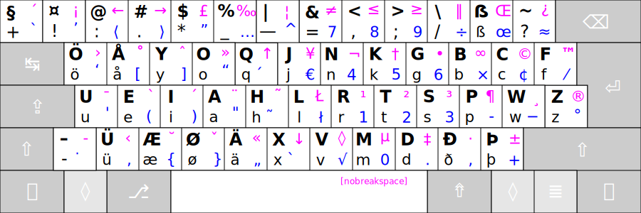
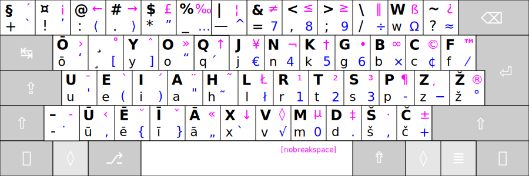
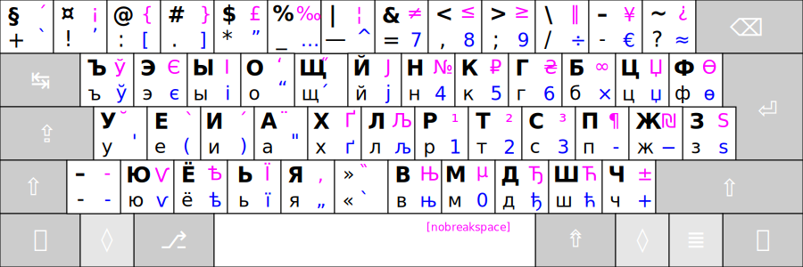

# ADDITIONAL LAYOUTS

These are four level layouts:

 1. First level.
 2. Shifted second level.
 3. AltGr third level.
 4. Shifted AltGr fourth level.

 ------------------------------------------------------------------------------------

## Germanic Ratise:

Supplement Germanic Phonetic Layout for Lithuanian Ergonomic Keyboard layout "Ratise".

------------------------------------------------------------------------------------

## Latvian Ratise:

Supplement Latvian Phonetic Layout for Lithuanian Ergonomic Keyboard layout "Ratise".

------------------------------------------------------------------------------------

## Cyrillic Ratise:

Supplement Cyrillic (Russian) Phonetic Layout for Lithuanian Ergonomic Keyboard layout "Ratise".

------------------------------------------------------------------------------------

[↓ Download "Ratise" layout ↓](https://github.com/albuck/Ratise-layout/zipball/master)

