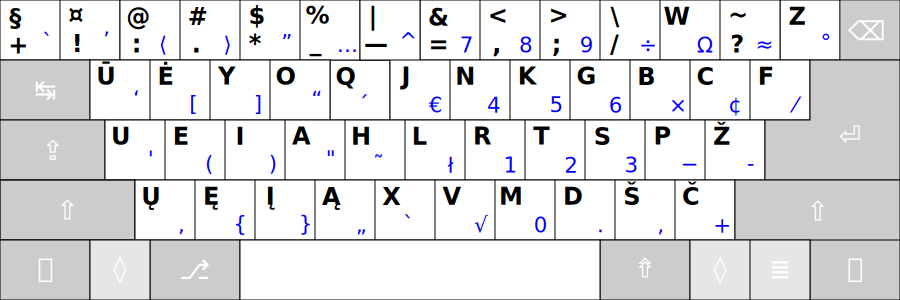
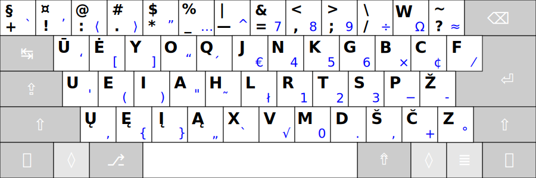
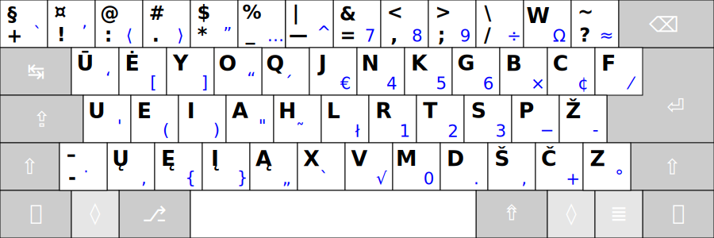
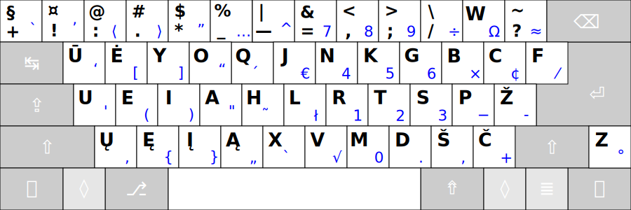

# RATISĖ SKIRTINGOS DARYBOS KLAVIATŪROSE

Ratisės išdėstymas skirtingos darybos klaviatūrose atrodys kiek kitaip, dažniausiai gali pritrūkti brūkšnelio mygtuko ir ```Z``` mygtukas gali būti kiek kitoje vietoje.

Čia, žemiau, klaviatūrų mygtukų išdėstymai rikiuojami pagal patogumą, nuo geresnio prie prastesnio (nors tas skirtumas ir nedidelis).


1. __104 mygtukų klaviatūra „ANSISO“ (ISO be 105-to mygtuko, „ISO+ANSI“):__

    - Spausdinimui: [Ratisė ANSISO juodbaltis pdf](images/kb-lt-ratise-ansiso.pdf).
    
2. __104 mygtukų klaviatūra, amerikietiškas ANSI:__

    - Spausdinimui: [Ratisė ANSI juodbaltis pdf](images/kb-lt-ratise-ansi.pdf).

3. __104 mygtukų klaviatūra (su apverstu dideliu _L_ pavidalo _Enter_, kartais dar vadinamas „azijietišku“):__

    - Spausdinimui: [Ratisė ‘L Enter’ juodbaltis pdf](images/kb-lt-ratise-l.pdf).
    
4. __105 mygtukų klaviatūra, ISO (europietiškas):__

    - Spausdinimui: [Ratisė ISO juodbaltis pdf](images/kb-lt-ratise-iso.pdf).
    
5. __105 mygtukų klaviatūra „ISOANSI“ (ANSI su 105-tu mygtuku, „ISO+ANSI“):__

    - Spausdinimui: [Ratisė ISOANSI juodbaltis pdf](images/kb-lt-ratise-isoansi.pdf).
    
6. __104 mygtukų klaviatūra (su apverstu dideliu _L_ pavidalo _Enter_ ir nukeltu apačion _Z_):__

    - Spausdinimui: [Ratisė ‘L Enter 2’ juodbaltis pdf](images/kb-lt-ratise-l2.pdf).
    
7. __105 mygtukų klaviatūra (su apverstu dideliu _L_ pavidalo _Enter_, nukeltu apačion _Z_, papildomu brūkšnelio mygtuku):__

    - Spausdinimui: [Ratisė ‘L Enter 3’ juodbaltis pdf](images/kb-lt-ratise-l3.pdf).
    
8. __104 mygtukų klaviatūra (su apverstu dideliu _L_ pavidalo _Enter_, nukeltu apačion ir už _Shift’o_ _Z_):__

    
__Pastabos:__
+ Paskutiniųjų keturių išdėstymų vietos parinktos be patikros, tik atsižvelgiant į kitų išdėstymų patikrų duomenis (prielaida, kad ```Shift``` priėjimo sunkinimas prastina patogumą).
+ Pats paskutinysis išdėstymas savo vietoje dėl atskirtos ir nepatogios ```Z``` mygtuko vietos.
+ Pasitaiko nepatogių klaviatūrų, ypatingai sumažinto dydžio (kompaktiškų), kuriose kraštiniai mygtukai, su labai retai naudojamais neraidiniais ženklais (pradedančiojo anglų kalbos vartotojo požiūriu) būna sumažinto dydžio, ar nukelti į pačią apatinę (tarpo) eilę, ar netgi išvis jų nėra ir jųjų ženklai prieinami tik kituose mygtukuose per papildomą priėjimo lygį (```Fn```), pastarieji būtų patys nepatogiausi Ratisės naudotojui.

--------------------------------------------------------------------

[Ratisė stačiakampio mygtukų išdėstymo klaviatūrose](ratise-staciakampese-klaviaturose.md)

[Ratisės našumo palyginimas su kitais išdėstymais](lt-isdestymu-palyginimas.md)

[Į pradžią](../README.md)
