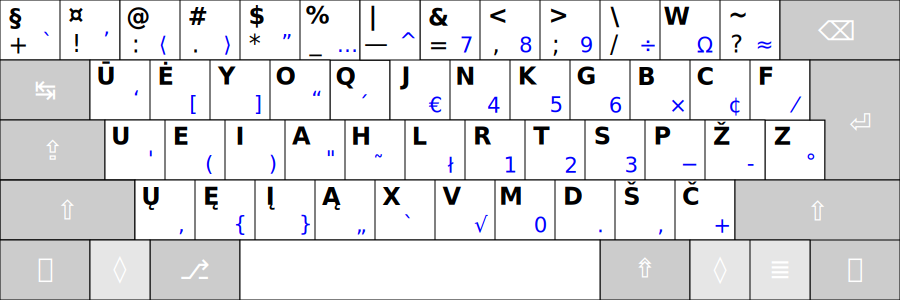
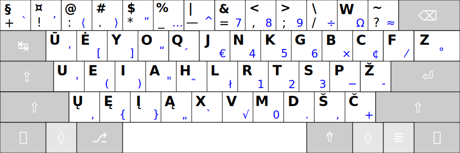
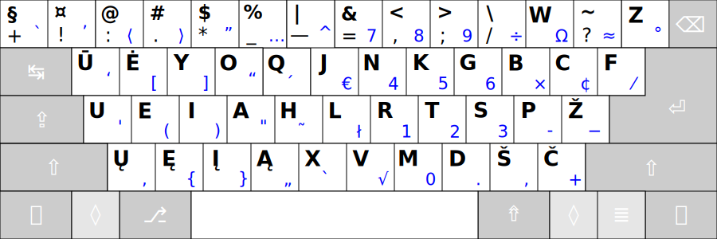
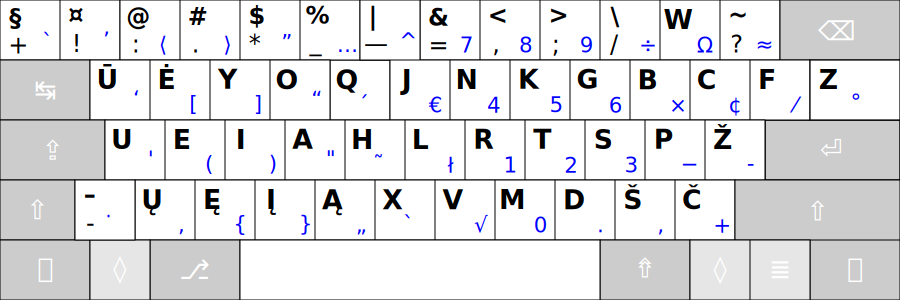
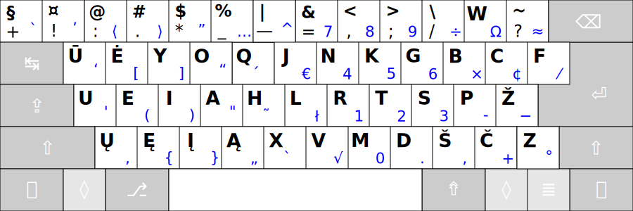
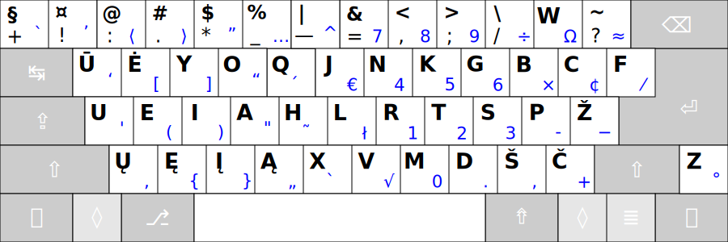

# RATISĖ SKIRTINGOS DARYBOS KLAVIATŪROSE

Ratisės išdėstymas skirtingos darybos klaviatūrose atrodys kiek kitaip, dažniausiai gali pritrūkti <kbd>-</kbd> mygtuko ir <kbd>Z</kbd> mygtukas gali būti kiek kitoje vietoje.

Čia, žemiau, klaviatūrų mygtukų išdėstymai rikiuojami pagal patogumą, nuo geresnio prie prastesnio (nors tas skirtumas ir labai nedidelis).

 

__101/104 mygtukų klaviatūra „ANSISO“__ (ISO be papildomo mygtuko, „ANSI+ISO“):

 

__101/104 mygtukų ANSI klaviatūra__ (dar vadinama „amerikietiška“):

 

__101/104 mygtukų PC/AT klaviatūra__ (kartais dar vadinama „azijietiška“):

 

__102/105 mygtukų ISO klaviatūra__ (dar vadinama „europietiška“):

 

__102/105 mygtukų klaviatūra „ISOANSI“__ (ANSI su papildomu mygtuku, „ISO+ANSI“):

 

__101/104 mygtukų PC/AT klaviatūros atmaina „2“__ (su nukeltu apačion _Z‘u_, padidintu _Backspace_):

 

__102/105 mygtukų PC/AT klaviatūros atmaina „3“__ (su nukeltu apačion _Z‘u_, papildomu brūkšnelio mygtuku, padidintu _Backspace_):

 

__101/104 mygtukų PC/AT klaviatūros atmaina „4“__ (su nukeltu apačion už _Shift‘o_ _Z‘u_, padidintu _Backspace_):

 
 

Ratisės išdėstymo skirtingos darybos klaviatūrose tekstinės diagramos

<pre>

Ratisės vaizdas skirtingose standartinėse (https://en.wikipedia.org/wiki/ISO/IEC_9995) klaviatūrose:

 Ratisė ISO:
┏━━━┯━━━┯━━━┯━━━┯━━━┯━━━┯━━━┯━━━┯━━━┯━━━┯━━━┯━━━┯━━━┳━━━━━━━┓
┃ + │ ! │ : │ . │ * │ _ │ — │ = │ , │ ; │ / │ W │ ? ┃     ⌫ ┃
┣━━━┷━┱─┴─┬─┴─┬─┴─┬─┴─┬─┴─┬─┴─┬─┴─┬─┴─┬─┴─┬─┴─┬─┴─┬─┺━┳━━━━━┫
┃ ↹   ┃ Ū │ Ė │ Y │ O │ Q │ J │ N │ K │ G │ B │ C │ F ┃     ┃
┣━━━━━┻┱──┴┬──┴┬──┴┬──┴┬──┴┬──┴┬──┴┬──┴┬──┴┬──┴┬──┴┬──┺┓  ⏎ ┃
┃ ⇬    ┃ U │ E │ I │ A │ H │ L │ R │ T │ S │ P │ Ž │ Z ┃    ┃
┣━━━━┳━┹─┬─┴─┬─┴─┬─┴─┬─┴─┬─┴─┬─┴─┬─┴─┬─┴─┬─┴─┬─┴─┲━┷━━━┻━━━━┫
┃ ⇧  ┃ - │ Ų │ Ę │ Į │ Ą │ X │ V │ M │ D │ Š │ Č ┃        ⇧ ┃
┣━━━━┻━┳━┷━┳━┷━┳━┷━┱─┴───┴───┴───┴───┴─┲━┷━┳━┷━┳━┻━┳━━━┳━━━━┫
┃ ⎈    ┃ ƒ ┃ ◇ ┃ ⎇ ┃                   ┃ ⇮ ┃ ⇨ ┃ ◇ ┃ ≣ ┃  ⎈ ┃
┗━━━━━━┻━━━┻━━━┻━━━┻━━━━━━━━━━━━━━━━━━━┻━━━┻━━━┻━━━┻━━━┻━━━━┛

 Ratisė ANSI:
┏━━━┯━━━┯━━━┯━━━┯━━━┯━━━┯━━━┯━━━┯━━━┯━━━┯━━━┯━━━┯━━━┳━━━━━━━┓
┃ + │ ! │ : │ . │ * │ _ │ — │ = │ , │ ; │ / │ W │ ? ┃     ⌫ ┃
┣━━━┷━┱─┴─┬─┴─┬─┴─┬─┴─┬─┴─┬─┴─┬─┴─┬─┴─┬─┴─┬─┴─┬─┴─┬─┺━┯━━━━━┫
┃ ↹   ┃ Ū │ Ė │ Y │ O │ Q │ J │ N │ K │ G │ B │ C │ F │ Z   ┃
┣━━━━━┻┱──┴┬──┴┬──┴┬──┴┬──┴┬──┴┬──┴┬──┴┬──┴┬──┴┬──┴┲━━┷━━━━━┫
┃ ⇬    ┃ U │ E │ I │ A │ H │ L │ R │ T │ S │ P │ Ž ┃      ⏎ ┃
┣━━━━━━┻━┱─┴─┬─┴─┬─┴─┬─┴─┬─┴─┬─┴─┬─┴─┬─┴─┬─┴─┬─┴─┲━┻━━━━━━━━┫
┃ ⇧      ┃ Ų │ Ę │ Į │ Ą │ X │ V │ M │ D │ Š │ Č ┃        ⇧ ┃
┣━━━━━━┳━┻━┳━┷━┳━┷━┱─┴───┴───┴───┴───┴─┲━┷━┳━┷━┳━┻━┳━━━┳━━━━┫
┃ ⎈    ┃ ƒ ┃ ◇ ┃ ⎇ ┃                   ┃ ⇮ ┃ ⇨ ┃ ◇ ┃ ≣ ┃  ⎈ ┃
┗━━━━━━┻━━━┻━━━┻━━━┻━━━━━━━━━━━━━━━━━━━┻━━━┻━━━┻━━━┻━━━┻━━━━┛

 Ratisė „ANSISO“:
┏━━━┯━━━┯━━━┯━━━┯━━━┯━━━┯━━━┯━━━┯━━━┯━━━┯━━━┯━━━┯━━━┳━━━━━━━┓
┃ + │ ! │ : │ . │ * │ _ │ — │ = │ , │ ; │ / │ W │ ? ┃     ⌫ ┃
┣━━━┷━┱─┴─┬─┴─┬─┴─┬─┴─┬─┴─┬─┴─┬─┴─┬─┴─┬─┴─┬─┴─┬─┴─┬─┺━┳━━━━━┫
┃ ↹   ┃ Ū │ Ė │ Y │ O │ Q │ J │ N │ K │ G │ B │ C │ F ┃     ┃
┣━━━━━┻┱──┴┬──┴┬──┴┬──┴┬──┴┬──┴┬──┴┬──┴┬──┴┬──┴┬──┴┬──┺┓  ⏎ ┃
┃ ⇬    ┃ U │ E │ I │ A │ H │ L │ R │ T │ S │ P │ Ž │ Z ┃    ┃
┣━━━━━━┻━┱─┴─┬─┴─┬─┴─┬─┴─┬─┴─┬─┴─┬─┴─┬─┴─┬─┴─┬─┴─┲━┷━━━┻━━━━┫
┃ ⇧      ┃ Ų │ Ę │ Į │ Ą │ X │ V │ M │ D │ Š │ Č ┃        ⇧ ┃
┣━━━━━━┳━┻━┳━┷━┳━┷━┱─┴───┴───┴───┴───┴─┲━┷━┳━┷━┳━┻━┳━━━┳━━━━┫
┃ ⎈    ┃ ƒ ┃ ◇ ┃ ⎇ ┃                   ┃ ⇮ ┃ ⇨ ┃ ◇ ┃ ≣ ┃  ⎈ ┃
┗━━━━━━┻━━━┻━━━┻━━━┻━━━━━━━━━━━━━━━━━━━┻━━━┻━━━┻━━━┻━━━┻━━━━┛

 Ratisė „ISOANSI“:
┏━━━┯━━━┯━━━┯━━━┯━━━┯━━━┯━━━┯━━━┯━━━┯━━━┯━━━┯━━━┯━━━┳━━━━━━━┓
┃ + │ ! │ : │ . │ * │ _ │ — │ = │ , │ ; │ / │ W │ ? ┃     ⌫ ┃
┣━━━┷━┱─┴─┬─┴─┬─┴─┬─┴─┬─┴─┬─┴─┬─┴─┬─┴─┬─┴─┬─┴─┬─┴─┬─┺━┯━━━━━┫
┃ ↹   ┃ Ū │ Ė │ Y │ O │ Q │ J │ N │ K │ G │ B │ C │ F │ Z   ┃
┣━━━━━┻┱──┴┬──┴┬──┴┬──┴┬──┴┬──┴┬──┴┬──┴┬──┴┬──┴┬──┴┲━━┷━━━━━┫
┃ ⇬    ┃ U │ E │ I │ A │ H │ L │ R │ T │ S │ P │ Ž ┃      ⏎ ┃
┣━━━━┳━┹─┬─┴─┬─┴─┬─┴─┬─┴─┬─┴─┬─┴─┬─┴─┬─┴─┬─┴─┬─┴─┲━┻━━━━━━━━┫
┃ ⇧  ┃ - │ Ų │ Ę │ Į │ Ą │ X │ V │ M │ D │ Š │ Č ┃        ⇧ ┃
┣━━━━┻━┳━┷━┳━┷━┳━┷━┱─┴───┴───┴───┴───┴─┲━┷━┳━┷━┳━┻━┳━━━┳━━━━┫
┃ ⎈    ┃ ƒ ┃ ◇ ┃ ⎇ ┃                   ┃ ⇮ ┃ ⇨ ┃ ◇ ┃ ≣ ┃  ⎈ ┃
┗━━━━━━┻━━━┻━━━┻━━━┻━━━━━━━━━━━━━━━━━━━┻━━━┻━━━┻━━━┻━━━┻━━━━┛

 Ratisė PC/AT:
┏━━━┯━━━┯━━━┯━━━┯━━━┯━━━┯━━━┯━━━┯━━━┯━━━┯━━━┯━━━┯━━━┯━━━┳━━━┓
┃ + │ ! │ : │ . │ * │ _ │ — │ = │ , │ ; │ / │ W │ ? │ z ┃ ⌫ ┃
┣━━━┷━┱─┴─┬─┴─┬─┴─┬─┴─┬─┴─┬─┴─┬─┴─┬─┴─┬─┴─┬─┴─┬─┴─┬─┴─┲━┻━━━┫
┃ ↹   ┃ Ū │ Ė │ Y │ O │ Q │ J │ N │ K │ G │ B │ C │ F ┃     ┃
┣━━━━━┻┱──┴┬──┴┬──┴┬──┴┬──┴┬──┴┬──┴┬──┴┬──┴┬──┴┬──┴┲━━┛   ⏎ ┃
┃ ⇬    ┃ U │ E │ I │ A │ H │ L │ R │ T │ S │ P │ Ž ┃        ┃
┣━━━━━━┻━┱─┴─┬─┴─┬─┴─┬─┴─┬─┴─┬─┴─┬─┴─┬─┴─┬─┴─┬─┴─┲━┻━━━━━━━━┫
┃ ⇧      ┃ Ų │ Ę │ Į │ Ą │ X │ V │ M │ D │ Š │ Č ┃        ⇧ ┃
┣━━━━━━┳━┻━┳━┷━┳━┷━┱─┴───┴───┴───┴───┴─┲━┷━┳━┷━┳━┻━┳━━━┳━━━━┫
┃ ⎈    ┃ ƒ ┃ ◇ ┃ ⎇ ┃                   ┃ ⇮ ┃ ⇨ ┃ ◇ ┃ ≣ ┃  ⎈ ┃
┗━━━━━━┻━━━┻━━━┻━━━┻━━━━━━━━━━━━━━━━━━━┻━━━┻━━━┻━━━┻━━━┻━━━━┛

 Ratisė PC/AT „2“:
┏━━━┯━━━┯━━━┯━━━┯━━━┯━━━┯━━━┯━━━┯━━━┯━━━┯━━━┯━━━┯━━━┳━━━━━━━┓
┃ + │ ! │ : │ . │ * │ _ │ — │ = │ , │ ; │ / │ W │ ? ┃     ⌫ ┃
┣━━━┷━┱─┴─┬─┴─┬─┴─┬─┴─┬─┴─┬─┴─┬─┴─┬─┴─┬─┴─┬─┴─┬─┴─┬─┺━┳━━━━━┫
┃ ↹   ┃ Ū │ Ė │ Y │ O │ Q │ J │ N │ K │ G │ B │ C │ F ┃     ┃
┣━━━━━┻┱──┴┬──┴┬──┴┬──┴┬──┴┬──┴┬──┴┬──┴┬──┴┬──┴┬──┴┲━━┛   ⏎ ┃
┃ ⇬    ┃ U │ E │ I │ A │ H │ L │ R │ T │ S │ P │ Ž ┃        ┃
┣━━━━━━┻━┱─┴─┬─┴─┬─┴─┬─┴─┬─┴─┬─┴─┬─┴─┬─┴─┬─┴─┬─┴─┬─┺━┳━━━━━━┫
┃ ⇧      ┃ Ų │ Ę │ Į │ Ą │ X │ V │ M │ D │ Š │ Č │ Z ┃    ⇧ ┃
┣━━━━━━┳━┻━┳━┷━┳━┷━┱─┴───┴───┴───┴───┴─┲━┷━┳━┷━┳━┷━┳━┻━┳━━━━┫
┃ ⎈    ┃ ƒ ┃ ◇ ┃ ⎇ ┃                   ┃ ⇮ ┃ ⇨ ┃ ◇ ┃ ≣ ┃  ⎈ ┃
┗━━━━━━┻━━━┻━━━┻━━━┻━━━━━━━━━━━━━━━━━━━┻━━━┻━━━┻━━━┻━━━┻━━━━┛

 Ratisė PC/AT „3“:
┏━━━┯━━━┯━━━┯━━━┯━━━┯━━━┯━━━┯━━━┯━━━┯━━━┯━━━┯━━━┯━━━┳━━━━━━━┓
┃ + │ ! │ : │ . │ * │ _ │ — │ = │ , │ ; │ / │ W │ ? ┃     ⌫ ┃
┣━━━┷━┱─┴─┬─┴─┬─┴─┬─┴─┬─┴─┬─┴─┬─┴─┬─┴─┬─┴─┬─┴─┬─┴─┬─┺━┳━━━━━┫
┃ ↹   ┃ Ū │ Ė │ Y │ O │ Q │ J │ N │ K │ G │ B │ C │ F ┃     ┃
┣━━━━━┻┱──┴┬──┴┬──┴┬──┴┬──┴┬──┴┬──┴┬──┴┬──┴┬──┴┬──┴┲━━┛   ⏎ ┃
┃ ⇬    ┃ U │ E │ I │ A │ H │ L │ R │ T │ S │ P │ Ž ┃        ┃
┣━━━━┳━┹─┬─┴─┬─┴─┬─┴─┬─┴─┬─┴─┬─┴─┬─┴─┬─┴─┬─┴─┬─┴─┬─┺━┳━━━━━━┫
┃ ⇧  ┃ - │ Ų │ Ę │ Į │ Ą │ X │ V │ M │ D │ Š │ Č │ Z ┃    ⇧ ┃
┣━━━━┻━┳━┷━┳━┷━┳━┷━┱─┴───┴───┴───┴───┴─┲━┷━┳━┷━┳━┷━┳━┻━┳━━━━┫
┃ ⎈    ┃ ƒ ┃ ◇ ┃ ⎇ ┃                   ┃ ⇮ ┃ ⇨ ┃ ◇ ┃ ≣ ┃  ⎈ ┃
┗━━━━━━┻━━━┻━━━┻━━━┻━━━━━━━━━━━━━━━━━━━┻━━━┻━━━┻━━━┻━━━┻━━━━┛

 Ratisė PC/AT „4“ (nestandartinė klaviatūra):
┏━━━┯━━━┯━━━┯━━━┯━━━┯━━━┯━━━┯━━━┯━━━┯━━━┯━━━┯━━━┯━━━┳━━━━━━━┓
┃ + │ ! │ : │ . │ * │ _ │ — │ = │ , │ ; │ / │ W │ ? ┃     ⌫ ┃
┣━━━┷━┱─┴─┬─┴─┬─┴─┬─┴─┬─┴─┬─┴─┬─┴─┬─┴─┬─┴─┬─┴─┬─┴─┬─┺━┳━━━━━┫
┃ ↹   ┃ Ū │ Ė │ Y │ O │ Q │ J │ N │ K │ G │ B │ C │ F ┃     ┃
┣━━━━━┻┱──┴┬──┴┬──┴┬──┴┬──┴┬──┴┬──┴┬──┴┬──┴┬──┴┬──┴┲━━┛   ⏎ ┃
┃ ⇬    ┃ U │ E │ I │ A │ H │ L │ R │ T │ S │ P │ Ž ┃        ┃
┣━━━━━━┻━┱─┴─┬─┴─┬─┴─┬─┴─┬─┴─┬─┴─┬─┴─┬─┴─┬─┴─┬─┴─┲━┻━━━━┳━━━┫
┃ ⇧      ┃ Ų │ Ę │ Į │ Ą │ X │ V │ M │ D │ Š │ Č ┃    ⇧ ┃ Z ┃
┣━━━━━━┳━┻━┳━┷━┳━┷━┱─┴───┴───┴───┴───┴─┲━┷━┳━┷━┳━┻━┳━━━┳┻━━━┫
┃ ⎈    ┃ ƒ ┃ ◇ ┃ ⎇ ┃                   ┃ ⇮ ┃ ⇨ ┃ ◇ ┃ ≣ ┃  ⎈ ┃
┗━━━━━━┻━━━┻━━━┻━━━┻━━━━━━━━━━━━━━━━━━━┻━━━┻━━━┻━━━┻━━━┻━━━━┛

Mygtukų ženklinimų reikšmės:

⌫ — Backspace key — Trynimo mygtukas.
⏎ — Enter key — Įvedimo mygtukas.
↹ — Tab key — Atitraukimo mygtukas.
⇬ — Caps Lock key — Didžiųjų raidžių rakinimo mygtukas.
⇧ — Shift key — Didžiųjų raidžių (antrojo lygio) įjungimo mygtukas.
⇮ — AltGr key — Kitokio ženklo (grafikos) įvedimo mygtukas.
⎇ — Alt key — Kitokio įvedimo būdo pasirinkimo mygtukas.
⎈ — Ctrl key — Valdymo mygtukas.
≣ — Menu key (optional) — Sąrašo (Meniu) mygtukas (neprivalomas).
◇ — System key (optional) — Vėliavos (Sistemos) mygtukas (neprivalomas).
ƒ — Fn, Function key (optional) — Veikmens (Funkcijos) mygtukas (neprivalomas).
⇨ — Group selection key (optional) — Kito raidyno pasirinkimo mygtukas (neprivalomas).

</pre>

 

__Pastabos:__
+ Paskutiniųjų keturių išdėstymų vietos parinktos be patikros, tik atsižvelgiant į kitų išdėstymų patikrų duomenis (prielaida, kad <kbd>Shift</kbd> priėjimo sunkinimas prastina patogumą).
+ Pats paskutinysis išdėstymas savo vietoje dėl atskirtos ir nepatogios <kbd>Z</kbd> mygtuko vietos.
+ Klaviatūrose gali nebūti ne tik Ratisės <kbd>-</kbd> mygtuko (apačioje kairėje), bet ir Ratisės <kbd>+</kbd> mygtuko (viršuje kairėje) — šie mygtukai [ISO/IEC 9995](https://en.wikipedia.org/wiki/ISO/IEC_9995) klaviatūrų standarte nėra privalomi.
+ Pasitaiko nepatogių klaviatūrų, ypatingai sumažinto dydžio (glaustų, kompaktiškų), kuriose kraštiniai mygtukai, su rečiau naudojamais neraidiniais ženklais ar net <kbd>Enter</kbd>, būna sumažinto dydžio, arba nukelti į pačią apatinę (tarpo) eilę, arba netgi išvis jų nėra ir jųjų ženklai būna prieinami tik kituose mygtukuose per papildomą priėjimo lygį (<kbd>Fn</kbd>).
+ Pasitaiko klaviatūrų su dar kiek kitokiu kraštinių mygtukų išdėstymu (tai būtų visokiausios ergonomiškos arba jau pasenusios klaviatūros).

 

__Žodynėlis:__

+ _101/104_ ir _102/105_ — mygtukų skaičius pilnoje klaviatūroje, mažesnis skaičius — mygtukus skaičiuojant be papildomų trijų valdymo-keitimo mygtukų (<kbd>Fn</kbd>, <kbd>≣ Menu</kbd> ir dešiniojo <kbd>◊ OS</kbd>).
+ _ANSI_ — sutrumpinimas _American National Standard Institute_ — Amerikos (Jungtinių Amerikos Valstijų) valstybinis standartų institutas, „Amerikos valstybinė pavyzdžių įstaiga“.
+ _ISO_ — _International Standards Organization_ — Tarptautinė standartų organizacija, „Tarptautinis pavyzdžių susivienijimas“.
+ _PC/AT_ (_IBM PC AT_) — _Personal Computer Advance Technology_ — „Pažangios gamybos asmeninis skaitytuvas”.
+ _IBM_ — _International Business Machines_ — „Tarptautinė verslo įranga (įtaisai, mašinos)“.

--------------------------------------------------------------------

[Ratisė stačiakampio mygtukų išdėstymo klaviatūrose](ratise-staciakampese-klaviaturose.md)

[Ratisės našumo palyginimas su kitais išdėstymais](lt-isdestymu-palyginimas.md)

[Į pradžią](../README.md)
