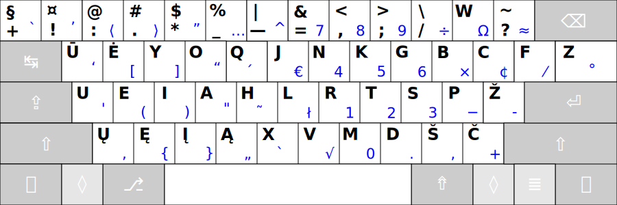
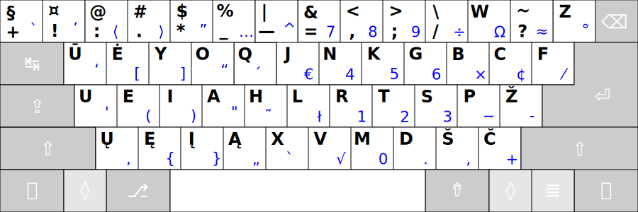

# RATISĖ SKIRTINGOS DARYBOS KLAVIATŪROSE

Ratisės išdėstymas skirtingos darybos klaviatūrose atrodys kiek kitaip, dažniausiai gali pritrūkti brūkšnelio mygtuko ir __Z__ mygtukas gali būti kiek kitoje vietoje.

  - 105 mygtukų klaviatūra, europietiškas ISO:

    - Daugiau paveikslėlių: [nespalvotas pdf](images/kb-lt-ratise.pdf), [spalvotas svg](images/ratise-spausdinimo-tvarka.svg), [spalvotas pdf](images/ratise-spausdinimo-tvarka.pdf), [nespalvotas png](images/lek_ratise_layout.png), [su visais ženklais svg](images/kb-lt-ratise-visi-zenklai.svg).

    104 mygtukų klaviatūra, amerikietiškas ANSI:

    - Daugiau paveikslėlių: [nespalvotas pdf](images/kb-lt-ratise-104-ansi.pdf).

  - 104 mygtukų klaviatūra (su apverstu dideliu ‘L’ pavidalo ‘Enter’, kartais vadinamas „azijietišku“):

    - Daugiau paveikslėlių: [nespalvotas pdf](images/kb-lt-ratise-104-b.pdf).

  - 104 mygtukų klaviatūra (ISO be 105-to mygtuko, „ISO+ANSI“, „ANSISO“):

    - Daugiau paveikslėlių: [nespalvotas pdf](images/kb-lt-ratise-104-c.pdf).

  - Stačiakampio mygtukų išdėstymo klaviatūros: [Kinesis/Ergodox numatytasis (svg)](images/kb-lt-ratise-kinesis-ergodox.svg), [Kinesis/Ergodox patvarkytas-pagerintas (svg)](images/kb-lt-ratise-kinesis-ergodox-patvarkytas.svg), [SEL (svg)](images/kb-lt-ratise-sel.svg), [Matrix (svg)](images/kb-lt-ratise-matrix.svg).

--------------------------------------------------------------------

[Į pradžią](../README.md)
