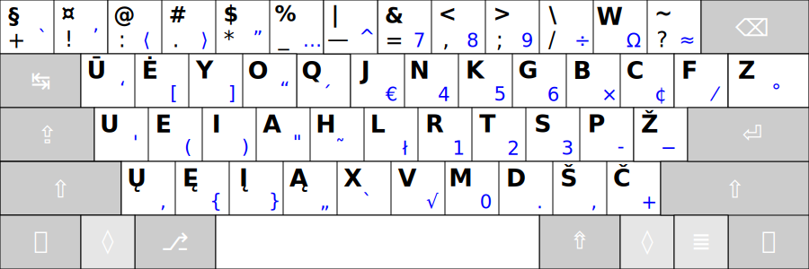

# RATISĖ SKIRTINGOS DARYBOS KLAVIATŪROSE

Ratisės išdėstymas skirtingos darybos klaviatūrose atrodys kiek kitaip, dažniausiai gali pritrūkti <kbd>-</kbd> mygtuko ir <kbd>Z</kbd> mygtukas gali būti kiek kitoje vietoje.

Čia, žemiau, klaviatūrų mygtukų išdėstymai rikiuojami pagal patogumą, nuo geresnio prie prastesnio (nors tas skirtumas ir nedidelis).

 

1. __101/104 mygtukų klaviatūra „ANSISO“ (ISO be papildomo mygtuko, „ANSI+ISO“):__

 

2. __101/104 mygtukų ANSI klaviatūra (dar vadinama „amerikietiška“):__

 

3. __101/104 mygtukų PC/AT klaviatūra (su labai dideliu _Enter_, kartais dar vadinama „azijietiška“):__

 

4. __102/105 mygtukų ISO klaviatūra (dar vadinama „europietiška“):__

 

5. __102/105 mygtukų klaviatūra „ISOANSI“ (ANSI su papildomu mygtuku, „ISO+ANSI“):__

 

6. __101/104 mygtukų PC/AT klaviatūros atmaina „2“ (su labai dideliu _Enter_, nukeltu apačion _Z‘u_, padidintu _Backspace_):__

 

7. __102/105 mygtukų PC/AT klaviatūros atmaina „3“ (su labai dideliu _Enter_, nukeltu apačion _Z‘u_, papildomu brūkšnelio mygtuku, padidintu _Backspace_):__

 

8. __101/104 mygtukų PC/AT klaviatūros atmaina „4“ (su labai dideliu _Enter_, nukeltu apačion už _Shift‘o_ _Z‘u_, padidintu _Backspace_):__

 
  

__Pastabos:__
+ Paskutiniųjų keturių išdėstymų vietos parinktos be patikros, tik atsižvelgiant į kitų išdėstymų patikrų duomenis (prielaida, kad <kbd>Shift</kbd> priėjimo sunkinimas prastina patogumą).
+ Pats paskutinysis išdėstymas savo vietoje dėl atskirtos ir nepatogios <kbd>Z</kbd> mygtuko vietos.
+ Klaviatūrose gali nebūti ne tik Ratisės <kbd>-</kbd> mygtuko (apačioje kairėje), bet ir Ratisės <kbd>+</kbd> mygtuko (viršuje kairėje) — šie mygtukai [ISO/IEC 9995](https://en.wikipedia.org/wiki/ISO/IEC_9995) klaviatūrų standarte nėra privalomi.
+ Pasitaiko nepatogių klaviatūrų, ypatingai sumažinto dydžio (glaustų, kompaktiškų), kuriose kraštiniai mygtukai, su rečiau naudojamais neraidiniais ženklais ar net <kbd>Enter</kbd>, būna sumažinto dydžio, arba nukelti į pačią apatinę (tarpo) eilę, arba netgi išvis jų nėra ir jųjų ženklai būna prieinami tik kituose mygtukuose per papildomą priėjimo lygį (<kbd>Fn</kbd>).
+ Pasitaiko klaviatūrų su dar kiek kitokiu mygtukų išdėstymu (tai būtų visokiausios ergonomiškos arba jau pasenusios klaviatūros).

 

__Žodynėlis:__
+ _ANSI_ — sutrumpinimas _American National Standard Institute_ — Jungtinių Amerikos Valstijų valstybinis standartų institutas.
+ _ISO_ — _International Standards Organization_ — Tarptautinė standartų organizacija.
+ _PC/AT_ (_IBM PC AT_) — _Personal Computer Advance Technology_ — „Pažangios gamybos asmeninis skaitytuvas”.
+ _IBM_ — _International Business Machines_ — „Tarptautinė verslo įranga (įtaisai, mašinos)“

--------------------------------------------------------------------

[Ratisė stačiakampio mygtukų išdėstymo klaviatūrose](ratise-staciakampese-klaviaturose.md)

[Ratisės našumo palyginimas su kitais išdėstymais](lt-isdestymu-palyginimas.md)

[Į pradžią](../README.md)
