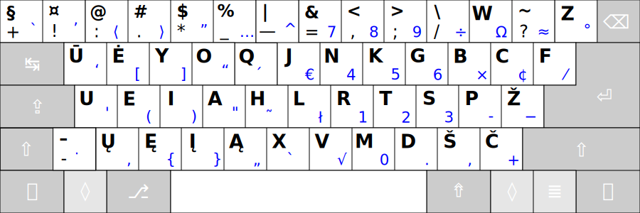

# RATISĖ SKIRTINGOS DARYBOS KLAVIATŪROSE

Ratisės išdėstymas skirtingos darybos klaviatūrose atrodys kiek kitaip, dažniausiai gali pritrūkti <kbd>-</kbd> mygtuko ir <kbd>Z</kbd> mygtukas gali būti kiek kitoje vietoje.

 

__Ratisė ISO-CB, 102/105 mygtukų ISO klaviatūra__ (dar vadinama „europietiška“):

- [Ratisė ISO, pdf'as spausdinimui](kb-lt-ratise-iso.pdf)

 

__Ratisė ISO-D, 101/104 mygtukų ANSI klaviatūra__ (dar vadinama „amerikietiška“):

- [Ratisė ANSI, pdf'as spausdinimui](kb-lt-ratise-ansi.pdf)

 

__Ratisė ISO-C, 101/104 mygtukų klaviatūra „ANSISO“__ (ISO be papildomo mygtuko, „ANSI+ISO“):

- [Ratisė ANSISO, pdf'as spausdinimui](kb-lt-ratise-ansiso.pdf)

 

__Ratisė ISO-DB, 102/105 mygtukų klaviatūra „ISOANSI“__ (ANSI su papildomu mygtuku, „ISO+ANSI“):

- [Ratisė ISOANSI, pdf'as spausdinimui](kb-lt-ratise-isoansi.pdf)

 

__Ratisė ISO-E, 101/104 mygtukų PC/AT klaviatūra__ (kartais dar vadinama „azijietiška“ arba kuri su dideliu apsuktos _L_ pavidalo _Enter_):

- [Ratisė PC/AT, pdf'as spausdinimui](kb-lt-ratise-pc-at.pdf)

 

__Ratisė ISO-EB, 102/105 mygtukų PC/AT klaviatūros atmaina „1“__ (su papildomu brūkšnelio mygtuku):

- [Ratisė PC/AT-1, pdf'as spausdinimui](kb-lt-ratise-pc-at-1.pdf)

 

__Ratisė ISO-B, 101/104 mygtukų PC/AT klaviatūros atmaina „2“__ (su nukeltu apačion _Z‘u_, padidintu _Backspace_):

- [Ratisė PC/AT-2, pdf'as spausdinimui](kb-lt-ratise-pc-at-2.pdf)

 

__Ratisė ISO-BB, 102/105 mygtukų PC/AT klaviatūros atmaina „3“__ (su nukeltu apačion _Z‘u_, papildomu brūkšnelio mygtuku, padidintu _Backspace_):

- [Ratisė PC/AT-3, pdf'as spausdinimui](kb-lt-ratise-pc-at-3.pdf)

 

__101/104 mygtukų PC/AT klaviatūros nestandartinė atmaina „4“__ (su nukeltu apačion už _Shift‘o_ _Z‘u_, padidintu _Backspace_):

 
 

Ratisės išdėstymo skirtingos darybos klaviatūrose tekstiniai braižiniai

<pre style="font-size: 60%">

Ratisės vaizdas skirtingose standartinėse klaviatūrose:

 Ratisė ISO:
┏━━━┯━━━┯━━━┯━━━┯━━━┯━━━┯━━━┯━━━┯━━━┯━━━┯━━━┯━━━┯━━━┳━━━━━━━┓
┃ + │ ! │ : │ . │ * │ _ │ — │ = │ , │ ; │ / │ W │ ? ┃     ⌫ ┃
┣━━━┷━┱─┴─┬─┴─┬─┴─┬─┴─┬─┴─┬─┴─┬─┴─┬─┴─┬─┴─┬─┴─┬─┴─┬─┺━┳━━━━━┫
┃ ↹   ┃ Ū │ Ė │ Y │ O │ Q │ J │ N │ K │ G │ B │ C │ F ┃     ┃
┣━━━━━┻┱──┴┬──┴┬──┴┬──┴┬──┴┬──┴┬──┴┬──┴┬──┴┬──┴┬──┴┬──┺┓  ⏎ ┃
┃ ⇬    ┃ U │ E │ I │ A │ H │ L │ R │ T │ S │ P │ Ž │ Z ┃    ┃
┣━━━━┳━┹─┬─┴─┬─┴─┬─┴─┬─┴─┬─┴─┬─┴─┬─┴─┬─┴─┬─┴─┬─┴─┲━┷━━━┻━━━━┫
┃ ⇧  ┃ - │ Ų │ Ę │ Į │ Ą │ X │ V │ M │ D │ Š │ Č ┃        ⇧ ┃
┣━━━━┻━┳━┷━┳━┷━┳━┷━┱─┴───┴───┴───┴───┴─┲━┷━┳━┷━┳━┻━┳━━━┳━━━━┫
┃ ⎈    ┃ ƒ ┃ ◇ ┃ ⎇ ┃                   ┃ ⇮ ┃ ⇨ ┃ ◇ ┃ ≣ ┃  ⎈ ┃
┗━━━━━━┻━━━┻━━━┻━━━┻━━━━━━━━━━━━━━━━━━━┻━━━┻━━━┻━━━┻━━━┻━━━━┛

 Ratisė ANSI:
┏━━━┯━━━┯━━━┯━━━┯━━━┯━━━┯━━━┯━━━┯━━━┯━━━┯━━━┯━━━┯━━━┳━━━━━━━┓
┃ + │ ! │ : │ . │ * │ _ │ — │ = │ , │ ; │ / │ W │ ? ┃     ⌫ ┃
┣━━━┷━┱─┴─┬─┴─┬─┴─┬─┴─┬─┴─┬─┴─┬─┴─┬─┴─┬─┴─┬─┴─┬─┴─┬─┺━┯━━━━━┫
┃ ↹   ┃ Ū │ Ė │ Y │ O │ Q │ J │ N │ K │ G │ B │ C │ F │ Z   ┃
┣━━━━━┻┱──┴┬──┴┬──┴┬──┴┬──┴┬──┴┬──┴┬──┴┬──┴┬──┴┬──┴┲━━┷━━━━━┫
┃ ⇬    ┃ U │ E │ I │ A │ H │ L │ R │ T │ S │ P │ Ž ┃      ⏎ ┃
┣━━━━━━┻━┱─┴─┬─┴─┬─┴─┬─┴─┬─┴─┬─┴─┬─┴─┬─┴─┬─┴─┬─┴─┲━┻━━━━━━━━┫
┃ ⇧      ┃ Ų │ Ę │ Į │ Ą │ X │ V │ M │ D │ Š │ Č ┃        ⇧ ┃
┣━━━━━━┳━┻━┳━┷━┳━┷━┱─┴───┴───┴───┴───┴─┲━┷━┳━┷━┳━┻━┳━━━┳━━━━┫
┃ ⎈    ┃ ƒ ┃ ◇ ┃ ⎇ ┃                   ┃ ⇮ ┃ ⇨ ┃ ◇ ┃ ≣ ┃  ⎈ ┃
┗━━━━━━┻━━━┻━━━┻━━━┻━━━━━━━━━━━━━━━━━━━┻━━━┻━━━┻━━━┻━━━┻━━━━┛

 Ratisė „ANSISO“:
┏━━━┯━━━┯━━━┯━━━┯━━━┯━━━┯━━━┯━━━┯━━━┯━━━┯━━━┯━━━┯━━━┳━━━━━━━┓
┃ + │ ! │ : │ . │ * │ _ │ — │ = │ , │ ; │ / │ W │ ? ┃     ⌫ ┃
┣━━━┷━┱─┴─┬─┴─┬─┴─┬─┴─┬─┴─┬─┴─┬─┴─┬─┴─┬─┴─┬─┴─┬─┴─┬─┺━┳━━━━━┫
┃ ↹   ┃ Ū │ Ė │ Y │ O │ Q │ J │ N │ K │ G │ B │ C │ F ┃     ┃
┣━━━━━┻┱──┴┬──┴┬──┴┬──┴┬──┴┬──┴┬──┴┬──┴┬──┴┬──┴┬──┴┬──┺┓  ⏎ ┃
┃ ⇬    ┃ U │ E │ I │ A │ H │ L │ R │ T │ S │ P │ Ž │ Z ┃    ┃
┣━━━━━━┻━┱─┴─┬─┴─┬─┴─┬─┴─┬─┴─┬─┴─┬─┴─┬─┴─┬─┴─┬─┴─┲━┷━━━┻━━━━┫
┃ ⇧      ┃ Ų │ Ę │ Į │ Ą │ X │ V │ M │ D │ Š │ Č ┃        ⇧ ┃
┣━━━━━━┳━┻━┳━┷━┳━┷━┱─┴───┴───┴───┴───┴─┲━┷━┳━┷━┳━┻━┳━━━┳━━━━┫
┃ ⎈    ┃ ƒ ┃ ◇ ┃ ⎇ ┃                   ┃ ⇮ ┃ ⇨ ┃ ◇ ┃ ≣ ┃  ⎈ ┃
┗━━━━━━┻━━━┻━━━┻━━━┻━━━━━━━━━━━━━━━━━━━┻━━━┻━━━┻━━━┻━━━┻━━━━┛

 Ratisė „ISOANSI“:
┏━━━┯━━━┯━━━┯━━━┯━━━┯━━━┯━━━┯━━━┯━━━┯━━━┯━━━┯━━━┯━━━┳━━━━━━━┓
┃ + │ ! │ : │ . │ * │ _ │ — │ = │ , │ ; │ / │ W │ ? ┃     ⌫ ┃
┣━━━┷━┱─┴─┬─┴─┬─┴─┬─┴─┬─┴─┬─┴─┬─┴─┬─┴─┬─┴─┬─┴─┬─┴─┬─┺━┯━━━━━┫
┃ ↹   ┃ Ū │ Ė │ Y │ O │ Q │ J │ N │ K │ G │ B │ C │ F │ Z   ┃
┣━━━━━┻┱──┴┬──┴┬──┴┬──┴┬──┴┬──┴┬──┴┬──┴┬──┴┬──┴┬──┴┲━━┷━━━━━┫
┃ ⇬    ┃ U │ E │ I │ A │ H │ L │ R │ T │ S │ P │ Ž ┃      ⏎ ┃
┣━━━━┳━┹─┬─┴─┬─┴─┬─┴─┬─┴─┬─┴─┬─┴─┬─┴─┬─┴─┬─┴─┬─┴─┲━┻━━━━━━━━┫
┃ ⇧  ┃ - │ Ų │ Ę │ Į │ Ą │ X │ V │ M │ D │ Š │ Č ┃        ⇧ ┃
┣━━━━┻━┳━┷━┳━┷━┳━┷━┱─┴───┴───┴───┴───┴─┲━┷━┳━┷━┳━┻━┳━━━┳━━━━┫
┃ ⎈    ┃ ƒ ┃ ◇ ┃ ⎇ ┃                   ┃ ⇮ ┃ ⇨ ┃ ◇ ┃ ≣ ┃  ⎈ ┃
┗━━━━━━┻━━━┻━━━┻━━━┻━━━━━━━━━━━━━━━━━━━┻━━━┻━━━┻━━━┻━━━┻━━━━┛

 Ratisė PC/AT:
┏━━━┯━━━┯━━━┯━━━┯━━━┯━━━┯━━━┯━━━┯━━━┯━━━┯━━━┯━━━┯━━━┯━━━┳━━━┓
┃ + │ ! │ : │ . │ * │ _ │ — │ = │ , │ ; │ / │ W │ ? │ z ┃ ⌫ ┃
┣━━━┷━┱─┴─┬─┴─┬─┴─┬─┴─┬─┴─┬─┴─┬─┴─┬─┴─┬─┴─┬─┴─┬─┴─┬─┴─┲━┻━━━┫
┃ ↹   ┃ Ū │ Ė │ Y │ O │ Q │ J │ N │ K │ G │ B │ C │ F ┃     ┃
┣━━━━━┻┱──┴┬──┴┬──┴┬──┴┬──┴┬──┴┬──┴┬──┴┬──┴┬──┴┬──┴┲━━┛   ⏎ ┃
┃ ⇬    ┃ U │ E │ I │ A │ H │ L │ R │ T │ S │ P │ Ž ┃        ┃
┣━━━━━━┻━┱─┴─┬─┴─┬─┴─┬─┴─┬─┴─┬─┴─┬─┴─┬─┴─┬─┴─┬─┴─┲━┻━━━━━━━━┫
┃ ⇧      ┃ Ų │ Ę │ Į │ Ą │ X │ V │ M │ D │ Š │ Č ┃        ⇧ ┃
┣━━━━━━┳━┻━┳━┷━┳━┷━┱─┴───┴───┴───┴───┴─┲━┷━┳━┷━┳━┻━┳━━━┳━━━━┫
┃ ⎈    ┃ ƒ ┃ ◇ ┃ ⎇ ┃                   ┃ ⇮ ┃ ⇨ ┃ ◇ ┃ ≣ ┃  ⎈ ┃
┗━━━━━━┻━━━┻━━━┻━━━┻━━━━━━━━━━━━━━━━━━━┻━━━┻━━━┻━━━┻━━━┻━━━━┛

 Ratisė PC/AT „2“:
┏━━━┯━━━┯━━━┯━━━┯━━━┯━━━┯━━━┯━━━┯━━━┯━━━┯━━━┯━━━┯━━━┳━━━━━━━┓
┃ + │ ! │ : │ . │ * │ _ │ — │ = │ , │ ; │ / │ W │ ? ┃     ⌫ ┃
┣━━━┷━┱─┴─┬─┴─┬─┴─┬─┴─┬─┴─┬─┴─┬─┴─┬─┴─┬─┴─┬─┴─┬─┴─┬─┺━┳━━━━━┫
┃ ↹   ┃ Ū │ Ė │ Y │ O │ Q │ J │ N │ K │ G │ B │ C │ F ┃     ┃
┣━━━━━┻┱──┴┬──┴┬──┴┬──┴┬──┴┬──┴┬──┴┬──┴┬──┴┬──┴┬──┴┲━━┛   ⏎ ┃
┃ ⇬    ┃ U │ E │ I │ A │ H │ L │ R │ T │ S │ P │ Ž ┃        ┃
┣━━━━━━┻━┱─┴─┬─┴─┬─┴─┬─┴─┬─┴─┬─┴─┬─┴─┬─┴─┬─┴─┬─┴─┬─┺━┳━━━━━━┫
┃ ⇧      ┃ Ų │ Ę │ Į │ Ą │ X │ V │ M │ D │ Š │ Č │ Z ┃    ⇧ ┃
┣━━━━━━┳━┻━┳━┷━┳━┷━┱─┴───┴───┴───┴───┴─┲━┷━┳━┷━┳━┷━┳━┻━┳━━━━┫
┃ ⎈    ┃ ƒ ┃ ◇ ┃ ⎇ ┃                   ┃ ⇮ ┃ ⇨ ┃ ◇ ┃ ≣ ┃  ⎈ ┃
┗━━━━━━┻━━━┻━━━┻━━━┻━━━━━━━━━━━━━━━━━━━┻━━━┻━━━┻━━━┻━━━┻━━━━┛

 Ratisė PC/AT „3“:
┏━━━┯━━━┯━━━┯━━━┯━━━┯━━━┯━━━┯━━━┯━━━┯━━━┯━━━┯━━━┯━━━┳━━━━━━━┓
┃ + │ ! │ : │ . │ * │ _ │ — │ = │ , │ ; │ / │ W │ ? ┃     ⌫ ┃
┣━━━┷━┱─┴─┬─┴─┬─┴─┬─┴─┬─┴─┬─┴─┬─┴─┬─┴─┬─┴─┬─┴─┬─┴─┬─┺━┳━━━━━┫
┃ ↹   ┃ Ū │ Ė │ Y │ O │ Q │ J │ N │ K │ G │ B │ C │ F ┃     ┃
┣━━━━━┻┱──┴┬──┴┬──┴┬──┴┬──┴┬──┴┬──┴┬──┴┬──┴┬──┴┬──┴┲━━┛   ⏎ ┃
┃ ⇬    ┃ U │ E │ I │ A │ H │ L │ R │ T │ S │ P │ Ž ┃        ┃
┣━━━━┳━┹─┬─┴─┬─┴─┬─┴─┬─┴─┬─┴─┬─┴─┬─┴─┬─┴─┬─┴─┬─┴─┬─┺━┳━━━━━━┫
┃ ⇧  ┃ - │ Ų │ Ę │ Į │ Ą │ X │ V │ M │ D │ Š │ Č │ Z ┃    ⇧ ┃
┣━━━━┻━┳━┷━┳━┷━┳━┷━┱─┴───┴───┴───┴───┴─┲━┷━┳━┷━┳━┷━┳━┻━┳━━━━┫
┃ ⎈    ┃ ƒ ┃ ◇ ┃ ⎇ ┃                   ┃ ⇮ ┃ ⇨ ┃ ◇ ┃ ≣ ┃  ⎈ ┃
┗━━━━━━┻━━━┻━━━┻━━━┻━━━━━━━━━━━━━━━━━━━┻━━━┻━━━┻━━━┻━━━┻━━━━┛

 Ratisė PC/AT „4“ (nestandartinė klaviatūra):
┏━━━┯━━━┯━━━┯━━━┯━━━┯━━━┯━━━┯━━━┯━━━┯━━━┯━━━┯━━━┯━━━┳━━━━━━━┓
┃ + │ ! │ : │ . │ * │ _ │ — │ = │ , │ ; │ / │ W │ ? ┃     ⌫ ┃
┣━━━┷━┱─┴─┬─┴─┬─┴─┬─┴─┬─┴─┬─┴─┬─┴─┬─┴─┬─┴─┬─┴─┬─┴─┬─┺━┳━━━━━┫
┃ ↹   ┃ Ū │ Ė │ Y │ O │ Q │ J │ N │ K │ G │ B │ C │ F ┃     ┃
┣━━━━━┻┱──┴┬──┴┬──┴┬──┴┬──┴┬──┴┬──┴┬──┴┬──┴┬──┴┬──┴┲━━┛   ⏎ ┃
┃ ⇬    ┃ U │ E │ I │ A │ H │ L │ R │ T │ S │ P │ Ž ┃        ┃
┣━━━━━━┻━┱─┴─┬─┴─┬─┴─┬─┴─┬─┴─┬─┴─┬─┴─┬─┴─┬─┴─┬─┴─┲━┻━━━━┳━━━┫
┃ ⇧      ┃ Ų │ Ę │ Į │ Ą │ X │ V │ M │ D │ Š │ Č ┃    ⇧ ┃ Z ┃
┣━━━━━━┳━┻━┳━┷━┳━┷━┱─┴───┴───┴───┴───┴─┲━┷━┳━┷━┳━┻━┳━━━┳┻━━━┫
┃ ⎈    ┃ ƒ ┃ ◇ ┃ ⎇ ┃                   ┃ ⇮ ┃ ⇨ ┃ ◇ ┃ ≣ ┃  ⎈ ┃
┗━━━━━━┻━━━┻━━━┻━━━┻━━━━━━━━━━━━━━━━━━━┻━━━┻━━━┻━━━┻━━━┻━━━━┛

Mygtukų ženklinimų reikšmės:

⌫ — Backspace key — Trynimo mygtukas.
⏎ — Enter key — Įvedimo mygtukas.
↹ — Tab key — Atitraukimo mygtukas.
⇬ — Caps Lock key — Didžiųjų raidžių rakinimo mygtukas.
⇧ — Shift key — Didžiųjų raidžių (antrojo lygio) įjungimo mygtukas.
⇮ — AltGr key — Kitokio ženklo (grafikos) įvedimo mygtukas.
⎇ — Alt key — Kitokio įvedimo būdo pasirinkimo mygtukas.
⎈ — Ctrl key — Valdymo mygtukas.
≣ — Menu key (optional) — Sąrašo (Meniu) mygtukas (neprivalomas).
◇ — System key (optional) — Vėliavos (Sistemos) mygtukas (neprivalomas).
ƒ — Fn, fn, Function key (optional) — Veikmens (Funkcijos) mygtukas (neprivalomas).
⇨ — Group selection key (optional) — Kito raidyno pasirinkimo mygtukas (neprivalomas).

</pre>

 

__Labiau paplitusių klaviatūros darybos variantų našumo patikros:__
- [Lietuviškas tekstas](http://patorjk.com/keyboard-layout-analyzer/#/load/bsBMfsNb){:target="_blank"}
- [Programavimo tekstas](http://patorjk.com/keyboard-layout-analyzer/#/load/sqT0WNJV){:target="_blank"}

 

__Pastabos:__

+ Visos paminėtos aukščiau skirtingos darybos klaviatūros, išskyrus paskutiniąją, atitinka [ISO standartą](https://upload.wikimedia.org/wikipedia/commons/b/bb/Keyboard-alphanumeric-section-ISOIEC-9995-2-2009-with-amd1-2012.png){:target="blank"}, nors tik pirmoji įprastai vadinama ISO klaviatūra.
+ Klaviatūrose gali nebūti ne tik Ratisės <kbd>-</kbd> mygtuko (apačioje kairėje), bet ir Ratisės <kbd>+</kbd> mygtuko (viršuje kairėje) — šie mygtukai [ISO/IEC 9995](https://en.wikipedia.org/wiki/ISO/IEC_9995){:target="_blank"} klaviatūrų standarte nėra privalomi.
+ Pasitaiko klaviatūrų su dar kiek kitokiu kraštinių mygtukų išdėstymu.

 

__Žodynėlis:__

+ _101/104_ ir _102/105_ — mygtukų skaičius pilnoje klaviatūroje, mažesnis skaičius — mygtukus skaičiuojant be papildomų trijų valdymo-keitimo mygtukų (<kbd>Fn</kbd>, <kbd>≣ Menu</kbd> ir dešiniojo <kbd>◊ OS</kbd>).
+ _ANSI_ — sutrumpinimas _American National Standard Institute_ — Amerikos (Jungtinių Amerikos Valstijų) valstybinis standartų institutas, „Amerikos valstybinė pavyzdžių įstaiga“.
+ _ISO_ — _International Standards Organization_ — Tarptautinė standartų organizacija, „Tarptautinis pavyzdžių susivienijimas“.
+ _PC_ — _Personal Computer_ — „Asmeninis skaitytuvas“.
+ _PC/AT_ (_IBM PC AT_) — _Personal Computer Advance Technology_ — „Pažangios gamybos asmeninis skaitytuvas”.
+ _IBM_ — _International Business Machines_ — „Tarptautinė verslo įranga (įtaisai, mašinos)“.

--------------------------------------------------------------------

[Ratisė stačiakampio mygtukų išdėstymo klaviatūrose](ratise-staciakampese-klaviaturose.md)

[Į pradžią](../README.md)
