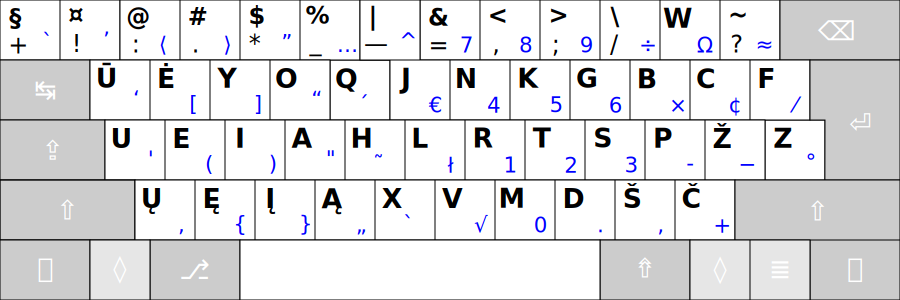

# RATISĖ SKIRTINGOS DARYBOS KLAVIATŪROSE

Ratisės išdėstymas skirtingos darybos klaviatūrose atrodys kiek kitaip, dažniausiai gali pritrūkti brūkšnelio mygtuko ir ```Z``` mygtukas gali būti kiek kitoje vietoje.

Čia, žemiau, klaviatūrų mygtukų išdėstymai rikiuojami pagal patogumą, nuo geresnio prie prastesnio (nors tas skirtumas ir nedidelis).

<br>

1. __101/104 mygtukų klaviatūra „ANSISO“ (ISO be papildomo mygtuko, „ANSI+ISO“):__


<br>
   
2. __101/104 mygtukų ANSI klaviatūra (dar vadinama „amerikietiška“):__


<br>

3. __101/104 mygtukų PC/AT klaviatūra (su labai dideliu _Enter_, kartais dar vadinama „azijietiška“):__


<br>
    
4. __102/105 mygtukų ISO klaviatūra (dar vadinama „europietiška“):__


<br>
    
5. __102/105 mygtukų klaviatūra „ISOANSI“ (ANSI su papildomu mygtuku, „ISO+ANSI“):__


<br>
   
6. __101/104 mygtukų PC/AT klaviatūros atmaina „2“ (su labai dideliu _Enter_, nukeltu apačion _Z‘u_, padidintu _Backspace_):__


<br>
    
7. __102/105 mygtukų PC/AT klaviatūros atmaina „3“ (su labai dideliu _Enter_, nukeltu apačion _Z‘u_, papildomu brūkšnelio mygtuku, padidintu _Backspace_):__


<br>
    
8. __101/104 mygtukų PC/AT klaviatūros atmaina „4“ (su labai dideliu _Enter_, nukeltu apačion už _Shift‘o_ _Z‘u_, padidintu _Backspace_):__

 
 <br>
   
__Pastabos:__
+ Paskutiniųjų keturių išdėstymų vietos parinktos be patikros, tik atsižvelgiant į kitų išdėstymų patikrų duomenis (prielaida, kad ```Shift``` priėjimo sunkinimas prastina patogumą).
+ Pats paskutinysis išdėstymas savo vietoje dėl atskirtos ir nepatogios ```Z``` mygtuko vietos.
+ Pasitaiko nepatogių klaviatūrų, ypatingai sumažinto dydžio (kompaktiškų), kuriose kraštiniai mygtukai, su labai retai naudojamais neraidiniais ženklais (pradedančiojo anglų kalbos vartotojo požiūriu) ar net ```Enter```, būna sumažinto dydžio, ar nukelti į pačią apatinę (tarpo) eilę, ar netgi išvis jų nėra ir jųjų ženklai prieinami tik kituose mygtukuose per papildomą priėjimo lygį (```Fn```), pastarieji būtų patys nepatogiausi Ratisės naudotojui.
+ Būna klaviatūrų su dar kiek kitokiu mygtukų išdėstymu (tai visokiausios ergonomiškos arba senos klaviatūros).


--------------------------------------------------------------------

[Ratisė stačiakampio mygtukų išdėstymo klaviatūrose](ratise-staciakampese-klaviaturose.md)

[Ratisės našumo palyginimas su kitais išdėstymais](lt-isdestymu-palyginimas.md)

[Į pradžią](../README.md)
