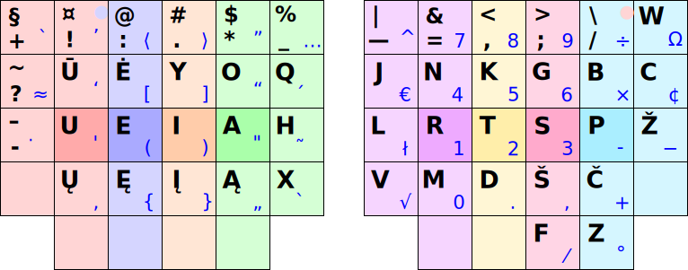

# Ratisė stačiakampio mygtukų išdėstymo klaviatūrose

Ratisės išdėstymas klaviatūrose su stačiakampiškai (neskersuotai) išdėstytais mygtukais bei spausdinimo tvarka klaviatūrose su tokiu mygtukų išdėstymu. Paveikslėliuose skirtingam pirštui tenkantys spausti mygtukai žymėti skirtinga spalva (kitos spalvos skrituliukas mygtuke rodo spaudimo kitu pirštu galimybę).

## Kinesis/ergodox

## Kinesis/argodox (pertvarkytas-pagerintas):

## SEL (Standard Ergonomic Layout):

## „Key Matrix“:
.

__Pastaba.__ Yra klaviatūrų dar ir su kitokiu mygtukų išdėstymu.

-----------------------------------------

[Lietuviškų klaviatūros išdėstymų našumo palyginimas](lt-isdestymu-palyginimas.md)

[Į pradžią](../README.md)

