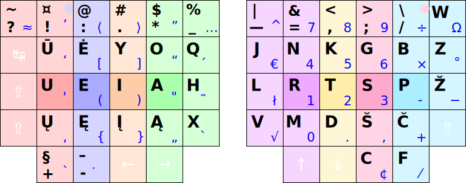

# Ratisė stačiakampio mygtukų išdėstymo klaviatūrose

Ratisės išdėstymas klaviatūrose su stačiakampiškai (neskersuotai) išdėstytais mygtukais bei spausdinimo tvarka klaviatūrose su tokiu mygtukų išdėstymu. Paveikslėliuose skirtingam pirštui tenkantys spausti mygtukai žymėti skirtinga spalva (kitos spalvos skrituliukas mygtuke rodo spaudimo kitu pirštu galimybę).

 

## Ergodox / Kinesis Advantage (numatytasis):

### Ergodox / Kinesis Advantage (patvarkytas):

#### Našumo patikros Ergodox/Kinesis klaviatūroms su numatytuoju ir patvarkytu išdėstymu:

##### Lietuviškam tekstui:

   1. ŪĖYOQJ Ratise (Ergodox) — patvarkytas — 68.61
   2. ŪĖYOQJ Ratise (Ergodox) — numatytasis — 68.60

 __Šaltinis:__ [Keyboard Layout Analyzer _Lietuviškos pasakos (iš Basanavičiaus rinkinio)_](http://patorjk.com/keyboard-layout-analyzer/#/load/DCV8rkJD)

##### Angliškam tekstui:

   1. ŪĖYOQJ Ratise (Ergodox) — patvarkytas — 64.87
   2. ŪĖYOQJ Ratise (Ergodox) — numatytasis — 64.73

__Šaltinis:__ [Keyboard Layout Analyzer _Alice in Wonderland, Chapter 1_](http://patorjk.com/keyboard-layout-analyzer/#/load/pF9Lw29B)

##### Programavimo tekstui:

   1. ŪĖYOQJ Ratise (Ergodox) — numatytasis — 56.35
   2. ŪĖYOQJ Ratise (Ergodox) — patvarkytas — 55.76

__Šaltinis:__ [Keyboard Layout Analyzer _Bash, C, CPP, HTML, JavaScript, Python_](http://patorjk.com/keyboard-layout-analyzer/#/load/XxKw0851)

 

## SEL (Standard Ergonomic Layout):

 

## „Matrix“:

 

## TypeMatrix:

 

__Pastaba.__ Būna klaviatūrų dar ir kiek su kitokiu mygtukų išdėstymu. Paprastai tai būna, kad koks nors kraštinis mygtukas nukeltas kiton klaviatūros pusėn ir panašiai. Kartais, tokiose klaviatūrose yra galimybė programiškai sukeitinėti mygtukus (pačioje klaviatūros programinėje įrangoje). Taigi, sekant pavyzdžiais aukščiau, derėtų prisitaikyti tokią klaviatūrą prie patogesnio Ratisės išdėstymo. Kitaip, galima mygtukus susikeisti programiškai ir pačioje skaitmeninėje aplinkoje (OS). Dar kitaip, galima taisyti prie tam tikros klaviatūros patį Ratisės išdėstymą (išdėstymo valdyklę).

-----------------------------------------

[Į pradžią](../README.md)
