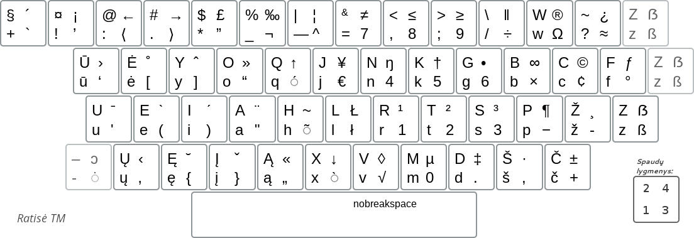

[To the top](../README_eng.md)

LITHUANIAN RATISE WITH ALL CHARACTERS IN ONE PICTURE
-----------------------------------------

This is four level layout:

 1. first level
 2. shifted second level
 3. AltGr third level
 4. shifted AltGr fourth level

+ There are two versions of the Ratise layout differing in some characters at the fourth level.

#### Lithuanian Ratisė:

#### Lithuanian Ratisė TM (with dead keys):

