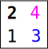

# Ratisės atmainos

Išdėstymai atvaizduoti su visais keturių lygių ženklais:



+ 1 — Pagrindinis, pirmasis lygis;
+ 2 — ```⇧``` antrasis, ‘Shift’ lygis;
+ 3 — ```⇮``` trečiasis, ‘AltGr’ lygis;
+ 4 — ```⇧```+```⇮``` ketvirtasis, ‘AltGr+Shift’ lygis.

<br>

1. Įprastas __Ratisės__ išdėstymas:


<br>

2. __Ratisės W__ išdėstymas, su sukeistais vietomis ```-``` ir ```W``` ženklais, tinka tik ISO klaviatūroms (toms, kurios turi papildomą mygtuką):


   + Brūkšnelio mygtuko trečiajame lygyje yra „Nepertraukiamasis brūkšnelis“.

<br>

3. __Ratisės B__ išdėstymas be tęsties mygtukų (su atitinkamais uždėtiniais ženkleliais vietoje jų):


  + ```ı``` ketvirtame ```I``` mygtuko lygyje yra betaškė mažoji „i“.

<br>

-------------------------

[Ratisės išdėstymo ženklai](ratises-isdestymo-zenklai.md)

[Į pradžią](../README.md)
