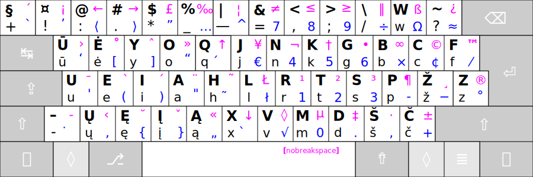

# Ratisės išdėstymo atmainos

Išdėstymai atvaizduoti su visais keturių lygių ženklais:


+ 1 — Pagrindinis, pirmasis lygis;
+ 2 — ```⇧``` antrasis, ‘Shift’ lygis;
+ 3 — ```⇮``` trečiasis, ‘AltGr’ lygis;
+ 4 — ```⇧```+```⇮``` ketvirtasis, ‘AltGr+Shift’ lygis.

<br>

Įprastas __Ratisės__ išdėstymas:



<br>

__Ratisės W__ išdėstymas, su sukeistais vietomis ```-``` ir ```W``` ženklais, tinka tik [ISO klaviatūroms](https://upload.wikimedia.org/wikipedia/commons/1/14/Physical_keyboard_layouts_comparison_ANSI_ISO.png) (toms, kurios prie kairiojo ```Shift``` turi papildomą mygtuką):


   + Brūkšnelio mygtuko trečiajame lygyje yra „Nepertraukiamasis brūkšnelis“.

<br>

__Ratisės B__ išdėstymas be tęsties mygtukų (su atitinkamais uždėtiniais ženkleliais vietoje jų):


  + ```ı``` ketvirtame ```I``` mygtuko lygyje yra betaškė mažoji „i“.
  + Šios atmainos Ratisės išdėstyme nėra tęsties mygtukų lỹgių ženklų.

<br>

-------------------------

[Ratisė skirtingos darybos klaviatūrose](ratise-skirtingos-darybos-klaviaturose.md)

[Ratisės išdėstymo ženklai](ratises-isdestymo-zenklai.md)

[Į pradžią](../README.md)
