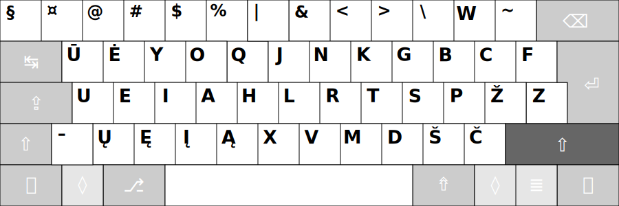

# RATISĖS ŽENKLŲ IŠDĖSTYMO LYGIAI


_Ratisės išdėstyme raidės ir kiti ženklai ẽsti keturiuose lygiuose._

Kaip išdėstyti spausdinamieji ženklai (spaudaĩ) keturiuose lygiuose, žiūrėkite paveikslėliuose žemiau.


## Ratisės 1-is lygis

Spausdinamasis ženklas įvedamas tiesiog paspaudus ant reikiamo mygtuko.

_Tai yra pagrindinių rašto ženklų išdėstymo lygis. Šičia sudėti reikalingiausi teksto rinkimui ženklai._


+ Tarp mygtukų  ```pabraukimas``` ir ```lygu``` yra mygtukas su ilguoju brūkšniu, vadinamuoju _m_ ilgio brūkšniu (tai yra _m_ raidės pločio brūkšniu). Kai kuriuose spaudmenyse (šriftuose) klaidingai atvaizduojamas trumpesnis nei turėtų būti.


## Ratisės 2-is lygis

Spausdinamasis ženklas įvedimui pasiekiamas papildomai kartu iš anksto spaudžiant ir _Antrojo lygio_ mygtuką ```⇧ Shift```.

_Tai yra didžiųjų raidžių ir papildomų rašto ženklų išdėstymo lygis._



+ Brūkšnelio mygtuko antrajame lygyje yra pusilgis brūkšnys, vadinamasis _n_ ilgio brūkšnys. Kai kuriuose spaudmenyse klaidingai atvaizduojamas veik vienodo ilgumo su ilgesniuoju _m_ ilgio brūkšniu. Dėl to, kad _n_ ilgio brūkšnys savo ilgiu panašus į tikrąjį atimties ženklą, jo nederėtų vartoti vietoje ilgojo brūkšnio (_m_ ilgio brūkšnio), dėl tos pat priežąsties _n_ ilgio brūkšnys netinka naudoti atstumo tarpui tarp skaičių ar dalykų žymėti (nors anglų kalboje jis vartojamas taip, dėl to, matyt, kad jie ilgąjį _m_ brūkšnį deda tarp žodžių be tarpų). Toks brūkšnių ilgių neapibrėžtumas, ar dėl netikusio spausdintojo ar dėl spaudmenų darytojo pasirinkimo, gali kelti painiavos, palyginkite: 5−7, 5–7, 5—7 (kas gi čia parašyta? — kai kuriuose spaudmenyse jie gali mažne nesiskirti.).


## Ratisės 3-is lygis

Spausdinamasis ženklas įvedimui pasiekiamas papildomai kartu iš anksto spaudžiant ir _Trečiojo lygio_ mygtuką ```⇮ AltGr```.

_Šiame išdėstymo lygyje kairėje pusėje yra papildomi skyrybos ženkai: kabutės, skliaustai, daugtaškis, priegaidžių uždėtiniai ženkleliai. Išdėstymo lygyje dešinėje pusėje yra skaičiukynė su susijusiais ženklais, bei kietasis ```ł```. Dažniausiai reikalingi iš papildomų ženklų sudėti patogiausiose vietoje. Esanti šiame lygyje skaičiukynė Ratisės išdėstyme atitinka [ISO standartą](https://en.wikipedia.org/wiki/ISO/IEC_9995), be to turi papildomą tašką._


+ Paveikslėlyje brūkšnelio, ```Q```, ```H```, ```X``` mygtukų vietose esantys ženkliukai yra ant raidžių dedami uždėtiniai ženkleliai („diakritikai“), tai — _lietùviškų príegaidžių uždėtìniai ženklẽliai_. Uždėtiniai ženkleliai įvedami papildomai iškart ant prieš tai įvestos ir norimos sukirčiuoti raidės.
+ Trečiajame ```P``` mygtuko lygyje yra tikrasis minuso ženklas, o trečiajame ```Ž``` mygtuko lygyje — brūkšnelio‑minuso ženklas (tas pats ženklas kaip ir ne visose klaviatūrose būnančio brūkšnelio mygtuko pirmajame lygyje ženklas). Kai kurioje skaitmeninėje įrangoje, pavyzdžiui senoje skaičiuotuvo programoje, tikrasis minuso ženklas gali būti neatpažintas, tada skaičiuodami naudokite senąjį brūkšnelį‑minusą vietoje jo; tas pats yra pasakytina ir apie ```×``` bei ```÷``` ženklus, kurių neatpažinimo atveju atitinkamai naudokite ```*``` bei ```/``` mygtukus.
+ Trečiajame ```F``` mygtuko lygyje esantis ```⁄``` yra trupmeninis žambas, skirtas trupmenoms sudaryti, pvz.: 1⁄2 (pastaba: ne visa skaitmeninė įranga taisyklingai atvaizduoja taip sudarytas trupmenas; šiaip jau, ši turėtų atrodyti taip: ½).
+ [Ką daryti jei klaviatūroje yra tik vienas trečio lygio įjungimo mygtukas?!](ratises-trukumu-apejimas.md)


## Ratisės 4-is lygis

Spausdinamasis ženklas įvedimui pasiekiamas papildomai iš anksto spaudžiant _Trečiojo lygio_ mygtuką ```⇮``` kartu su _Antrojo lygio_ mygtuku ```⇧``` (```AltGr+Shift```).

_Įvairių papildomų retais ar ypatingais atvejais reikalingų rašto ženklų išdėstymo lygis._


+ Ketvirtajame lygyje tarpo mygtukas yra _nepertraukiamasis tarpas_ (rašyklės ties juo neturėtų laužyti žodžių keliant juos į kitą eilutę).
+ Brūkšnelis ketvirtajame lygyje yra _nepertraukiamasis brūkšnelis_.
+ Gelzganai žymėtieji yra tęsties mygtukai (angliškai „Dead Keys“), apie juos skaitykite:
[Ratisės tęsties mygtukai ir jais įvedami ženklai](ratises-testies-mygtukai.md).


## Ratisės Didžiųjų raidžių įjungimas

Spausdinamasis ženklas įvedimui pasiekiamas po Didžiųjų raidžių įvedimo mygtuko ```⇪ CapsLock``` paspaudimo (įjungimo).


-------------------------

[Ratisės išdėstymo ženklai](ratise-isdestymo-zenklai.md)

[Į pradžią](../README.md)
