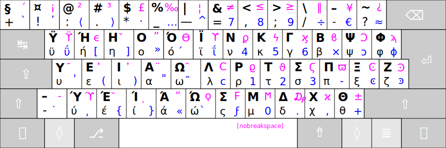
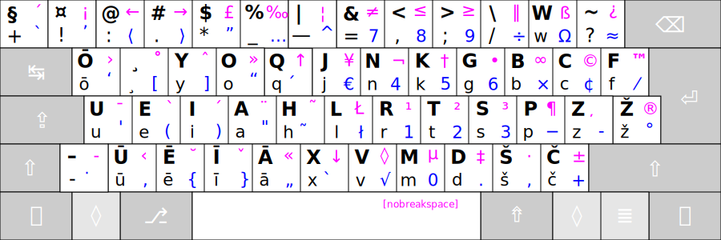
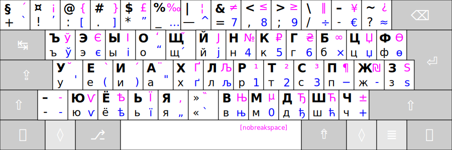

# RATISĖS PAPILDOMIEJI KITAKALBIAI IŠDĖSTYMAI

 

## RATISĖS GERMANIŠKAS IŠDĖSTYMAS

- Tai yra papildomas Ratisės išdėstymas, kuriame germanų kalbų raidės išdėstytos vietoje lietuviškųjų pagal garso ar kitą panašumą.
Ratisės germaniškasis išdėstymas leidžia patogiau rinkti tekstus germanų kalbomis.

 

## RATISĖS GRAIKIŠKAS IŠDĖSTYMAS

- Tai yra papildomas Ratisės išdėstymas, kuriame graikiškos raidės išdėstytos vietoje lietuviškųjų pagal garso ar kitą panašumą.
Ratisės graikiškasis išdėstymas leidžia patogiau rinkti tekstus graikų kalba.

 

## RATISĖS LATVIŠKAS IŠDĖSTYMAS

- Tai yra papildomas Ratisės išdėstymas, kuriame latviškos raidės išdėstytos vietoje lietuviškųjų pagal garso ar kitą panašumą.
Ratisės latviškasis išdėstymas leidžia patogiai rinkti tekstus latvių kalba bei latgalių tarme.

 

## RATISĖS KIRILICA (RUSŲ) IŠDĖSTYMAS

- Tai yra papildomas Ratisės išdėstymas, kuriame kirilicos raidės išdėstytos vietoje lietuviškųjų pagal garso ar kitą panašumą.
Ratisės Kirilica išdėstymas leidžia rinkti tekstus rusų bei kitomis kirilicą vartojančiomis kalbomis.

 

Šių klaviatūros valdyklių diegimo ypatumai yra tie patys kaip ir lietuviško Ratisės išdėstymo.

[↓ Parsisiųsti Ratisės išdėstymo papildomas kitakalbes valdykles ↓](https://github.com/albuck/ratise_kitakalbe/zipball/master)

-------------------------

[Į pradžią](../README.md)
