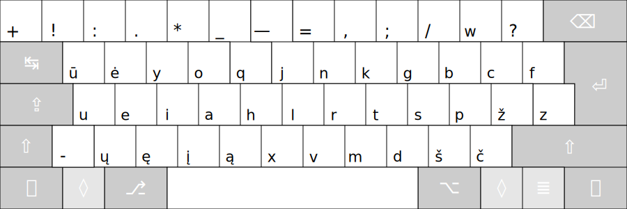
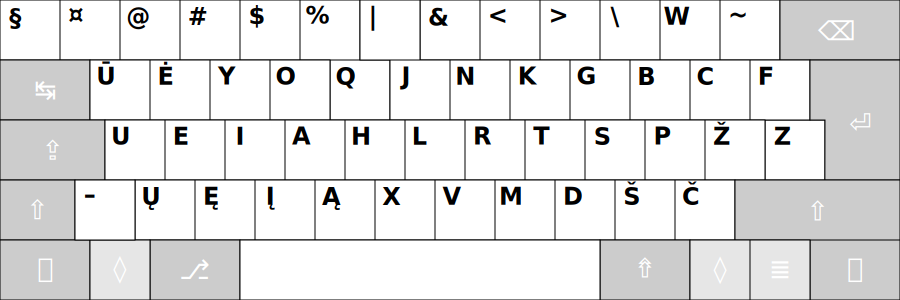
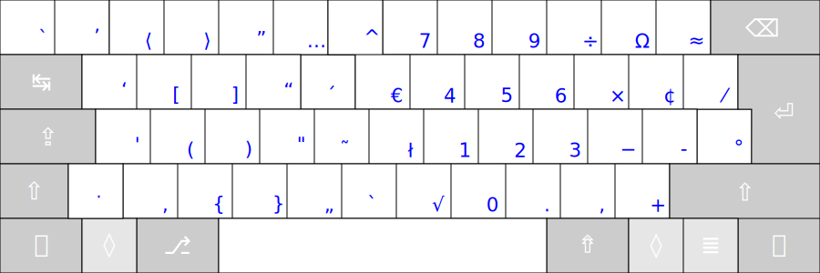
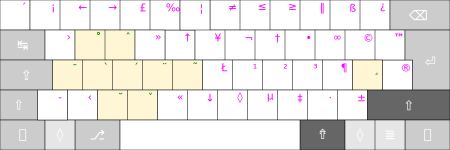
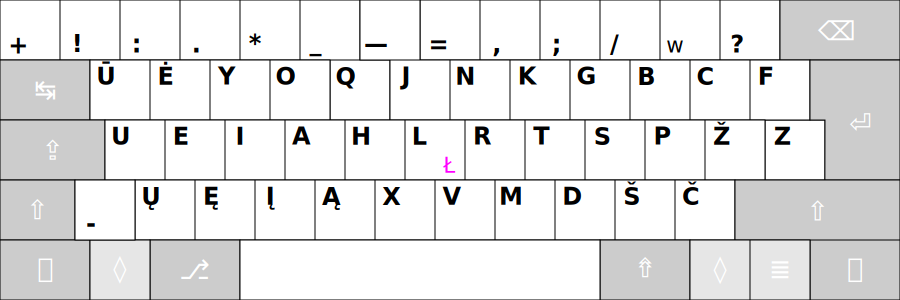
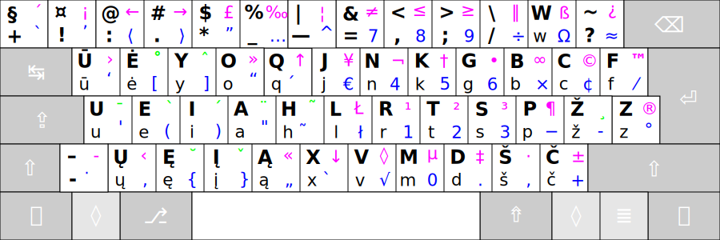
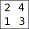

# RATISĖS ŽENKLŲ IŠDĖSTYMO LYGIAI

Kaip išdėstyti spausdinamieji ženklai (spaudaĩ) keturiuose lygiuose, žiūrėkite paveikslėliuose žemiau.

## Ratisės 1-is lygis

— spausdinamasis ženklas įvedamas tiesiog paspaudus ant reikiamo mygtuko.

Tai yra pagrindinių rašto ženklų išdėstymo lygis.

+ Tarp mygtukų  ‘pabraukimas’ ir ‘lygu’ yra mygtukas su ilguoju brūkšniu, vadinamuoju ‘m’ ilgio brūkšniu (tai yra ‘m’ raidės pločio brūkšniu).

## Ratisės 2-is lygis

— spausdinamasis ženklas įvedimui pasiekiamas papildomai kartu iš anksto spaudžiant ir _Antrojo lygio_ mygtuką ⇧ ‘Shift’.

Tai yra didžiųjų raidžių ir papildomų rašto ženklų išdėstymo lygis.

+ Brūkšnelio mygtuko antrajame lygyje yra pusilgis brūkšnys, vadinamasis ‘n’ ilgio brūkšnys. Kai kuriuose spaudmenyse (‘šriftuose’) klaidingai atvaizduojamas vienodo ilgumo su ilgesniuoju ‘m’ ilgio brūkšniu.

## Ratisės 3-is lygis

— spausdinamasis ženklas įvedimui pasiekiamas papildomai kartu iš anksto spaudžiant ir _Trečiojo lygio_ mygtuką ⇮ ‘AltGr’.

Šiame išdėstymo lygyje kairėje pusėje yra papildomi skyrybos ženkai: kabutės, skliaustai, daugtaškis, priegaidžių uždėtiniai ženkleliai. Išdėstymo lygyje dešinėje pusėje yra skaičiukynė su susijusiais ženklais, bei kietasis ‘ł’.

+ Paveikslėlyje brūkšnelio, __Q__, __H__, __X__ mygtukų vietose esantys ženkliukai yra ant raidžių dedami uždėtiniai ženkleliai (‘diakritikai’), tai — _lietùviškų príegaidžių uždėtìniai ženklẽliai_. Uždėtiniai ženkleliai įvedami papildomai iškart ant prieš tai įvestos ir norimos sukirčiuoti raidės.

+ Trečiajame __P__ mygtuko lygyje yra tikrasis minuso ženklas, o trečiajame __Ž__ mygtuko lygyje — brūkšnelio‑minuso ženklas (tas pats ženklas kaip ir ne visose klaviatūrose būnančio brūkšnelio mygtuko pirmajame lygyje ženklas). Kai kurioje skaitmeninėje įrangoje, pavyzdžiui senoje skaičiuotuvo programoje, tikrasis minuso ženklas gali būti neatpažintas, tada skaičiuodami naudokite senąjį brūkšnelį‑minusą vietoje jo; tas pats yra pasakytina ir apie ‘×’ bei ‘÷’ ženklus, kurių neatpažinimo atveju atitinkamai naudokite ‘\*’ bei ‘/’ mygtukus (esančius išdėstymo pirmajame lygyje).

+ Trečiajame __F__ mygtuko lygyje esantis ‘ ⁄ ’ yra trupmeninis žambas, skirtas trupmenoms sudaryti, pvz.: 1⁄2 (pastaba: ne visa skaitmeninė įranga taisyklingai atvaizduoja taip sudarytas trupmenas; šiaip jau, ši turėtų atrodyti taip: ½).
 
+ [Ką daryti jei klaviatūroje yra tik vienas trečio lygio įjungimo mygtukas?!](trukumu_apejimas.md)

## Ratisės 4-is lygis

— spausdinamasis ženklas įvedimui pasiekiamas papildomai iš anksto spaudžiant _Trečiojo lygio_ mygtuką ⇮ kartu su _Antrojo lygio_ mygtuku ⇧ (‘AltGr+Vald’).

Įvairių papildomų retai reikalingų rašto ženklų išdėstymo lygis.

+ Ketvirtajame lygyje tarpo mygtukas yra _nepertraukiamasis tarpas_ (rašyklės ties juo neturėtų laužyti žodžių keliant juos į kitą eilutę).

+ Brūkšnelis ketvirtajame lygyje yra _nepertraukiamasis brūkšnelis_.

+ Gelzganai žymėtieji yra tęsties mygtukai (angliškai ‘Dead Keys’), apie juos skaitykite:
[Tęsties mygtukai ir jais įvedami ženklai](testies_mygtukai.md).

## Ratisės Didžiųjų raidžių lygis

— spausdinamasis ženklas įvedimui pasiekiamas po Didžiųjų raidžių įvedimo mygtuko ⇪ ‘CapsLock’ paspaudimo (įjungimo).

## Ratisės keturių lygių ženklai viename paveikslėlyje

Paveikslėlyje yra matomi Ratisės išdėstymo visi keturių lygių ženklai:

Spaudų išdėstymo lygiai:

+ 1 — Pagrindinis, pirmasis lygis; 
+ 2 — ⇧ antrasis, ‘Shift’ lygis; 
+ 3 — ⇮ trečiasis, ‘AltGr’ lygis; 
+ 4 — ⇧+⇮ ketvirtasis, ‘AltGr+Shift’ lygis.

__Pastaba:__ [skirtingos darybos klaviatūrose](images/Physical_keyboard_layouts_comparison_ANSI_ISO_variants.png) gali trūkti brūkšnelio mygtuko ir __Z__ mygtukas gali būti kiek kitoje vietoje (būna klaviatūrų ir su dar kitaip išdėstytais kraštiniais mygtukais).

-------------------------
+ [Toliau](spaud_tvarka.md)
+ [Į pradžią](../README.md)
