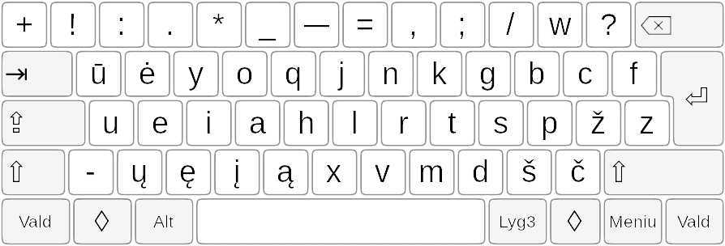
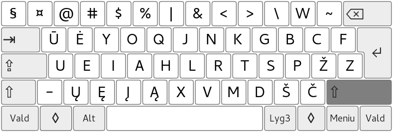
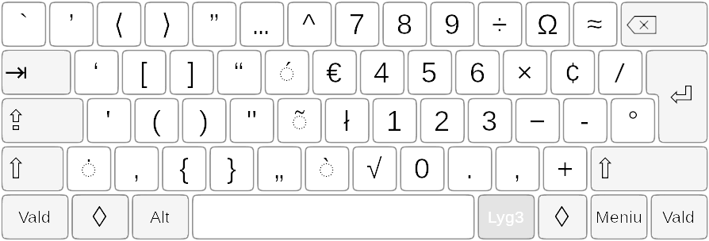
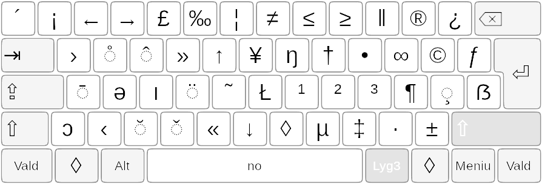
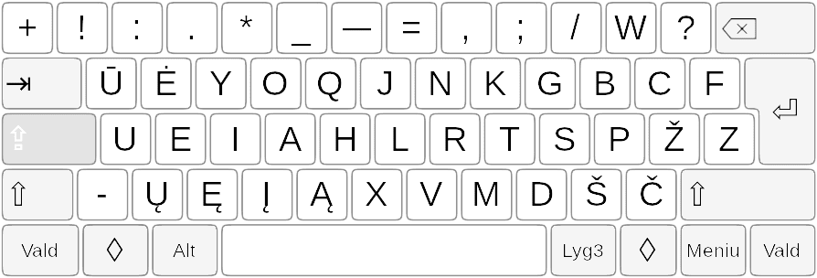

[Į pradžią](../README.md)

RATISĖS ŽENKLŲ IŠDĖSTYMO LYGIAI
-------------------------------

Kaip išdėstyti spausdinamieji ženklai (spaudaĩ) keturiuose lygiuose, žiūrėkite paveikslėliuose žemiau.

### Ratisės 1-sis lygis

— spausdinamasis ženklas įvedamas tiesiog paspaudus ant reikiamo mygtuko.

+ Tarp mygtukų  ‘pabraukimas’ ir ‘lygu’ yra mygtukas su ilguoju brūkšniu, vadinamuoju ‘m’ ilgio brūkšniu (tai yra ‘m’ raidės pločio brūkšniu).

### Ratisės 2-sis lygis

— spausdinamasis ženklas įvedimui pasiekiamas papildomai kartu iš anksto spaudžiant ir _Antrojo lygio_ mygtuką ‘Shift’.

+ Brūkšnelio mygtuko antrajame lygyje yra pusilgis brūkšnys, vadinamasis ‘n’ ilgio brūkšnys. Kai kuriuose spaudmenyse (‘šriftuose’) klaidingai atvaizduojamas vienodo ilgumo su ilgesniuoju ‘m’ ilgio brūkšniu.

### Ratisės 3-sis lygis

— spausdinamasis ženklas įvedimui pasiekiamas papildomai kartu iš anksto spaudžiant ir _Trečiojo lygio_ mygtuką ‘AltGr’.

+ Paveikslėlyje virš taškinių ratiliukų esantys ženkliukai yra ant raidžių dedami uždėtiniai ženkleliai (‘diakritikai’), tai — _lietùviškų príegaidžių uždėtìniai ženklẽliai_. Uždėtiniai ženkleliai įvedami papildomai iškart ant prieš tai įvestos ir norimos sukirčiuoti raidės.

+ Trečiajame __P__ mygtuko lygyje yra tikrasis minuso ženklas, o trečiajame __Ž__ mygtuko lygyje — brūkšnelio‑minuso ženklas (tas pats ženklas kaip ir ne visose klaviatūrose būnančio brūkšnelio mygtuko pirmajame lygyje ženklas). Senesnėje skaitmeninėje įrangoje, pavyzdžiui senoje skaičiuotuvo programoje, tikrasis minuso ženklas gali būti neatpažintas, tada skaičiuodami naudokite senąjį brūkšnelį‑minusą vietoje jo; tas pats yra pasakytina ir apie ‘×’ bei ‘÷’ ženklus, kurių neatpažinimo atveju atitinkamai naudokite ‘\*’ bei ‘/’ mygtukus (esančius išdėstymo pirmame lygyje).
 
+ [Ką daryti jei klaviatūroje yra tik vienas trečio lygio įjungimo mygtukas?!](trukumu_apejimas.md)

### Ratisės 4-sis lygis

— spausdinamasis ženklas įvedimui pasiekiamas papildomai iš anksto spaudžiant _Trečiojo lygio_ mygtuką kartu su _Antrojo lygio_ mygtuku (‘AltGr+Vald’).

+ Paveikslėlyje ant tarpo mygtuko užrašas ‘no’ reiškia, kad ketvirtajame lygyje tai yra _nepertraukiamasis tarpas_ (rašyklės ties juo neturėtų laužyti žodžių keliant juos į kitą eilutę).

+ Gelzganai žymėtieji yra tęsties mygtukai (angliškai ‘Dead Keys’), apie juos skaitykite:
[Tęsties mygtukai ir jais įvedami ženklai](testies_mygtukai.md)

### Ratisės Didžiųjų raidžių lygis

— spausdinamasis ženklas įvedimui pasiekiamas po Didžiųjų raidžių įvedimo mygtuko ‘CapsLock’ paspaudimo (įjungimo).

-------------------------
[Į pradžią](../README.md)
