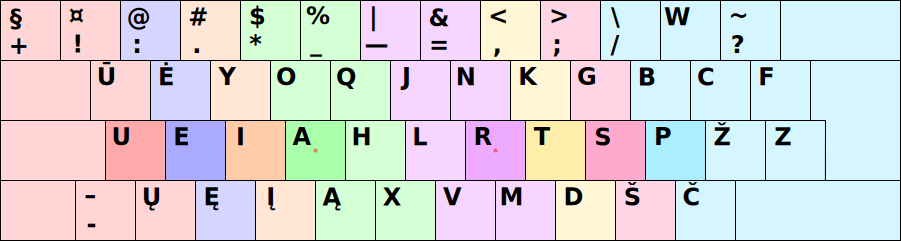
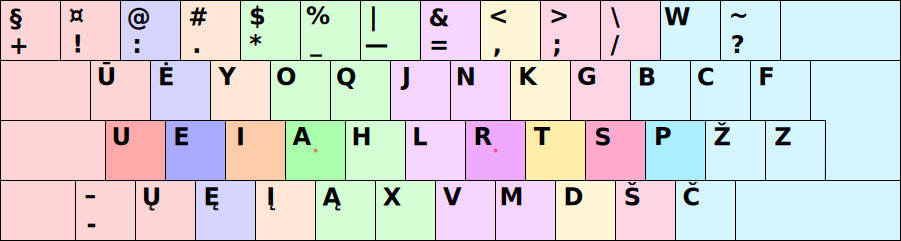
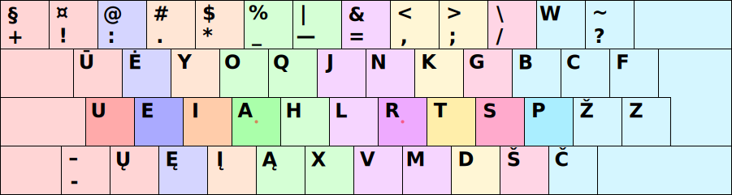
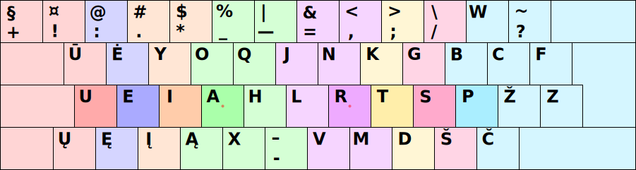

# Galimos skirtingos spausdinimo visais pirštais tvarkos

Galima būtų išskirti penkis kiek skirtingus spausdinimo visais pirštais būdus klaviatūrose su skersuotais mygtukais. Dėl to mygtukų skilčių skersavimo, kartais yra patogiau spausti pirštu viršutinės ar apatinės eilės (aukšto) mygtuką priklausantį kito piršto skilčiai. Šiaip jau, Ratisės išdėstymo bendram patogumui tai turi nedidelį poveikį.

1. Įprastas spausdinimo būdas, kai pirštai spaudo tik griežtai jiems priskirtų skilčių mygtukus:

2. Pirmas pagerintas spausdinimo būdas:

3. Antras pagerintas spausdinimo būdas:

4. Trečias pagerintas spausdinimo būdas:

1. Ergonomiškas spausdinimo būdas (šiuo atveju yra būtina kiek keisti klaviatūros išdėstymą):

## Patikrų lyginamieji duomenys

+ [Keyboard Layout Analyzer: Lietuviškos pasakos (iš Basanavičiaus rinkinio)](http://patorjk.com/keyboard-layout-analyzer/#/load/KQTKhs5V)

   1. Ratise (ISO) - pagerintas 3 — 67.44
   2. Ratise (ISO) - pagerintas 1 — 67.42
   3. Ratise (ISO) - pagerintas 2 — 67.42
   4. Ratise (ISO) - įprastas — 67.26
   5. Ratise (ISO) - ergonomiškas — 66.98

+ [Keyboard Layout Analyzer: Alice in Wonderland, Chapter 1](http://patorjk.com/keyboard-layout-analyzer/#/load/THSFcdDz)

   1. Ratise (ISO) - pagerintas 3 — 62.49
   2. Ratise (ISO) - pagerintas 1 — 62.38
   3. Ratise (ISO) - pagerintas 2 — 62.38
   4. Ratise (ISO) - įprastas — 62.38
   5. Ratise (ISO) - ergonomiškas — 62.28

+ [Keyboard Layout Analyzer: ‘Bash, C, CPP, HTML, JavaScript, Python’](http://patorjk.com/keyboard-layout-analyzer/#/load/Nt46GlH3)

   1. Ratise (ISO) - ergonomiškas — 46.05
   2. Ratise (ISO) - pagerintas 3 — 45.84
   3. Ratise (ISO) - pagerintas 2 — 45.54
   4. Ratise (ISO) - pagerintas 1 — 45.38
   5. Ratise (ISO) - įprastas — 45.29

+ [Keyboard Layout Analyzer: ‘Programming Punctuation Torture Test’](http://patorjk.com/keyboard-layout-analyzer/#/load/1hHNb7kL)

   1. Ratise (ISO) - pagerintas 3 — 47.80
   2. Ratise (ISO) - pagerintas 2 — 47.32
   3. Ratise (ISO) - pagerintas 1 — 46.95
   4. Ratise (ISO) - įprastas — 46.42
   5. Ratise (ISO) - ergonomiškas — 44.60

-----------------------------------------

+ [Į pradžią](README.md)

