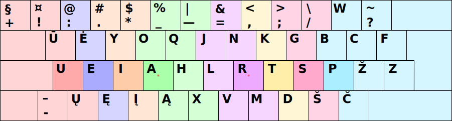

# Galimos skirtingos spausdinimo visais pirštais tvarkos

Galima būtų išskirti keli̇̀s kiek skirtingus spausdinimo visais pirštais būdus klaviatūrose su skersuotais mygtukais. Dėl to mygtukų skilčių skersavimo, kartais yra patogiau spausti pirštu viršutinės ar apatinės eilės (aukšto) mygtuką priklausantį kito piršto skilčiai.

+ Paveikslėlyje sąlygiškai skaičiais įvertintos pastangos spaudžiant mygtuką klaviatūroje su skersuotais mygtukais:


   + Vertinimo skaičiai imti iš [Colemak Mod-DH - Typing Effort Grid](https://colemakmods.github.io/mod-dh/model.html).

Nors, reikia pažymėti, Ratisės išdėstymo bendram patogumui tie skirtingi mygtukų skilčių spaudeliojimo pasirinkimai paprastai turi nedidelį poveikį.

+ Įprastas spausdinimo būdas, kai pirštai spaudo tik griežtai jiems priskirtų skilčių mygtukus:


+ Pirmas pagerintas spausdinimo būdas:


+ Antras pagerintas spausdinimo būdas:


+ Trečias pagerintas spausdinimo būdas:


+ Ketvirtas pagerintas spausdinimo būdas:


+ „Ergonomiškas“ spausdinimo būdas (šiuo atveju yra būtina sukeisti kelis mygtukus vietomis):


+ Antras „ergonomiškas“ spausdinimo būdas (šiuo atveju yra būtina sukeisti kelis mygtukus vietomis):


<br>

## Skirtingų spausdinimo tvarkų našumų patikrų lyginamieji duomenys

+ Keyboard Layout Analyzer ‘Lietuviškos pasakos (iš Basanavičiaus rinkinio)’ — [nuoroda-1](http://patorjk.com/keyboard-layout-analyzer/#/load/G1jJSlSm), [nuoroda-2](http://patorjk.com/keyboard-layout-analyzer/#/load/BhPmMVrc):

   1. Ratise (ISO) - pagerintas 3 — 67.44
   2. Ratise (ISO) - pagerintas 1 — 67.42
   3. Ratise (ISO) - pagerintas 2 — 67.42
   4. Ratise (ISO) - įprastas — 67.26
   5. Ratise (ISO) - ergonomiškas 2 — 67.24
   6. Ratise (ISO) - ergonomiškas — 66.98
   7. Ratise (ISO) - pagerintas 4 — 66.94

+ Keyboard Layout Analyzer ‘Alice in Wonderland, Chapter 1’ — [nuoroda-1](http://patorjk.com/keyboard-layout-analyzer/#/load/ZZh9pGGh), [nuoroda-1](http://patorjk.com/keyboard-layout-analyzer/#/load/l3k5cnVp):

   1. Ratise (ISO) - pagerintas 3 — 62.55
   2. Ratise (ISO) - pagerintas 1 — 62.49
   3. Ratise (ISO) - pagerintas 2 — 62.43
   4. Ratise (ISO) - įprastas — 62.43
   5. Ratise (ISO) - ergonomiškas — 62.28
   6. Ratise (ISO) - ergonomiškas 2 — 62.28
   7. Ratise (ISO) - pagerintas 4 — 62.15

+ Keyboard Layout Analyzer ‘Bash, C, CPP, HTML, JavaScript, Python’ — [nuoroda-1](http://patorjk.com/keyboard-layout-analyzer/#/load/9sJMzGJX), [nuoroda-2](http://patorjk.com/keyboard-layout-analyzer/#/load/5FJd6V6x):

   1. Ratise (ISO) - pagerintas 3 — 46.27
   2. Ratise (ISO) - ergonomiškas — 46.05 
   3. Ratise (ISO) - pagerintas 2 — 45.97
   4. Ratise (ISO) - pagerintas 4 — 45.94
   5. Ratise (ISO) - pagerintas 1 — 45.88
   6. Ratise (ISO) - įprastas — 45.71
   7. Ratise (ISO) - ergonomiškas 2 — 45.63

+ Keyboard Layout Analyzer ‘Programming Punctuation Torture Test’ — [nuoroda-1](http://patorjk.com/keyboard-layout-analyzer/#/load/1hHNb7kL), [nuoroda-2](http://patorjk.com/keyboard-layout-analyzer/#/load/q84SL6ln):

   1. Ratise (ISO) - pagerintas 3 — 47.80
   2. Ratise (ISO) - pagerintas 2 — 47.32
   3. Ratise (ISO) - įprastas — 46.42
   4. Ratise (ISO) - ergonomiškas 2 — 44.74
   5. Ratise (ISO) - ergonomiškas — 44.60
   6. Ratise (ISO) - pagerintas 1 — 44.47
   7. Ratise (ISO) - pagerintas 4 — 41.40

<br>

__Pastabos:__

+ Lengviausia išmokti spausdinti yra įprastuoju būdu. O našiausias (ir sudėtingiausias) spausdinimo būdas, ko gero, būtų įprastojo ir trečiojo pagerinto derinimas tarpusavyje: priklausomai nuo prieš tai naudoto piršto pasirenkamas tas būdas, kuriame būtų galima spausti mygtuką kitu nenaudotu pirštu. Pavyzdžiui: po ```d```, ```t```, ```k``` spaudimo didžiuoju pirštu — ```;``` renkamas bevardžiu, o po ```š```, ```s```, ```g``` spaudimo bevardžiu pirštu — ```;``` renkamas jau didžiuoju pirštu.

+ Dėl to, kad Ratisės (ISO) išdėstyme brūkšnelis-minusas ir pliusas yra dviejose vietose, patikrų algoritmas ne visada pasirenka patogiausią skaičiuodamas.

-----------------------------------------

[Ratisė stačiakampio mygtukų išdėstymo klaviatūrose](ratise-staciakampese-klaviaturose.md)

[Į pradžią](../README.md)

