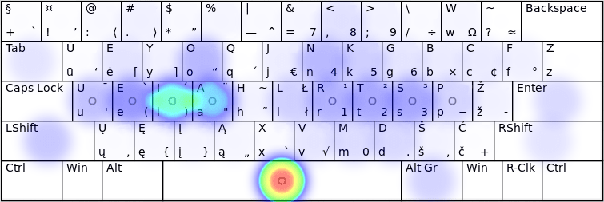

# RATISĖS MYGTUKŲ SPAUDELIOJIMO DAŽNUMAI

Mygtukų (klavišų) paspaudimo dažnumas yra apspręstas pačių raidžių dažnumo lietuviškame rašte, būtent: [iasteourknlpmdvjėgšbžyųąįūčęczhfxwq](lt_raid_dazn.txt).

Akivaizdu, kad [spausdinant visais pirštais](spaud_tvarka.md) patogesnis yra tas klaviatūros išdėstymas, kuriame dažniau naudojamos raidės yra patogesnėje, lengviau ir greičiau pasiekiamoje vietoje.

Žemiau pateikiami paveikslėliai su Ratisės išdėstymo klaviatūros mygtukų naudojimo dažnumu spausdinant tam tikrą tekstą. Ryškesnė spalva rodo didesnį mygtuko naudojimo dažnumą.

## Lietuviško teksto skaida

__Lietuviškos pasakos iš Basanavičiaus rinkinio:__

__Pirštų užimtumas:__

+ kairysis mažasis — 6,9%
+ kairysis bevardis — 7,2%
+ kairysis didysis — 12,5%
+ kairysis smilius — 15,0%
+ nykščiai — 14,6%
+ dešinysis smilius — 16,3%
+ dešinysis didysis — 12,4%
+ dešinysis bevardis — 8,8%
+ dešinysis mažasis — 6,3%

## Angliško teksto skaida

__Angliškas grožinis tekstas (Alice in Wonderland, Chapter 1):__

__Pirštų užimtumas:__

+ kairysis mažasis — 4,3%
+ kairysis bevardis — 9,5%
+ kairysis didysis — 6,7%
+ kairysis smilius — 17,0%
+ nykščiai — 19,5%
+ dešinysis smilius — 14,2%
+ dešinysis didysis — 13,1%
+ dešinysis bevardis — 6,3%
+ dešinysis mažasis — 9,4%

__Programavimo kalbų tekstas (Bash, C, CPP, Python bendrai):__

__Pirštų užimtumas:__

+ kairysis mažasis — 11,0%
+ kairysis bevardis — 8,2%
+ kairysis didysis — 7,2%
+ kairysis smilius — 11,7%
+ nykščiai — 17,6%
+ dešinysis smilius — 13,4%
+ dešinysis didysis — 8,7%
+ dešinysis bevardis — 6,9%
+ dešinysis mažasis — 15,3%

## Aukščiau pateikti tekstai kartu:

__Pastaba:__ paveikslėliai imti iš [Keyboard Layout Analyzer](http://patorjk.com/keyboard-layout-analyzer/#/main) puslapio.

-------------------------
+ [Toliau](palyginimas.md)
+ [Į pradžią](../README.md)
