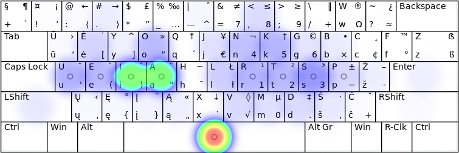
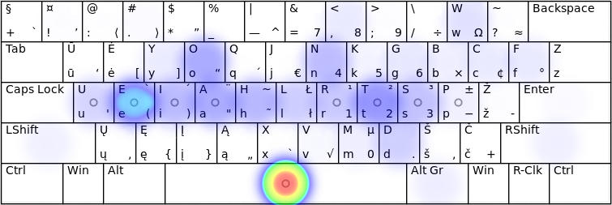
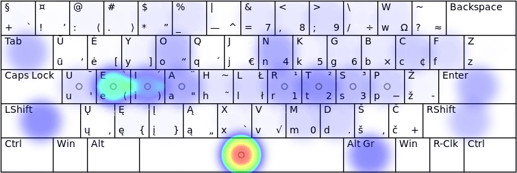

[Į pradžią](../README.md)

MYGTUKŲ SPAUDELIOJIMO DAŽNUMAI
------------------------------

Mygtukų paspaudimo dažnumas yra apspręstas pačių raidžių dažnumo lietuviškame rašte, būtent: [iasteourknlpmdvjėgšbžyųąįūčęczhfxwq](lt_raid_dazn.txt).

Akivaizdu, kad [spausdinant visais pirštais](spaud_tvarka.md) patogesnis yra tas klaviatūros išdėstymas, kuriame dažniau naudojamos raidės yra patogesnėje, lengviau ir greičiau pasiekiamoje vietoje.

## Lietuviškas tekstas

Žemiau pateikiamas paveikslėlis su klaviatūros mygtukų naudojimo dažnumu spausdinant lietuvišką tekstą (lietuviškos pasakos iš Basanavičiaus rinkinio). Ryškesnė spalva rodo didesnį mygtuko naudojimo dažnumą.

__Pirštų užimtumas:__

+ kairysis mažasis — 6,9%
+ kairysis bevardis — 7,2%
+ kairysis didysis — 12,5%
+ kairysis smilius — 15,0%
+ abu nykščiai — 14,6%
+ dešinysis smilius — 16,3%
+ dešinysis didysis — 12,4%
+ dešinysis bevardis — 8,8%
+ dešinysis mažasis — 6,3%

## Angliškas tekstas

### Angliškas grožinis tekstas

__Pirštų užimtumas:__

+ kairysis mažasis — 4,3%
+ kairysis bevardis — 9,5%
+ kairysis didysis — 6,7%
+ kairysis smilius — 17,0%
+ abu nykščiai — 19,5%
+ dešinysis smilius — 14,2%
+ dešinysis didysis — 13,1%
+ dešinysis bevardis — 6,3%
+ dešinysis mažasis — 9,4%

### Programavimo tekstas (Bash, C, CPP, Python)

__Pirštų užimtumas:__

+ kairysis mažasis — 11,0%
+ kairysis bevardis — 8,2%
+ kairysis didysis — 7,2%
+ kairysis smilius — 11,7%
+ abu nykščiai — 17,6%
+ dešinysis smilius — 13,4%
+ dešinysis didysis — 8,7%
+ dešinysis bevardis — 6,9%
+ dešinysis mažasis — 15,3%

• _Pastabėlė_. Sprendžiant iš rodmenų: programuotojams derėtų pagalvoti apie tikrai ergonomiškos ir programuojamos klaviatūros įsigijimą ar pasigaminimą — [žiūrėkite nuorodas pirmojo puslapio apačioje](../README.md#naudingos-nuorodos). Taip pat apie ‘Alt’ ir ‘Shift’ mygtukų sukeitimą vietomis: ‘Shift‘ (ar/ir ‘Enter’, ‘Tab’) priskyrimą pajėgesniam pirštui (didžiajam ar bevardžiui). 

------------------------------

__Pastaba:__ 
+ Paveikslėliai imti iš [Keyboard Layout Analyzer](http://patorjk.com/keyboard-layout-analyzer/#/main) puslapio.

------------------------------

### Papildomai:

[Lietuviškų išdėstymų palyginimas](palyginimas.md)

