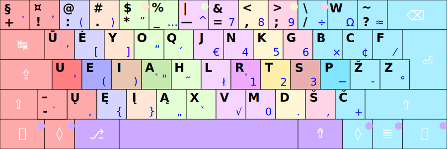

# SPAUSDINIMO VISAIS PIRŠTAIS TVARKA

Spausdinant visais pirštais, apčiuopomis, kiekvienas pirštas be pagrindinės padėties __UEIA RTSP__ mygtukų (paryškinti) spaudo tik tam tikrus savo skilties mygtukus, pirštas paspaudęs kokį ne pagrindinėje padėtyje esantį mygtuką, grąžinamas prie pagrindinės padėties mygtuko (jeigu jam netenka iškart vėl spausti kito jam priskirto mygtuko). Pagrindinę pirštų padėtį padeda surasti ant __A__ ir __R__ mygtukų esantys ir apčiuopiami rankų smiliais iškilūs kauburiukai. Renkant kokį spaudą esantį ne pirmame lygyje vienos rankos pirštu, keitimo mygtukus (‘Shift’, ‘AltGr’, ‘AltGr+Shift’) dera spausti kitos rankos pirštu/ais. Tarpo mygtukas taip pat paprastai spaudžiamas kitos rankos nykščiu nei prieš tai naudota įvedimui ranka, nebent yra patogiau kitaip, kai reikia spausti tuo nykščiu trečio lygio įjungimo mygtuką.

Paveikslėlyje skirtingam pirštui tenkantys spausti mygtukai žymėti skirtinga spalva (kitos spalvos skrituliukai mygtuke rodo spaudimo kitu pirštu galimybę, kai tai yra patogiau), nykščiams skirti mygtukai žymėti viena spalva, nors aišku, kad kairysis ir dešinysis nykštys paprastai spaudys savo pusės mygtukus:

Mygtukų paspaudimo pirštais būdas yra toks pat kaip ir grojant fortepijonu: pirštai kiek sulenkiami ir spusteli mygtuką iš viršaus statmenai į jį. Spausdinant, ranka per riešą laikoma tiesiai.

Pradedant mokytis spausdinimo visais pirštais, reikėtų prieš akis turėti Ratisės klaviatūros ženklų išdėstymo paveikslėlį, atsispausdintą ar ant ekrano (pvz.: [Ratisės pagrindiniai ženklai](images/lt_ratise.svg)).

Arba pasirinkite paveikslėlį su daugiau ženklų pagal savo turimą klaviatūrą:
  - 105 mygtukų klaviatūra, europietiškas ISO: [svg](images/kb_lt_ratise.svg), [nespalvotas pdf](images/kb_lt_ratise.pdf), [spalvotas svg](images/ratise_spaudotvarka.svg), [spalvotas pdf](images/ratise_spaudotvarka.pdf), [nespalvotas png](images/lek_ratise_layout.png), [su visais ženklais svg](images/kb_lt_ratise_viskas.svg);
  - 104 mygtukų klaviatūra, amerikietiškas ANSI: [svg](images/kb_lt_ratise_104_ansi.svg), [nespalvotas pdf](images/kb_lt_ratise_104_ansi.pdf);
  - 104 mygtukų klaviatūra (su apverstu dideliu ‘L’ pavidalo ‘Enter’): [svg](images/kb_lt_ratise_104_2.svg), [nespalvotas pdf](images/kb_lt_ratise_104_2.pdf);
  - 104 mygtukų klaviatūra (ISO be 105-to mygtuko): [svg](images/kb_lt_ratise_104_3.svg), [nespalvotas pdf](images/kb_lt_ratise_104_3.pdf);

Pačią klaviatūrą gerai apžiūrėkite ir apčiupinėkite. Pasidėkite klaviatūrą taip, kad būtų patogu spausdinti ja. Apčiuopomis pajuskite mygtukus, paspaudinėkite juos, smiliais raskite esančius ant __A__ ir __R__ mygtukų kauburiukus — jūsų rankų pirštų pagrindinės padėties gaires.

Mokytis rinkti įrašus pradedama nuo paprastų žodelių ir žodžių sudarytų iš pirštų pagrindinės padėties raidžių _ueia rtsp_, toliau pereinant prie sunkiau pasiekiamų ne pagrindinės padėties raidžių. [Dažniausias lietuviškas žodis yra „ir“](dazn_zod.txt), nuo jo galima ir pradėti. Į pačią klaviatūrą reikėtų vengti žiūrėti spausdinant — žiūrėkite į tekstą kurį renkate ir išdėstymo paveikslėlį, o kai nežinote, kur yra koks reikiamas jums ženklas, vadovaudamiesi tuo paveikslėliu bandykite apčiuopomis susirasti reikiamą mygtuką tam ženklui. Kartojant judesius mankštinamas kiekvienas pirštas iki susidaro įgūdis, kai pirštas „žino“, kur yra koks jam priskirtas spausti ženklas. Iš pradžių mintyse kiekvienas pirštas yra „prižiūrimas“ ir vedamas prie reikiamo mygtuko. Jeigu kokį raidžių derinį yra kebliau surinkti, žodį su tokiu deriniu reikėtų pakartotinai įvedinėti keletą šimtų kartų (visiškiems pradžiamoksliams, ko gero, tai bus bet kuris raidžių derinys). Po spausdinimo įgūdžio susidarymo ir pirštų išlavėjimo, pirštai spausdina veik savaime ir be didelių pastangų. Toliau jau, įgyjant daugiau patirties spausdinant, didėja ir spausdinimo greitis.

__Pastabos.__ Spausdinimo klaviatūra mokymo programėlės, dažniausiai, netinka pradžiamoksliams, dėl per sudėtingo duodamo jose teksto, sudaryto iš retesnių kalbai žodžių ir retesnių raidžių, esančių ne pagrindinėje pirštų padėtyje. Pradėkite mokytis nuo paprastų žodelių, žodžių ir pasakymų, kuriuos patys puikiai žinote ir kuriuos vartojate. Mokykitės palaipsniui — nuo paprasto prie sudėtingo. Išmokę vieną kurį raidžių derinį ar žodį, pereikite prie kito. Griežtai prisilaikykite kiekvienam pirštui priskirtų spausti mygtukų, išimtys galėtų būti taikomos kraštiniams viršutiniams šoniniams mygtukams (pvz.: ‘Esc’, ‘W’ ir ‘Backspace’), kur mažylį silpnestį pirštą gali pakeisti bevardis, tik turėkite omeny, tai papildomai išmokstama gudrybė, kuri ne visados bus patogi.

-------------------------
+ [Toliau](testies_mygtukai.md)
+ [Į pradžią](../README.md)
