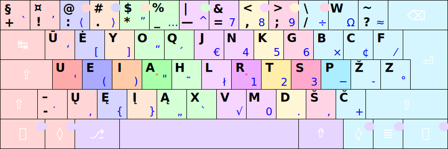

# SPAUSDINIMO VISAIS PIRŠTAIS TVARKA

Tai yra, vadinamojo, „aklojo teksto rinkimo“ arba „teksto rinkimo nežiūrint į klaviatūrą“ pagrindai. Turint patogų ir lengviau įsimenamą klaviatūros ženklų išdėstymą, rinkti tekstą visais pirštais išmokti nėra sunku.

Spausdinant visais pirštais, apčiuopomis, nežiūrint į klaviatūrą, kiekvienas pirštas be pagrindinės padėties _ueia··rtsp_ mygtukų (paryškinti) spaudo tik tam tikrus savo skilties mygtukus, pirštas paspaudęs kokį ne pagrindinėje padėtyje esantį mygtuką, grąžinamas prie pagrindinės padėties mygtuko (jeigu jam netenka iškart vėl spausti kito jam priskirto mygtuko). Pagrindinę pirštų padėtį padeda surasti ant ```A``` ir ```R``` mygtukų esantys ir apčiuopiami rankų smiliais iškilūs kauburiukai. Renkant kokį spaudą esantį ne pirmame lygyje vienos rankos pirštu, keitimo mygtukus (```Shift```, ```AltGr```, ```AltGr+Shift```) dera spausti kitos rankos pirštu/ais. Tarpo mygtukas taip pat paprastai spaudžiamas kitos rankos nykščiu nei prieš tai naudota įvedimui ranka, nebent yra patogiau kitaip, kai reikia spausti tuo nykščiu trečio lygio įjungimo mygtuką.

Paveikslėlyje skirtingam pirštui tenkantys spausti mygtukai žymėti skirtinga spalva. Kitos spalvos skrituliukai mygtuke rodo spaudimo kitu pirštu galimybę. Nykščiams skirti mygtukai žymėti viena spalva, nors aišku, kad kairysis ir dešinysis nykštys spaudys savo pusės mygtukus:



Mygtukų paspaudimo pirštais būdas yra toks pat kaip ir grojant fortepijonu: pirštai kiek sulenkiami ir spusteli mygtuką iš viršaus statmenai į jį. Spausdinant, ranka per riešą laikoma tiesiai.

Pradedant mokytis spausdinimo visais pirštais, reikėtų prieš akis turėti Ratisės klaviatūros ženklų išdėstymo paveikslėlį, atsispausdintą ar ant ekrano, pradėkite nuo paprasčiausio, pvz.: [Ratisės pagrindiniai ženklai](images/lt-ratise-isdestymas.svg), [Ratisės pirmojo lygio ženklai](images/kb-lt-ratise-1-lygis.svg), toliau jau pereidami prie kitų [Ratisės lygių ženklų](ratises-isdestymo-lygiai.md). Arba pasirinkite paveikslėlį su daugiau ženklų pagal savo turimą klaviatūrą: [Ratisė skirtingos darybos klaviatūrose](ratise-skirtingos-darybos-klaviaturose.md).

Pačią klaviatūrą gerai apžiūrėkite ir apčiupinėkite. Pasidėkite klaviatūrą taip, kad būtų patogu spausdinti ja. Apčiuopomis pajuskite mygtukus, paspaudinėkite juos, smiliais raskite esančius ant ```A``` ir ```R``` mygtukų kauburiukus — jūsų rankų pirštų pagrindinės padėties gaires.

Mokytis rinkti įrašus pradedama nuo paprastų žodelių ir žodžių sudarytų iš pirštų pagrindinės padėties raidžių _ueia··rtsp_, paskui pereinant prie sunkiau pasiekiamų ne pagrindinės padėties raidžių. Toliau besimokantiems gali praversti [dažniausių lietuviškų žodžių šimtukas](dazniausi-lt-zodziai.txt). Atskirai pramankštinamos dvibalsių, dvigarsių ir kitos [būdingesnės raidžių samplaikos](raidziu-samplaikos.txt). Išmokę spausti visas raides (nežiūrėdami į klaviatūrą), būtinai įtraukite į savo pratybas: tarpą, skyrybos ženklus ir didžiąsias raides. Papildomai galima pramankštinti kiekvieną pirštą spaudinėjant tam pirštui priklausančius mygtukus.

Į pačią klaviatūrą reikėtų vengti žiūrėti spausdinant — žiūrėkite į tekstą kurį renkate ir išdėstymo paveikslėlį, o kai nežinote, kur yra koks reikiamas jums ženklas, vadovaudamiesi tuo paveikslėliu bandykite apčiuopomis susirasti reikiamą mygtuką tam ženklui. Kartojant judesius mankštinamas kiekvienas pirštas iki susidaro įgūdis, kai pirštas „žino“, kur yra koks jam priskirtas spausti ženklas. Iš pradžių mintyse kiekvienas pirštas yra „prižiūrimas“ ir vedamas prie reikiamo mygtuko. Jeigu kokį raidžių derinį yra kebliau surinkti, žodį su tokiu deriniu reikėtų pakartotinai įvedinėti keletą šimtų kartų (visiškiems pradžiamoksliams, ko gero, tai bus bet kuris raidžių derinys). Po spausdinimo įgūdžio susidarymo ir pirštų išlavėjimo, pirštai spausdina veik savaime ir be didelių pastangų. Toliau jau, įgyjant daugiau patirties spausdinant, didėja ir spausdinimo greitis.

__Pastabos:__
+ Spausdinimo klaviatūra mokymo programėlės, dažniausiai, netinka pradžiamoksliams, dėl per sudėtingo duodamo jose teksto, sudaryto iš retesnių kalbai žodžių ir retesnių raidžių, esančių ne pagrindinėje pirštų padėtyje. Be to, tokios programėlės yra paremtos matomo teksto atkartojimu, kas yra sudėtingesnis bei papildomas įgūdis, nei tiesiog spausdinimas klaviatūra. Pradžiamokslis turėtų apsiriboti tik spausdinimo įgūdžio lavinimu.
+ Pradėkite mokytis nuo paprastų žodelių, žodžių ir pasakymų, kuriuos patys puikiai žinote ir kuriuos vartojate.
+ Mokykitės palaipsniui — nuo paprasto prie sudėtingo.
+ Išmokę vieną kurį raidžių derinį ar žodį, pereikite prie kito.
+ Griežtai prisilaikykite kiekvienam pirštui priskirtų spausti mygtukų, išimtys galėtų būti taikomos kraštiniams viršutiniams šoniniams mygtukams (pvz.: ```Esc```, ```W``` ir ```Backspace```), kur mažylį silpnesnį pirštą gali pakeisti bevardis, tik turėkite omeny, tai papildomai išmokstama gudrybė, kuri ir ne visados būna patogi.
+ Mokantis ir išmokus spausdinti nežiūrint į klaviatūrą kokie nors lipdukai ar užrašai ant pačios klaviatūros mygtukų nėra reikalingi. Kita vertus, išsaugoję QWERTY išdėstymo užrašus ant klaviatūros mygtukų, prireikus, lengviau surasite juos.


-------------------------

[Galimos skirtingos spausdinimo visais pirštais tvarkos](skirtingos-spausdinimo-tvarkos.md)

[Ratisė stačiakampio mygtukų išdėstymo klaviatūrose](ratise-staciakampese-klaviaturose.md)

[Į pradžią](../README.md)
