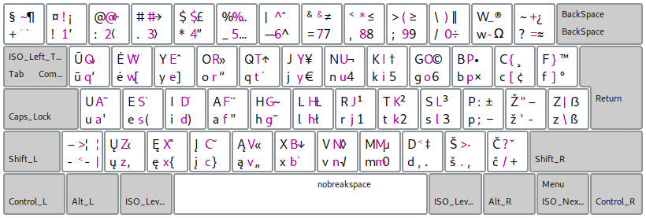

[Į pradžią](../README.md)

Ratisės sutapimai su kitais išdėstymais
---------------------------------------

* Riestiniuose skliaustuose spaudai, kurie yra tame pačiame mygtuke, bet tik kitame lygyje.

__Dvorak (Simplified):__ xXmM@#$%& {!^789-}

__Colemak:__ jJmM@#$%& {!^789}

__Maltron:__ iIyY@#$%& {!^789}

__Turkų F:__ uUaAnN+$% {!789}

__QWERTY:__ mM@#$%& {!^789}

__Workman:__ jJ@#$%& {!^789}

__Prancūzų BEPO:__ iIoO^{}¶ {789}

__LT Ergonomic 1989:__ !jJaAsS {+&789}

__AZERTY LT Standard 1992:__ !mMšŠ^ {@#$%&789}

__AZERTY LT Standard 2000:__ !mM^ {#$&789}

__QWERTY LT Baltic:__ mM {!@#$%^&789}

__LEKP:__ .@

---------------------------------------

#### Ratisė ir QWERTY išdėstymai viename paveikslėlyje:

* Mygtukuose violetine spalva QWERTY išdėstymo spaudai, ratisės spaudai juodi.
