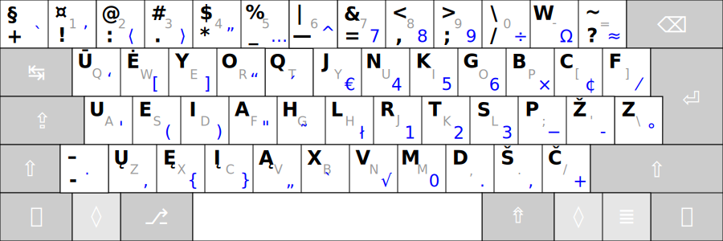

# Ratisės sutapimai su kitais išdėstymais

Lietuviška klaviatūra su Ratisės ŪĖYOQJ išdėstymu, mygtukų vyduryje palyginimui pilkšvi QWERTY išdėstymo spaudai:



## Sutapimai su kitais lietuviškais išdėstymais:

(Kampiniuose skliaustuose spaudai, kurie yra tame pačiame mygtuke, bet tik kitame lygyje.)

| Išdėstymas | sutampantys spaudai | sutampantys mygtukai, spaudas kitame lygyje |
| --- | --- | --- |
|__ĖOŪYHJ Remigijaus:__ | ```jJ nN kK gG lL rR tT sS žŽ vV mM``` | ```% 7 8 9``` |

|__FZVPUJ Lithuanian Ergonomic 1989 (LST 1092-89):__ | ```! jJ aA sS``` | ```+ & 7 8 9``` |

|__AZERTY Lithuanian Standard 1992 (IBM):__ |```! mM šŠ ^ |⟨` @ # $ % & 7 8 9⟩```|

|__QWERTY Lithuanian Programmers:__| ```@ # $ % & mM |⟨` ! ^ ūŪ ėĖ⟩```|

|__QWERTY Lithuanian Baltic/Numeric:__| ```mM |⟨` ! @ # $ % ^ & 7 8 9⟩```|

|__AZERTY Lithuanian Standard 2000:__| ```! mM ^ |⟨` # $ & 7 8 9⟩```|

|__QWERTY Lithuanian:__| ```mM |⟨! @ # $ % 7 8 9⟩```|

|__QGRLDČ LEKP:__| ```. @ |⟨` ´⟩```|


## Sutapimai su kitų kalbų žinomesniais/ergonominiais išdėstymais:

__Latvių ŪGJRMV:__ ```@ # $ % & ūŪ nN tT īĪ(įĮ) ⟨` ´ ^ 7 8 9⟩```

__Anglų Dvorak:__ ```tT xX mM @ # $ % & ⟨` ! ^ 7 8 9 -⟩```

__Anglų Colemak:__ ```jJ mM @ # $ % & ⟨` ! ^ 7 8 9⟩```

__Anglų Maltron:__ ```iI yY @ # $ % & ⟨! ^ 7 8 9⟩```

__Anglų Workman:__ ```jJ @ # $ % & ⟨` ! ^ 7 8 9⟩```

__Anglų QWERTY:__ ```@ # $ % & mM ⟨` ^ 7 8 9⟩```

__Turkų F:__ ```uU aA + $ % ⟨! # 7 8 9⟩```

__Prancūzų BEPO:__ ```iI oO ^ { } ⟨7 8 9⟩```

__Vokiečių Neo2:__ ```uU mM ⟨7 8 9⟩```

__Prancūzų AZERTY:__ ```⟨# | 7 8 9⟩```

-------------------------

[Lietuviškų klaviatūros išdėstymų palyginimas](https://albuck.github.io/lithuanian-keyboard-layouts/)

[Į pradžią](../README.md)
