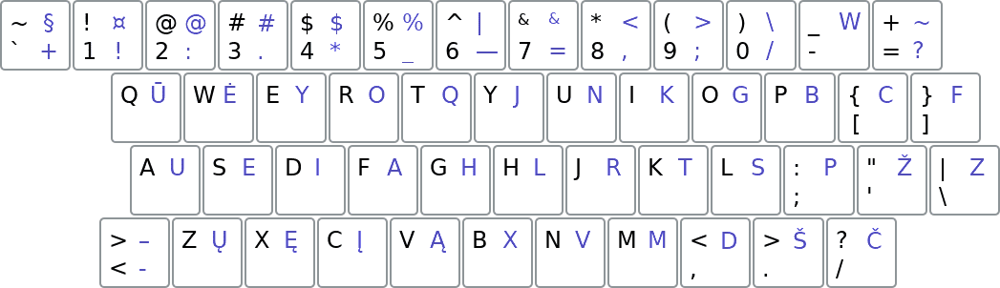

[Į pradžią](../README.md)

Ratisės sutapimai su kitais išdėstymais
---------------------------------------

Palyginimui QWERTY (juodi) ir Ratisės (mėlyni) išdėstymų pagrindiniai ženklai viename paveikslėjyje:

### Sutapimai su kitais išdėstymais:

- __[Remigijaus išdėstymas](images/remigijaus.png):__ jJnNkKgGlLrRtTsSžŽvVmM() {789%} (taip pat balsių stulpeliai kairėje pusėje vienodi tik priskirti kitiems pirštams)
- __[Lithuanian Ergonomic 1989](images/LTSR_RST_1092-89.png):__ !jJaAsS {+&789}
- __[Lithuanian Standard 1992](https://www.registrucentras.lt/litwin/kbdlta.gif):__ !mMšŠ^ {@#$%&789}
- __[Lithuanian Standard 2000](https://www.registrucentras.lt/litwin/kbdlts.gif):__ !mM^ {#$&789}
- __[Lithuanian Baltic](https://www.registrucentras.lt/litwin/kbdlt1.gif):__ mM {!@#$%^&789}
- __[LEKP](https://lekp.info/images/lekp.png):__ .@
- __[Dvorak](https://en.wikipedia.org/wiki/Dvorak_keyboard_layout#/media/File:KB_United_States_Dvorak.svg):__ tTxXmM@#$%& {!^789-}
- __[Colemak](https://colemak.com/wiki/images/6/6c/Colemak2.png):__ jJmM@#$%& {!^789}
- __[Maltron](https://upload.wikimedia.org/wikipedia/commons/5/56/KB_Maltron_3D_US.svg):__ iIyY@#$%& {!^789}
- __[Turkų F](https://en.wikibooks.org/wiki/Turkish/Computing_in_Turkish#/media/File:KB_Turkey_f_yeni.svg):__ uUaAnN+$% {!789}
- __[Workman](https://en.wikipedia.org/wiki/Keyboard_layout#/media/File:KB_English_Workman.svg):__ jJ@#$%& {!^789}
- __[BEPO](https://en.wikipedia.org/wiki/B%C3%89PO#/media/File:KB_French_B%C3%89PO-NF_Z71-300.svg):__ iIoO^{} {789}
- __[Neo](https://en.wikipedia.org/wiki/Neo_(keyboard_layout)#/media/File:Neo_2.0-Tastaturbelegung_Ebene1.svg):__ uUmM {789}

† Riestiniuose skliaustuose spaudai, kurie yra tame pačiame mygtuke, bet tik kitame išdėstymo lygyje.

--------------------------------------------------------------------

### Nuorodos į kitokius išdėstymus:

- [Lithuanian Baltic (QWERTY atmaina)](https://www.registrucentras.lt/litwin/keyboard.html)
- [Lithuanian Standard 2000 (AZERTY+QWERTY atmaina)](http://www.ims.mii.lt/klav/)
- [Lithuanian Standard 1992 (AZERTY+QWERTY atmaina)](https://www.registrucentras.lt/litwin/keyboard.html)
- [Lithuanian Ergonomic 1989 (Lietuvos TSR RST 1092-89)](https://lekp.info/RST1092)
- [Lietuviškas LEKP](https://lekp.info/)
- [Lietuviškas Remigijaus išdėstymas](https://web.archive.org/web/20080315055411/http://pradmenes.net/tekstu_katalogas/remigijus/klaviatura.html)
- [Angliškas QWERTY](https://en.wikipedia.org/wiki/QWERTY)
- [Angliškas Dvorak](https://en.wikipedia.org/wiki/Dvorak_keyboard_layout)
- [Angliškas Colemak](https://en.wikipedia.org/wiki/Colemak)
- [Angliškas Maltron](https://en.wikipedia.org/wiki/Maltron)
- [Angliškas Workman](https://en.wikipedia.org/wiki/Keyboard_layout#Workman)
- [Prancūziškas AZERTY](https://en.wikipedia.org/wiki/AZERTY)
- [Prancūziškas BEPO](https://en.wikipedia.org/wiki/B%C3%89PO)
- [Vokiškas QWERTZ](https://en.wikipedia.org/wiki/QWERTZ)
- [Vokiškas Neo](https://en.wikipedia.org/wiki/Neo_(keyboard_layout))
- [Turkų F](https://kbdlayout.info/KBDTUF/)

--------------------------------------------------------------------

[Į pradžią](../README.md)
