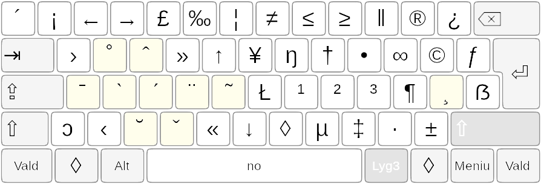

[Į pradžią](../README.md)

TĘSTIES MYGTUKAI
----------------

Pasinaudojus tęsties mygtukais galima įvesti daugiau papildomų ženklų, kurie nėra prieinami įprastuose išdėstymo lygiuose. Kiekvienas tęsties mygtukas turi lyg ir papildomą išdėstymo tęsties lygį.

Tęsties lygio spaudas įvedimui yra pasiekiamas prieš tai paspaudus ir atleidus atitinkamą tęsties mygtuką esantį ketvirtame lygyje (su ‘AltGr+Shift’). Po tęsties lygio spaudo įvedimo, tęsties mygtuko veikimo galiojimas baigiasi, ir norint įvesti kitą tęsties lygio spaudą reikia vėl spausti norimą tęsties mygtuką (iš anksto spaudžiant ‘AltGr+Shift’).

_Paveikslėlyje gelzganai žymėtieji ir esantys ketvirtajame „Ratisės“ lygyje tęsties mygtukai_:

Po tęsties mygtuko įjungimo, paspaudus tarpo mygtuką, gaunamas pats to tęsties mygtuko spaudas.

Paspaudus tiesiogiai gaunamos esamos mažosios raidės su atitinkamu tęsties mygtuko uždėtiniu spaudu, o paspaudus su ‘Shift’ — didžiosios.

__Pastabos__:
+ Dėl to, kad ypatingosios lietuviškos kirčiuotos raidės neįtrauktos į Unikodo standartą, jos gali būti įvedamos ir matomos tik naudojant tam skirtus spaudmenis (šriftus), pavyzdžiui ‘Vytis’, ‘Palemonas’.
+ Lietuviškomis priegaidėmis kirčiuotos ir taisyklingai atvaizduojamos (su priegaidės ženklu virš taško) mažosios ‘i’, esančios tik tam skirtuose spaudmenyse,  renkamos spaudžiant __h__ mygtuką vietoje __i__  mygtuko, kuriuo renkamos spaudmenyse įprastai esančios: _ì, í, ĩ_. Toks ypatingas kirčiuotų raidžių rinkimas galioja tik mažosioms ‘i’ raidėms.
+ Kitas būdas surinkti kirčiuotas raides yra naudoti kirčių uždėtinius ženklelius (jie yra mygtukų __X__, __H__ ir __Q__ trečiajame lygyje), dedant juos ant prieš tai įvestos raidės. Tokius uždėtinius ženklelius turi daugumas šiuolaikinių spaudmenų. Uždėtinių ženklelių uždėjimo kokybė įvairuoja nuo skirtingų spaudmenų ir skirtingos skaitmeninės įrangos: uždėtinis ženklelis gali būti paslinktas į šoną, ar uždėtas per aukštai, arba per žemai ant jau esančio kito uždėtinio ir priklausančio tai raidei ženklelio (taško, brūkšnio). Panašu, kad yra skirtingas supratimas tarp skirtingų kalbų vartotojų, kaip turėtų būti uždedami tie ženkleliai.
+ Skirtingose skaitmeninėse aplinkose tęsties mygtukų lygių palaikymas kiek įvairuoja ir turi savo ypatumų. _MacOS_ turi papildomą galimybę įvesti tęsties spaudo uždėtinį antrininką spaudžiant tarpą kartu su ‘Option’(‘Alt’).
+ _Haiku_ aplinkoje tęsties mygtukų lygiai palaikomi tik dalinai.

Išsamų spaudų esančių tęsties mygtukų lygiuose aprašymą rasite textinėse bylose: SPECIFICATIONS.txt bei SUPPLEMENT_SPECIFICATIONS.txt

-------------------------
[Į pradžią](../README.md)

